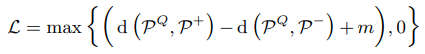
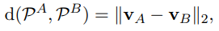
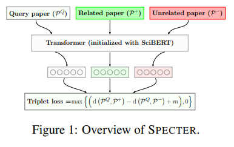
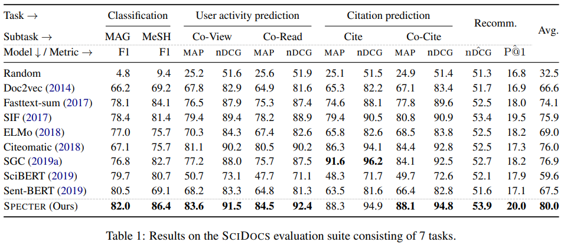
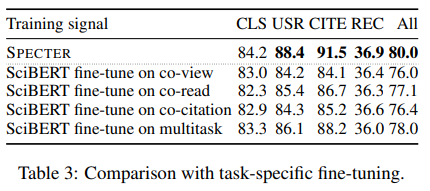
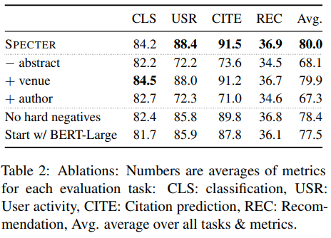
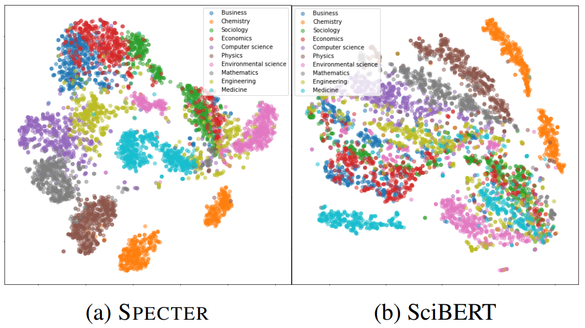

# SPECTER: Document-level Representation Learning using Citation-informed Transformers

## 논문
https://arxiv.org/abs/2004.07180

## 요약
- representation을 생성하는 것은 NLP의 주요 내용중 하나
- BERT와 같은 Transformer LM은 파워풀한 representation을 생성하지만, 토큰과 문장들의 문맥만 고려할 뿐(inner-document) **문서**간(inter-documnet)의 연관성은 고려하지 않는다. 이건 문서 레벨의 representation의 power를 제한시킴
- representation은 분류나 추천같은 downstream task에 강한 영향을 미치기 때문에 문서간의 연관성을 고려하여 문서 레벨에서 representation을 생성하는 SPECTER를 제안함
- 과학문서를 대상으로 한 모델이고, 각각의 Task에 별도의 finetuning 없이도 outperforms한 성능을 냄
- 논문의 제목과 초록은 풍부한 semantic 정보를 제공하지만 기존 PLM에 전달 하는 것 만으로는 정확한 논문의 representation을 제공하지 않음
- 문서간의 연관관계를 고려한 문서 레벨의 representation을 학습하기 위해 논문에서 자연적으로 발생한 인용 논문들을 사용함
- 이전 연구들과는 달리 inference 시점에는 인용된 논문의 정보가 필요하지는 않음. 이건 게시되지 않은 새로운 논문을 임베딩할 경우 중요하게 작용됨

## 방법

- 문서의 representation은 기존의 PLM들 처럼 얻음
    - v = Transformer(intput)[CLS] (input을 모델에 forward 시킨후 cls 토큰의 값을 대표 representation으로 삼음)
- SPECTER는 input으로 [[CLS] + [논문 제목] + [SEP] + [논문 초록]]을 사용함
- 이때 Transformer에 사용하는 모델은 과학 문서들로 pretrained된 SciBERT를 사용(MLM과 같은 다른 PLM의 objective function으로 학습된 모델)
- 논문의 인용 그래프를 참고하여 인용을 한 논문을 positive, 인용이 되지 않고 random sampling된 논문을 negative로 하여 Triplet loss로 학습

- 만약 P1의 논문이 P2를 인용을 했으면 P1과 P2는 positive, P1이 Pn을 인용하지 않았으면 P1과 Pn은 negative pair가 됨.
- 이때 p1 -> P2 -> P3 일때 P1 /-> P3 의 경우라면 P1과 P3는 hard negative sample이 되어 랜덤 샘플링이 안되더라도 negative pair로 학습시킴, 후술하겠지만 성능향상에 큰 영향이 있었음

## 실험 및 결과

### 결과 1
- 각각의 모델은은 finetuning이 되지 않은 상태, 사전학습만 된 상태에서 출력된 representation을 SVM을 통해 Task를 수행함

### 결과 2
- SPECTOR는 finetuning 없이, SciBERT는 각각의 Task에 맞게 finetuning을 한 이후 비교를 수행

### 실험1
- input과 pair를 어떻게 주느냐에 따라 바뀌는 성능을 측정함

### 실험2
- t-SNE를 이용한 시각화
