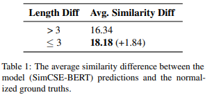
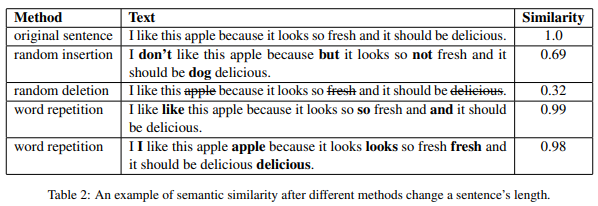
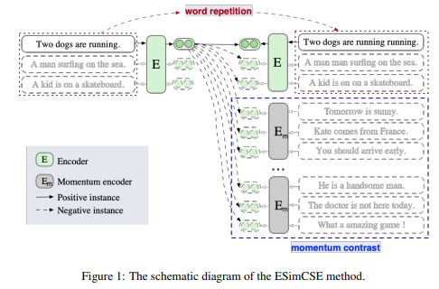
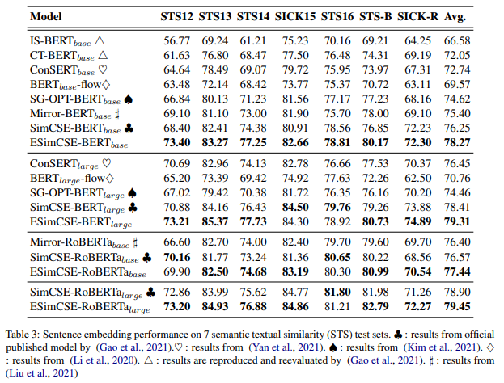

# ESimCSE: Enhanced Sample Building Method for Contrastive Learning of Unsupervised Sentence Embedding

## 논문
https://arxiv.org/abs/2109.04380

## 요약
1. SimCSE는 dropout augmentation과 constrastive learning을 이용하여 unsupervised 로 간단하지만 효과적인 문장 임베딩을 구할 수 있다. 하지만 positive pair(같은 문장, 다른 dropout)은 길이에 따른 bias 가질 수 있다.

2. 길이에 생기는 bias 를 해결하기 위해, 길이를 바꾸지만 문장의 의미가 바꾸지 않는 word repetition을 사용, 또 Vision 분야의 momentum contrast를 이용함

3. SimCSE와 비교해 대부분의 STS 밴치마크에서 더 좋은 성능을 기록

## 여담
- 매번 나오는 SimCSE의 파생 논문... 또CSE...
- 잘못된 부분이 있으면 알려주세요!
