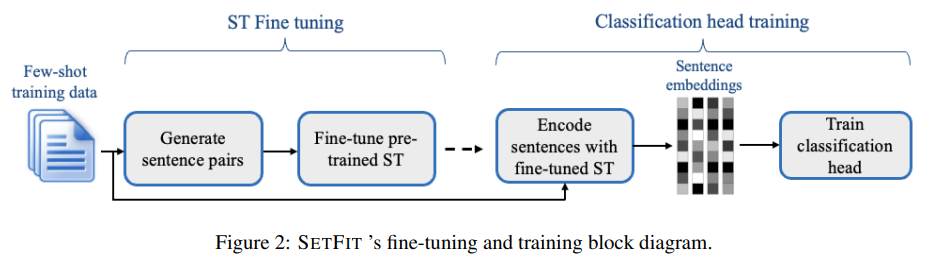
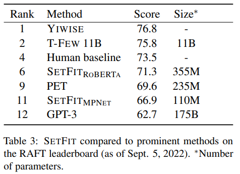
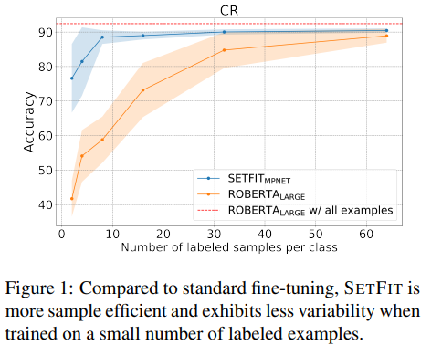
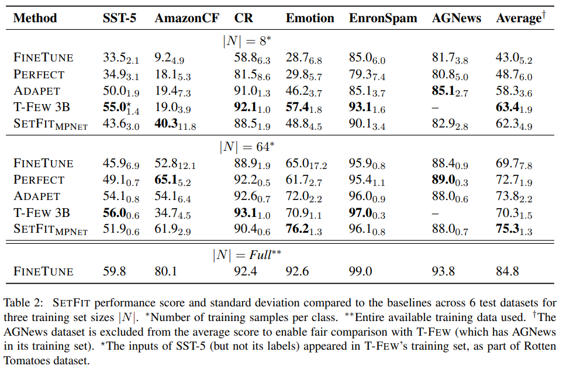

# Efficient Few-Shot Learning Without Prompts

## 논문
https://arxiv.org/abs/2209.11055

## 요약
- 데이터의 label이 부족한 상황에서 PEFT(parameter-efficient fine-tuning), PET(pattern exploiting training)은 인상적인 결과를 냈다.
- 그러나 해당 방법론은 prompt를 수동으로 만들어야 하고 모델의 사이즈가 매우 커야하며 특별한 인프라에서만 작동한다.
- 이 문제를 해결하기 위해 prompt와 verbalizers가 없이도 데이터가 부족한 상황에서 높은 정확도를 낼 수 있는 방법과 프레임워크인 SetFit(**Se**ntence **T**ransformer **Fi**ne-**t**uning)을 제시한다.

## 방법

- SetFit의 모델 학습은 2stage로 진행됨
### 1.ST Fine tuning
"/>

- 위와 같은 데이터가 있을 때(x는 문장, y는 해당 문장의 label)
positive pair와 negative pair를 랜덤으로 추출을 하여 만든다.

(y_i=y_j=c)"/>

(y_i=y_j\neq{c})"/>

- 최종적으로 contrastive fine-tuning dataset T를 만든다.

"/>

- |C|는 클래스의 갯수고 T가 가지는 pair의 갯수 |T| = 2R|C|로 한다. (R은 hyperparameter, 논문에서는 20으로 설정)

- 이러한 pair의 구성은 classification에서 label이 적은 상황(K 개)에서 최대 K(K-1)/2 개 까지의 pair를 구성 할 수 있게 되고, 중요한건 K보다 훨씬 큰 숫자이다.

- 해당 pair를 가지고 positive는 가깝게, negative는 멀게 contrastive learning을 하여 sentence embedding을 학습한다.

### 2. Classification head training

- 두번째 스텝으로 Sentence transformer의 fine-tuning이 끝나면, 전체 데이터셋을 inference 하여 모든 sentence embedding을 구하고, 해당 embedding을 feature로 logistic regression을 수행한다.

## Inference

(CH:classfication head, ST: sentence transformer)

## 실험 결과

- 비교 모델들의 패러미터 갯수

- 성능 

## 여담

- SetFit이 미래입니다. 여러분! 아마 관련된 후속 논문이 많이 나올 것 같습니다. 저는 처음 접할 때 SimCse와 비슷한 충격을 받았습니다.