# Model Stock: All we need is just a few fine-tuned models

## 논문

https://ar5iv.labs.arxiv.org/html/2403.19522

## 깃허브

https://github.com/naver-ai/model-stock

## 요약

Model Stock을 가장 잘 설명한 그림이다.

사전학습 모델 대비 추가로 학습된 모델 2개가 있다면, 그 가중치들의 중심을 잘 찾을 수 있고, 가중치 중심에서 모델의 성능이 극대화 될 수 있음을 시사한다.

맨 아래 마무리와 함께 읽어보면 Ties Merging과의 차이도 내 해석대로 적어놓았다.

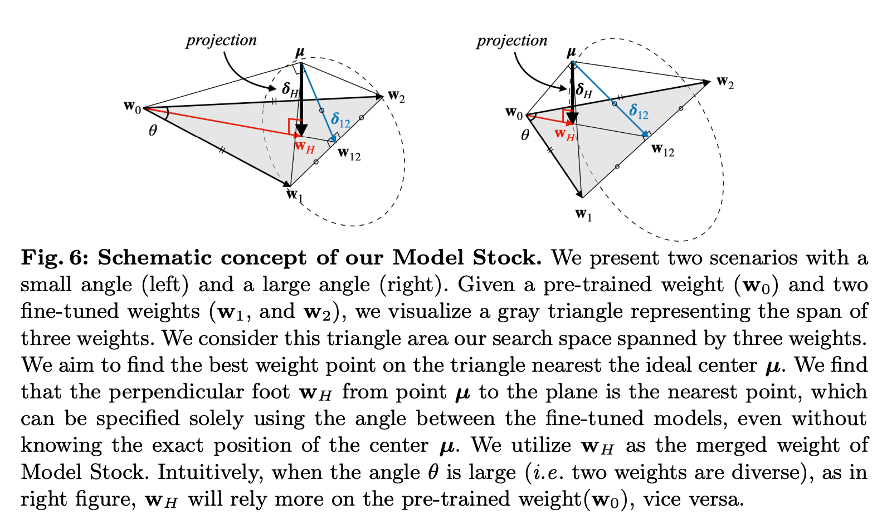

### 기존의 한계

- 모델을 머징하는 기법이 많이 연구되었음. 그 중에서도 model soup가 유명함.
  - 많은 종류의 모델을 합쳐, 뭔가 기하학적 중심을 찾을 수 있다면, 가장 로부스트한 모델을 만들 수 있을 것이다.
    - 다만, 이 사상은 merge 대상 모델을 너무 많이 요구하며, 계산 코스트가 매우 증가됨

- 우리가 제안하는 방법은, 적은 수의 모델로 기하학적 성질과 사전학습 모델의 Anchoring Effect를 이용하여, 효과적으로 모델의 중심을 찾을 수 있다
  - Anchoring Effect: 초반 시작의 느낌이 이후 선택에 영향을 미친다는 심리물리학 효과 (50만원짜리 상품 보다가 10만원 보면 싸보임)
    - 모델에는 사전학습 모델별로, 뭔가 그런 bias된 구간이 있다고 저자들은 이야기하는 것이 아닐지?

### Fine-tuned Weights를 분석해보자

**이 두가지를 명심하고 시작함**

- 모델을 여러 랜덤시드로 초기화하고 학습을 돌려본다.

- 모델의 범용 성능이 좋다는 것은, local minima가 대체적으로 평평한, 어떤 구간에 몰입되지 않은 loss surface를 구성할 것이다.

**Observation 1: Angle and norm consistency among fine-tuned weights.**

파인튜닝의 경우 모델이 실제로는 여러 옵션들을 바꿔도 모델 간 차이가 크게 발생하지 않음.

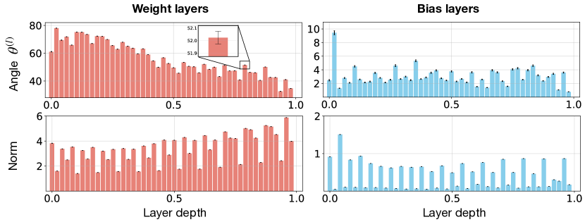

실제로 모델을 파인튜닝하고, 각 웨이트의 각도와 크기를 계산해서 표준편차를 계산해봄

실제로 검정색 차이를 보면 알 수 있듯이, 크게 차이가 발생하지 않음

​    **=> 앞으로 시드 같은게 바뀌었다고, 모델 학습이 달라지니 어쩌니 하는 명분은 사용하지 못하게 됨**

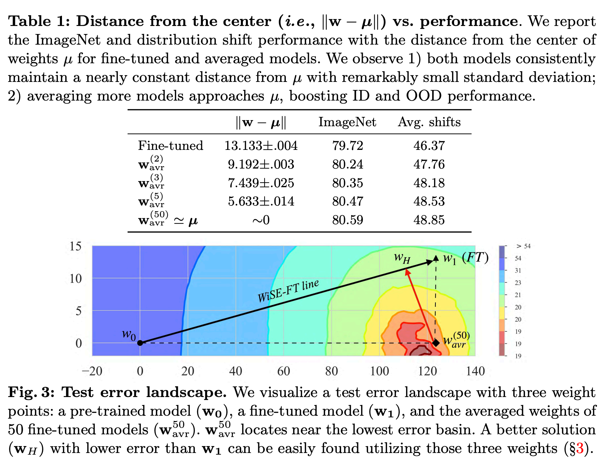

**Observation 2: Distance from the center of weights and performance.**

뭐 웨이트의 중간값을 정확하게 찾기는 어려울테니, 50개 평균으로 근사했다고 하겠음.

거리의 표준편차는 평균 거리의 0.1%의 표준편차를 가지는 것으로, 다양한 가중치의 중심으로부터의 파인튜닝된 가중치의 거리는 높은 일관성을 가진다.
(그림에서, w0부터 w1까지의 구간이 결국 평균가중치(중심가중치)를 기준으로 감싸고 도는 형태를 이루게 되어 thin shell이라는 의미를 사용하는 것으로 판단됨)

사전학습 모델 w0에서 학습을 한 파인튜닝모델 w1, 충분히 평균하여 중간값을 구할 수 있는 모델 Wavr이 있다면, 가장 가까운 WH를 찾을 수 있고, 그 의미는 최적의 가중치를 구할 수 있다는 의미. 

**Observation 3: Fine-tuned weights occupy local minima edges in the test error landscape.**

Fig. 3 에 대한 요약을 이야기한다. WiSE-FT는 2022년 논문으로, 프리트레이닝 모델에서 파인튜닝 모델까지 비율적으로 더해가면서 모델을 봐보면, 제로샷 성능도 지키면서, 파인튜닝 역할도 하는 무언가가 나온다는 것이다.

그래서 그 WiSE-FT를 쭉 나래비를 세워놓고 보니, 실제로 파인튜닝된 모델은 로스 최저값지점(Wavr)도 아니고, 생각보다 로스 최저점을 겉돈다는 이야기를 한다. 그래서 앞으로 제시하는 메소드들로 WH를 구하는게 목표라고 함.

**Observation 4: Randomly perturbed weights nearing the center also merit high performance.**

중앙으로 잘 정렬된 웨이트에 강제로 랜덤 노이즈를 부가하여, 성능을 측정해봄 (ImageNet)

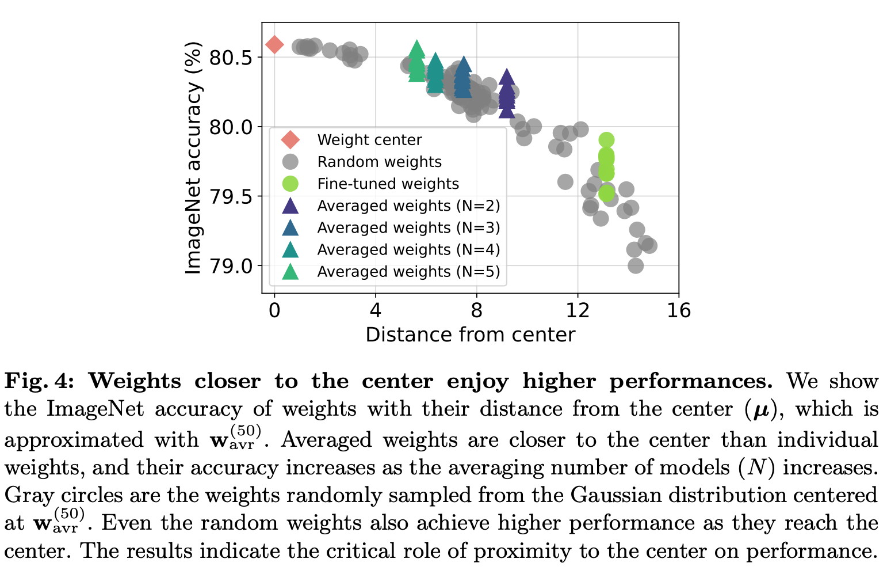

모델끼리 평균을 칠수록 중심에 가까워지며, 랜덤하게 샘플링된 노이즈 웨이트들도, 운좋게 중심과 가까운 무언가가 뽑힌다면, 성능이 증가됨

그렇다면 미세조정된 놈들은 왜 중간에 있지 못하는걸까?

loss surface 상에 많은 stationary point들이 존재하기 때문에 도달하기 어렵다고, 

3. Cha, J., Chun, S., Lee, K., Cho, H.C., Park, S., Lee, Y., Park, S.: Swad: Domain generalization by seeking flat minima. NeurIPS 34, 22405–22418 (2021)

13. Izmailov, P., Podoprikhin, D., Garipov, T., Vetrov, D., Wilson, A.G.: Averaging weights leads to wider optima and better generalization. arXiv preprint arXiv:1803.05407 (2018) 

에서 이야기함.

또는, 학습 자체가 어떤 minima를 잘 찾아가는 과정이나, 평균을 한 것은 local minima들을 flat하게 바꾸는 효과가 있을 것이므로, 옵티마이징과정 자체가 어려운게 사실일 것이다. (컨셉과 의도가 다르니 어렵다는 말)

어떻게든 center에 빨리 도달하는 방법이 있지 않을까!?

### 논문 저자들의 가설

관찰된 것들을 종합해보면, 거의 대부분이 가우시안 분포의 수학특성과 밀접한 관계가 있는 기하학적 특징들이 있었음.

𝒩(𝝁,Σ)

이게 그럴듯한 이유인게, 대부분 파인튜닝할때 정규분포로 초기화해서 학습을 하고, 학습 정규화를 목적으로 하는 테크닉들도 가우시안 노이즈를 많이 채택함. 그래서 대부분의 고차원 공간 벡터들을 샘플링해보면 이런 norm 특징을 가짐.

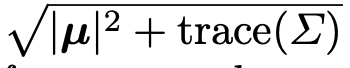

그리고 일관된 in-between angles를 가진다고 함. (각도와 크기가 일관된 패턴 양상을 보이는듯)

이는 측정값의 집중현상이 관려이 있다는데 연관 논문을 읽어봐야 알 것 같음.

그리고 이런 현상을 벗어나는 경우는 극히 없다시피해서 거의 무시해도 될 정도라고 함.

center 뮤를 기준으로, 표준편차 만큼의 거리를 가지는 아주 얇은 thin shell을 이루는 형태가 된다고 함.

**따라서 미세조정된 가중치는 가중치별로 가우스 분포를 따른다는 가설을 세울 수 있음.**

이런 가설이 중요한 것은, 모델 평균에 대한 직관적인 이해에 도움이 되고 N개를 평균한 모델의 무게중심까지의 거리는 1/root(N)에 비례하여 분산이 감소한다는 것이다. (아마 thin shell을 가정하고, 표준편차를 이용하여 중심까지의 거리로 생각하기로 한 모양)

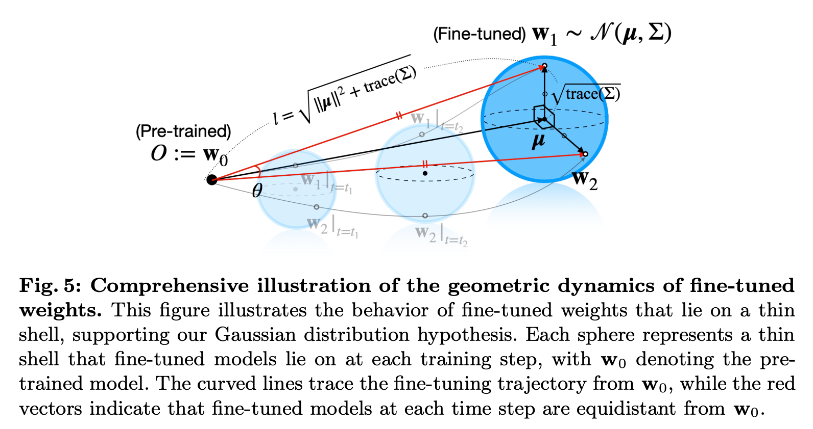

w0으로부터 미세조정되는 w1, w2가 어떤형태로 w0와 시간순으로 멀어지는지에 대한 그림이 Fig. 5이다.

미세조정된 것들이 가우시안 분포를 이룬다는 가설을 통해, 학습을 통해, 뮤만큼 멀어지지지만, 뮤를 기준으로 표준편차의 거리들 사이에 모델들(w1, w2)이 놓아지게 된다.

### 메소드!!!!!!!!!

뮤에 가까울수록 성능이 좋아진다고 하였으니, 뮤에 근사하려면 가장 쉬운 방법은 모델을 여러개 평균내는건데, 이거는 리소스가 많이든다.

사전학습만 된 모델은 여러 데이터를 많이 봤으므로 OOD성능은 뛰어나다. 그래서 이 녀석을 Anchor Point로 작용할 수 있다.

Fig 3.에서 봤듯이, 적절한 위치인 WH는 Anchor Point와 보간으로 구할 수 있다.

읽기 편하게 하기 위해서 레이어의 숫자인 k는 생략하도록 한다. 다만 이후 부터는 layer wise하게 적용한다고함.

2장에서 랜덤시드로 미세조정된 모델은 일정한 규범과 사이각을 가진다고 하였다. (바로 위에 있음)

#### 2개의 파인튜닝 모델을 사용한 경우

사전학습과 미세조정된 모델의 위치를 2차원 평면에 표현하면 회색 삼각형이 된다.

뭐 이 모델들은, 선형 이동한 웨이트가 될꺼고 (빼기로 빼서 보면, 프리트레이닝모델 W0이 목적 달성을 위해 얼만큼 이동해야 했는지를 레이어별로 알 수 있듯이.), 목표는 이 평면상에서 뮤와 가장 가까운 지점을 구하는게 목표이다.(최적의 학습점이라고 예상되는 부분)

그 구간은 뮤로부터 수직인 WH가 될것이고, 그 지점을 구하는게 목표이다.

정확한 센터 뮤의 위치를 몰라도, 두가지 조건을 충족하는 W1과 W2의 각도만으로 구할 수 있다. (Fig. 6 첫번째 그림 확인)

1. 뮤로부터 떨어진 w1과 w2를 뮤로부터 연결시키면, 이등변 삼각형이 만들어진다. (논문에서 제안하는 Observation에 의해서 그렇게 됨)
2. 1번에 의해 W12는 w1과 w2의 중앙값이 된다. (아마 파인튜닝 모델의 머지로 볼 수 있지 않을까?)

이 두 조건에 의해 뮤는 점선에 해당하는 원에 무조건 접선하게 된다. 말로 설명하면 어려운데, 수식을 보면 더 쉽다.

**θ는 사전학습 모델로부터 각각 파인튜닝모델1과 2 사이의 각도이다.**

**따라서 파인튜닝된 모델이 얼마나 가깝느냐(비슷하느냐)에 따라, 사전학습 모델과의 가중치를 두어 머징을 하는 방식이다.**

**(파인튜닝모델 1,2가 완전히 동일하면, θ는 0이되고, 그러면 w12만 쓰게되고, 그렇지 않을 수록 w0이 개입되는 형태이다.)** 

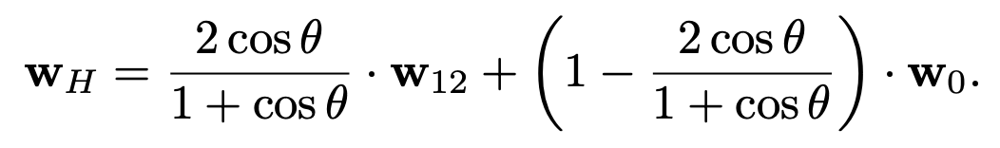

(2cos세타/(1+cos세타)를 뒤로는 인터폴레이션 `t`로 표현한다)

이 말인 즉슨, 세타가 작아질수록 사전학습 모델은 덜 쓰인다는 말이 되며, Fig. 2에서 다룬 것 처럼, bias layer는 파인튜닝 한 모델에 더 가깝고, weight layer는 사전학습 한 모델에 더 가까운 것과 같이 설명 된다고 한다. (Fig. 2 그림만 봐서는 잘 모르겠는데, 실제로 LLM을 학습해보면 실제로 weight가 많이 이동이 발생하진 않는다.)

#### 여러개의 파인튜닝 모델을 사용한 경우

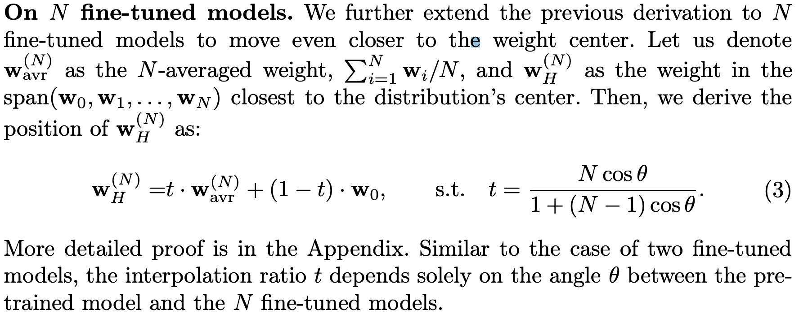

위에서 본 t를 N개 평균한 것으로 대응될 뿐이고, N개의 모델이 얼마나 유사했냐에 따라, 사용되는 비율이 결정될 것 같다.

#### Periodic merging

여기서 추가로 제안하는 방식인데, 학습하는동안 사전학습모델과 파인튜닝모델에 대한 병합을 진행하자는 얘기다.

에포크를 전부 수행하고, 사전학습모델, 현재학습중인모델, 파인튜닝모델 3개를 가지고 각도를 계산해서 현재학습중인 모델을 업데이트하면, 중심점을 더 잘 찾을 수 있다는 이야기이다.

아마, 생각하기로, 사전학습의 힘을 최대한 잊어먹지 않으면서, 새로운 파인튜닝의 역할을 배워나갈 수 있지 않을까 싶긴하다....

### 실험

이미지-텍스트 기반의 모델로 실험한다. (CLIP ViT)

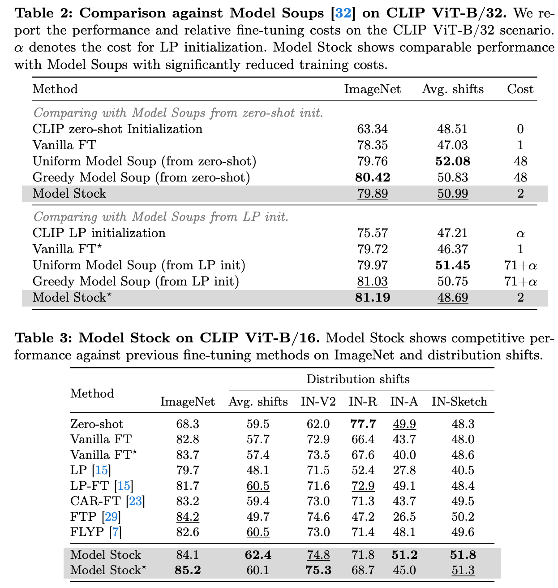

Table 2를 보면 생각보다 soup대비 엄청 잘하진 않는다. 단 명심해야할 것은 모델스탁은 원본모델 제외하고 딱 2개만 써서 했다는게 핵심이다. model soup는 71+a다....

Distribution shifts에서도 안정적인 성능을 나타낸다는 점에서, 되게 robust하게 됨을 알 수 있다.(여기서 *가 붙은거는 model soup를 이니셜라이즈로 훈련한 모델의 Stock 결과인 것 같다. 실험 셋업에 있는데 제대로 안읽어봄...)

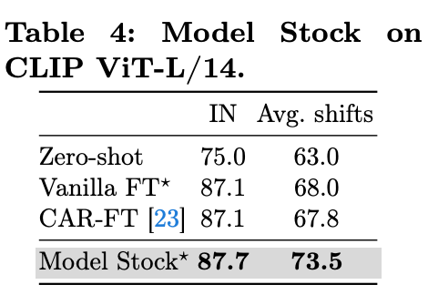

라지모델에서도 잘한다는 말이다. 즉, 여러 task와 파인튜닝 방식들, 라지모델에서도 잘 됨을 보임으로써, 전천후 사용 가능함을 강조한다.

#### Abalation Study

1. 모델은 많이 합칠 필요는 없다.
   1. 많이 합칠수록 더 잘해지지만, 2개만 합친것과 소수점대 accuracy 차이만 존재했다. 따라서 2개 합쳤을때가 코스트대비 가장 합리적임
2. Periodic Merging은 1에포크정도만 수행해도 충분히 좋은 모델이 나온다.
3. 아래 그림을 보면, 시드만 바꾸어서 모델을 만들고 stock하는 것 만으로, 일반적인 과거의 컴페티션 따위에서 써먹던 앙상블 기법보다 훨씬 나음을 강조한다.

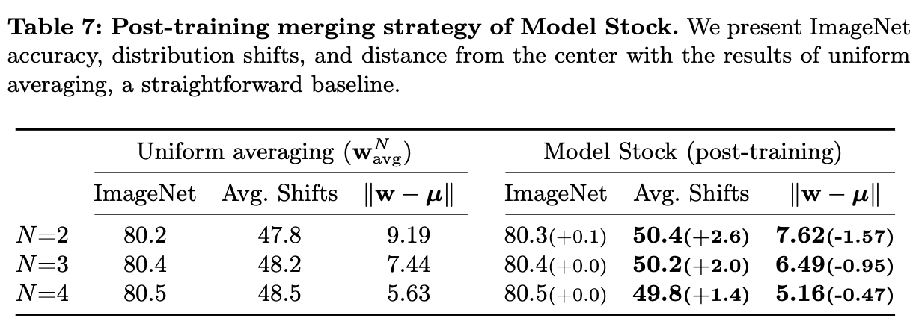

### Discussion

Model Soup를 되돌아보는데, 실제로 가우시안 분포로 나온 모델의 웨이트를 분석해보면, 모델 각각의 웨이트 분산은 꽤나 넓은편이나, 이걸 soup하면서 분산이 점점 줄어들게 된다. 따라서 모델을 무한히 평균내다보면, 어떤 중앙위치에 모델들이 잘 위치하게되며, 그로써 일반적인 성능이 향상됨을 시사한다고 해석한다.

내가 느끼기엔 주사위를 10번 던진 결과만 가지고 보면 1/6이 아닐 수 있는데, 10번 던진 사람이 100명이되고, 200명이 되어 종합해보면 1/6에 안정적으로 들어가게되는 현상을 말하는 것 아닐까 싶다.

그리고 Model Stock은 단순히 2명의 결과만으로 그 웨이트 공간에서 삼각함수로 중앙값을 잘 찾을 수 있음을 시사하는 것이고...

### 결론

미세 조정한 가중치는 일반적으로 가우시안 분포의 특성을 나타냄을 밝혔다.

성능 향상을 위해서는 이런 가중치 중심에 위치하는 것이 필요함을 나타냈다.

미세조정을 많이 하지 않은 모델로도, 여러개가 있다면 anchor를 이용하여 중앙값을 잘 근사시킬 수 있다.

로스 스페이스 상에서 뭔가 미니마에 근접하는 것이 중요하다는 것 뿐만이 아닌, 각각의 로컬 미니마들을 평평하게 만들 수 있는, 즉 분산을 줄일 수 있는 이런 방법론들을 통해 robust한 모델을 만들 수 있음을 시사했으며, 이런 연구가 앞으로 가중치나 파인튜닝 관련 연구에 많은 도움이 되기를 바란다.

## 마치며

뒤로 논문이 1/3어치가 남는데, 전부 위에 삼각함수를 증명하기 위한 수식들이고, 실제로 그들이 웨이트를 어떻게 까봤는지, 중앙값은 어떻게 판단했는지, 이게 어떤 영향을 미치는지 어떻게 데이터 분석을 했는지에 대한 방법들이 나열되어 있습니다.

만약 가중치에 대한 깊은 고민이 있다면 읽어보면 좋을듯도 하겠네요...

개인적으로 Ties Merging과의 가장 큰 차이는, Ties는 잘하는쪽으로 밀어주다보면, B모델의 능력을 A능력이 흡수할 수 있다는 사상인데 반해,

Model Stock은 A와 B가 사전학습 모델 대비 어떤 위치에 있냐에 따라, 최대한 3개 모델간의 `중용`을 이루게 함으로써, 서로의 능력을 최대한 잘 발휘할 수 있는 구간을 찾아 다른 능력또한 강화시키게 만드는 느낌이 강했다.

참고로 중용이란, `중간만 가라`가 아니고, `모든걸 바라보고, 상황에 맞게 판단하라`는 의미로 쓰인다. Model Stock을 가장 잘 설명한 표현이 아닐까...! (역시 한국 논문 답다...?)

다만 Ties Merging은 못하는 모델 여러개를 합치다보면 부스팅을 받는 느낌이라서, 하나라도 잘하는 모델이 나오지만, Model Stock은 못하는 모델들끼리 하면, 모든걸 바라보는 능력이 떨어져서, 적절한 판단을 잘 못할 것 같다는 느낌이다. (애시당초에 중심에 해당하는 곳이 전체 웨이트의 이상적인 중심과는 거리가 이미 멀어서....)

따라서, 좋은 시야를 바라보는 모델들의 능력을 적절히 섞어서 사용하고 싶다면, Model Stock이 최고의 방법이 아닐까...?