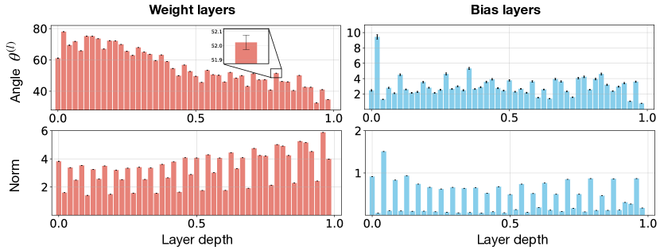
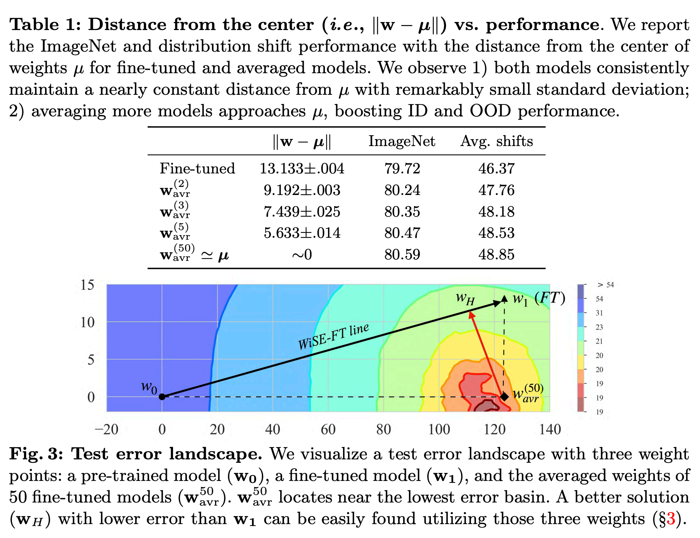
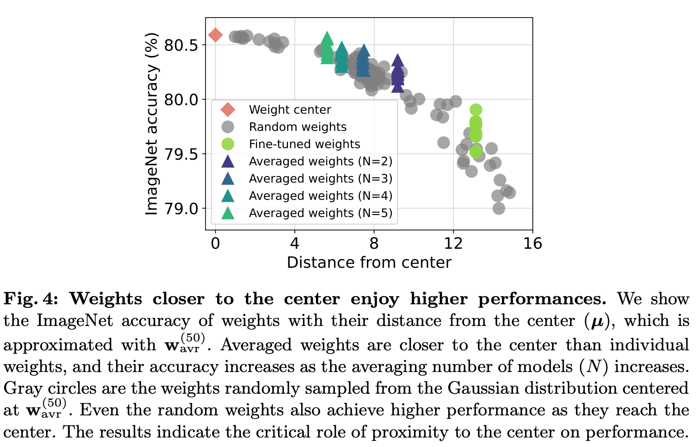
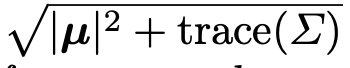
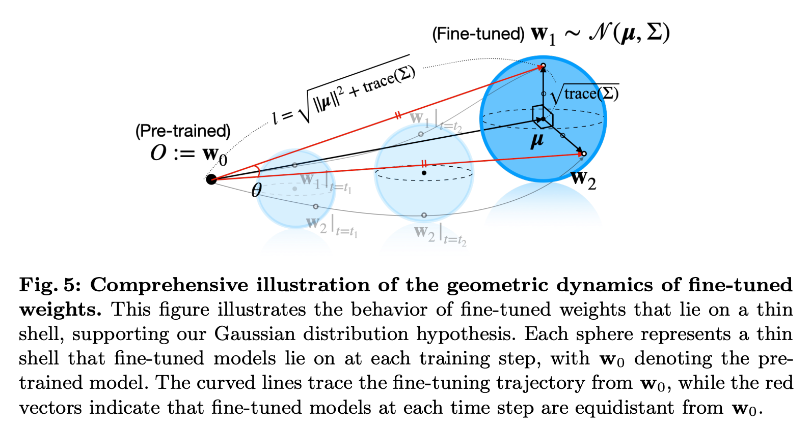
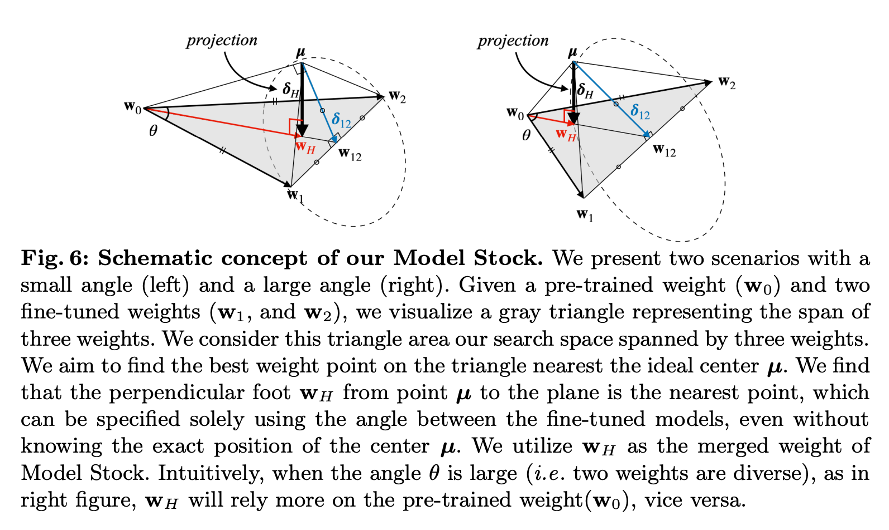
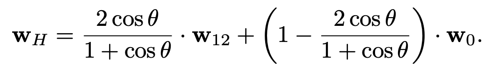

# Model Stock: All we need is just a few fine-tuned models

## 논문

https://ar5iv.labs.arxiv.org/html/2403.19522

## 깃허브

https://github.com/naver-ai/model-stock

## 요약

### 기존의 한계

- 모델을 머징하는 기법이 많이 연구되었음. 그 중에서도 model soup가 유명함.
  - 많은 종류의 모델을 합쳐, 뭔가 기하학적 중심을 찾을 수 있다면, 가장 로부스트한 모델을 만들 수 있을 것이다.
    - 다만, 이 사상은 merge 대상 모델을 너무 많이 요구하며, 계산 코스트가 매우 증가됨

- 우리가 제안하는 방법은, 적은 수의 모델로 기하학적 성질과 사전학습 모델의 Anchoring Effect를 이용하여, 효과적으로 모델의 중심을 찾을 수 있다
  - Anchoring Effect: 초반 시작의 느낌이 이후 선택에 영향을 미친다는 심리물리학 효과 (50만원짜리 상품 보다가 10만원 보면 싸보임)
    - 모델에는 사전학습 모델별로, 뭔가 그런 bias된 구간이 있다고 저자들은 이야기하는 것이 아닐지?

### Fine-tuned Weights를 분석해보자

##### **이 두가지를 명심하고 시작함**

- 모델을 여러 랜덤시드로 초기화하고 학습을 돌려본다.

- 모델의 범용 성능이 좋다는 것은, local minima가 대체적으로 평평한, 어떤 구간에 몰입되지 않은 loss surface를 구성할 것이다.

##### 파인튜닝의 경우 모델이 실제로는 여러 옵션들을 바꿔도 모델 간 차이가 크게 발생하지 않음.

실제로 모델을 파인튜닝하고, 각 웨이트의 각도와 크기를 계산해서 표준편차를 계산해봄

실제로 검정색 차이를 보면 알 수 있듯이, 크게 차이가 발생하지 않음

​    **=> 앞으로 시드 같은게 바뀌었다고, 모델 학습이 달라지니 어쩌니 하는 명분은 사용하지 못하게 됨**

### 간단하게 저게 되는 이유

- 다운 스트림 태스크의 경우는 다음과 같은 수식을 사용 할 수 있음

  

  - 패러미터 파이를의 가능도를 최대화 함
  - 우리는 그것을 아래와 같이 바꿈

- 즉 Φ0 + ∆Φ로 업데이트 되는 프로세스를 Φ0 + ∆Φ(Θ) 로 바꾸고 Θ를 최적화함 이는 위에서 가정한 row instrisic dimension을 가지고 있다고 가정을 세웠기 때문에 가능

- 다음의 수식으로 맨 위의 그림을 나타 낼 수 있음

  

- 즉 모델이 하이퍼패러미터를 최적화 하기 위해서 바꿔야 되는 그래디언트를 BA로 근사하겠다는 이야기

### 성능

## 마치며

급하게 읽은 논문이라 오역과 잘못된 내용이 있을 수 있습니다. 꼭 한번 읽어보세요! 그리고 오류 지적해주시면 감사하겠습니다.