# TIES-MERGING: Resolving Interference When Merging Models

## 논문
https://arxiv.org/abs/2306.01708

## 요약
### 이전까지의 한계

1. 기존의 Ensemble 기법과는 새로운 Model Merging 기술이 각광받고 있음.

2. 일반적인 방식의 Merging은

    1. 불필요 파라미터가 합쳐지는 단점
    2. 기호가 불일치되는 단점

    이 존재한다.

3. TrIm, Elect Sign (TIES) Merging은 파인튜닝동안 적게 움직인 파라미터를 초기화하고, 기호충돌을 해결하고, 최종적으로 뭔가 부호가 맞는 파라미터들만 Merging하는 것으로 위의 단점을 해결했다고 한다.

### 기존의 Merging은 무엇이고, 간섭이 생기는 이유가 무엇일까?

기존의 Merging은 가장 간단하게 weighted averaging 방식이 가장 쉽고 효과적이었다. (쉽게 말해 평균)

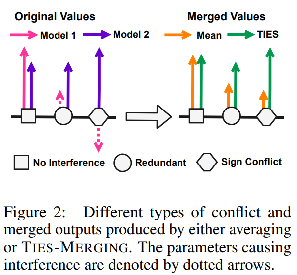

이런 방법은 2가지 문제가 있는데, 위에서 주황색 결과물처럼, 영향력이 없는(Redundant) 케이스의 Model1 파라미터가, 평균 과정에서, 영향력이 있는 Model2를 작게 만드는 효과로 작용한다던가, (성능이 떨어짐)

부호충돌(Sign Conflict) 케이스처럼, 단순하게 평균치면 당연히 작아지는 (7과 -4의 평균은 1.5) 효과로 모델에 악영향을 끼치게 된다.

### TIES-Merging의 동작

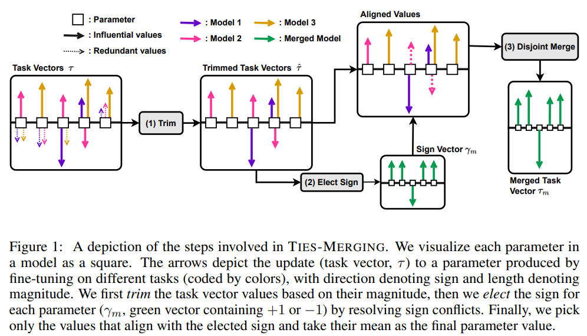

#### 1) Trim

영향력있는 vector만 남기는 과정으로, 불필요한 task vector를 0처리하거나, 사전학습된 모델의 값으로 재설정합니다.

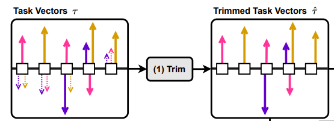

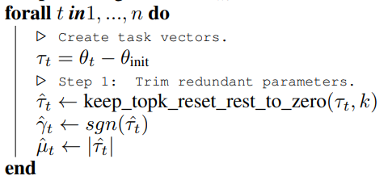

task vector = finetune vector - init vector 로 특정 task에 대응되는 벡터의 크기와 방향만 분리한뒤, 상위 최대 20%까지만 남기고, 부호함수와 절대값을 통해, 방향과 크기로 분리한다.

#### 2) Elect Sign

Trim 이후에 부호충돌이 당연히 발생할 수 있습니다. (Trimmed Task Vectors의 3번째 혹은 4번째와 같은 경우)

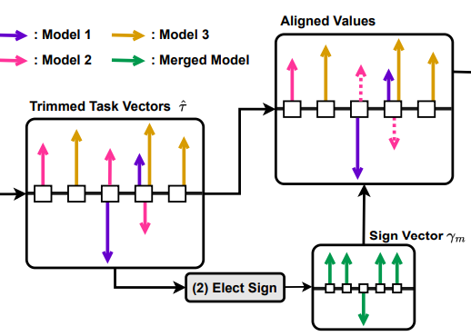

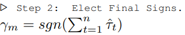

수식만보면,

Trim 단계에서 남은 Vector를 전부 더해서 부호만 저장하는 것으로 보이는데, 논문 설명에서는,

total magnitude가 가장 큰 값의 부호를 선택한다고 하며, 각 파라미터를 음수인 녀석과 양수인 녀석으로 분류해서, 각각 더한다음에, magnitude가 더 큰 부호를 선택한다고 한다.

**결과만 보면 +,-방향별로 다 더해봤을때 둘중에 더 컸던 쪽의 Vector만 남는다.** (Aligned Values)

γ은 참고로 부호만 저장되는 변수이다. (위에 Trim에서도 마찬가지.) 

#### 3) Disjoint Merge

최종적으로 한쪽 방향의 Vector들만 각각 남게 되는데, 이 남는 녀석들로 disjoint mean을 수행한다.

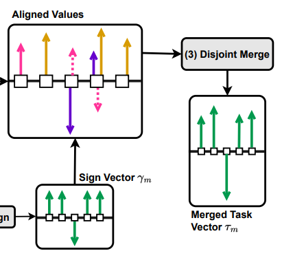

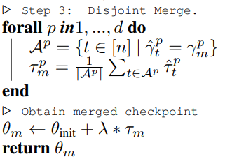

불연속 평균이랄게 어려운게 없고, Ap는 task들 중에 방향이 같았던 벡터들만 모아서, 그 녀석들만의 평균을 구하겠다는건데, 위의 이미지에서 보면 알 수 있듯이 어떤건 벡터가 1개 어떤건 벡터가 2개 이렇게 각각 파라미터별로 살아남은 벡터의 수가 다를테니, 일일이 평균을 효과적으로 구하는 코딩 스킬이 필요할 것 같다. 또한 0은 제외되도록 하게 한다고 한다. (분모 분자에 모두 포함 X)

마지막으로, 분리해놨던 parameter들에 scaling을 주고 기존 값에 더하면 모델이 완성된다.

### 실험

#### 주요 목표는 여러 작업별 모델을 도메인 내 혹은 외 시나리오 모두에서 잘 수행될 수 있도록 함임.

PEFT기법은 IA3을 사용함. https://github.com/huggingface/peft/pull/578

**PEFT 모델**: 문장완성, n지선다, 빈칸채우기, 단어 모호함 판별 4개 Task 총 11개 Dataset

**자연어 모델**: QA, 의역 식별(Paraphrase Identification; PAWS), 문장완성, 빈칸채우기(winogrande)의 4개 Task에 대한 7가지 Dataset

**이미지 모델**: 여러가지 이미지 분류 (위성이미지, 숫자, 교통 등) 8가지 Dataset

여기선, 데이터셋의 종류가 도메인이 달라지므로, Task라고 표현한다.

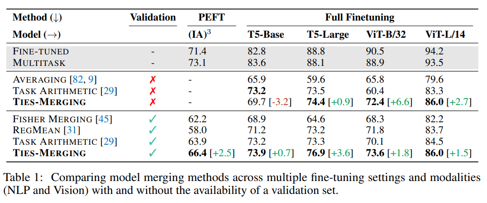

이미지 모델에도 효과 있음. LoRA는 아니지만 IA3 기준으로도 효과 있음.

Task가 다른애들끼리, 도메인도 다른데 합쳤더니 전부 잘된다.

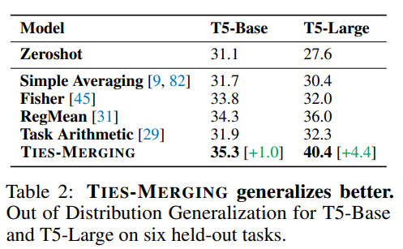

Zeroshot을 위한 QA, 단어채우기, 문장완성 Task에서도 성능이 가장 좋았던 것으로, 도메인 외의 데이터에도 더 강인해짐을 검증하였음.

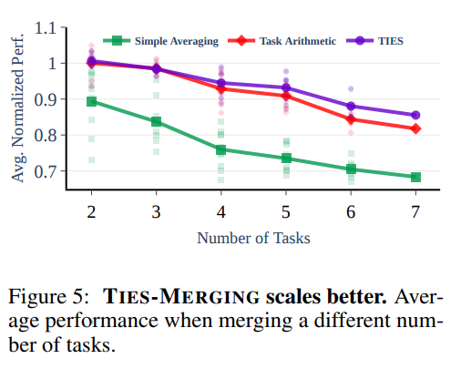

Task가 추가될수록 simple averaging은 눈에띄게 떨어지나, TIES는 그나마 덜 떨어지는 것을 확인

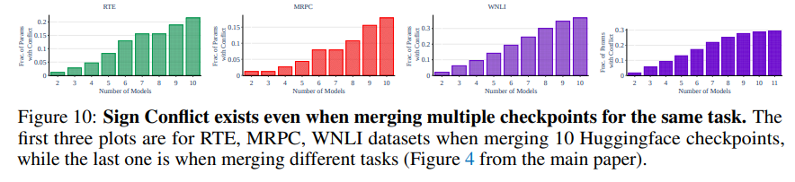

같은 학습데이터로 학습된 여러개의 모델을 합쳐도, 위와 같이 부호 충돌이 발생할 수 있으며, 

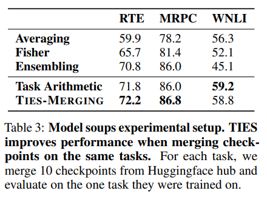

BERT로 학습시킨 같은 task에 대해 TIES-Merging이 엥간하면 좀 더 잘됐음. 즉, **같은 데이터로 학습된 여러개의 모델을 이렇게 합치는게 유효**함. (이쯤 되면 거의 모든 모델에 적용해볼 수 있을것 같은 느낌이 든다.)

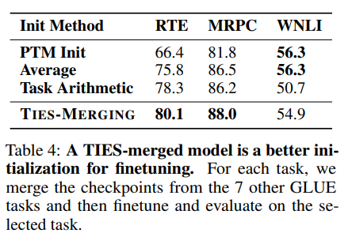

**모델 초기화** 역시 WNLI만 제외하고는 모두다 훨씬 잘 되었다.

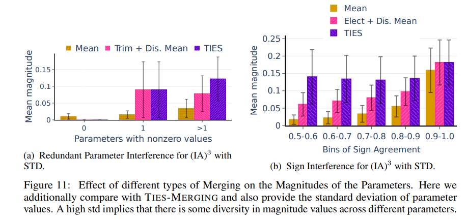

TIES로 하는경우, 파라미터의 다양성이 보장된다.

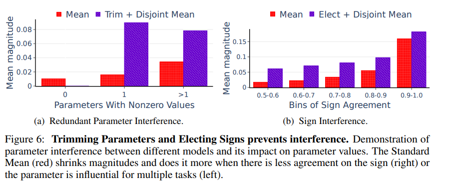

평균의경우 파라미터가 0이되는 경우가 생길 수 있다. 또한, (b) 를 보면 파라미터의 일치도(x축) 이 커질수록 Mean magnitude(파라미터 영향도)는 커지고, 작으면 작아지지만, 그래도 TIES 쪽이 조금 더 유지하려는 경향을 가지고 있다.

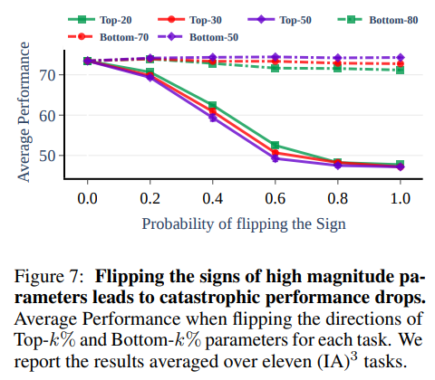

파라미터의 반전도 (평균등을 했는데 +였던애가 -가 되는경우)가 심해질 수록(1.0에 가까워질 수록),

평균적인 성능이 하락함을 알 수 있다. 따라서 뭐, 그냥 평균을 하더라도, 전체 파라미터의 20% 정도가 부호가 바뀐다면 크게 성능저하가 없을 수 있는데, 그게 넘어가게되면 크게 성능이 하락할 수 있다. (다만 이걸 어떤 개발자가 일일이 확인할까 ㄷㄷ)

TIES 알고리즘은 위와 같은 상황을 방지하므로, 좋은 성능을 얻을 수 있는 근거가 된다고 한다.

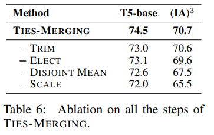

당연한 이야기겠지만 모든 기능을 사용하는 것이 성능이 가장 좋다.

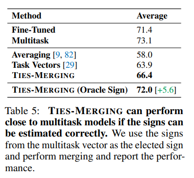

멀티테스크로 학습된 모델이 있으면, 그냥 해당 파라미터의 부호로 치환하는 것으로, 부호를 일일히 구하는 과정을 건너뛰고 각 Task로 학습된 모델을 TIES 를 진행했을때 거의 Multitask 모델을 학습한것과 유사한 수준이 된다.

이 말은 놀랍게도 단순히 성능 뿐만 아니라, 파라미터 자체의 차이를 줄일 수 있다는 말이며, 소수의 데이터로 멀티테스크 학습을 할 수 있다면, 작은 리소스로 가지고있는 각 task의 모델을 멀티테스크 모델로 만들 수 있다는 것이다.

## 결론

모델이 Init 된 이래로 크게 바뀌었다면, 해당 파라미터는 loss를 줄이기위해 큰 영향을 줘야만 한다는 의미일 것이다.

그러니 해당 파라미터들을 모아서, 값에 영향이 최대한 없도록 잘 합치면, A,B,C 각각의 3개의 모델로 ABC를 하는 모델 1개를 만들 수 있게 된다.

또한 모델의 강인성도 올라가며, 초기 학습 설정값으로도 유효하고, 더 성능이 좋아지는 앙상블의 효과도 있다.

이로써 모델 매개변수의 크기와 방향은, 모델 Task마다 영향을 미치는 것을 확인했으며, 부호 역시 매우 중요한 부분임을 강조할 수 있겠다.

## 여담
- Layer 구조의 무언가라면 전부다 적용해볼 수 있겠다는 생각이 들었다.
- 구현해서 자동화되게 쓸 수만 있다면 정말 막강한 기능인 것 같다.
