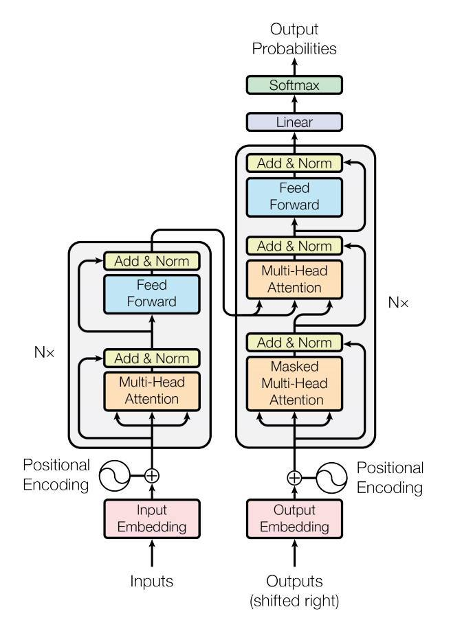

# [Attnetion Is All You Need](https://arxiv.org/abs/1706.03762)

## Abstract
기존 시퀀스 전이 학습 모델들은 Encoder-Decoder 기반의 RNN, CNN 모델이 주를 이뤘다.   
-> 하지만 이런 모델들은 기본적으로 너무 복잡하다는 단점이 존재함.    

논문의 저자들은 __[Attention-Mechanism](https://aclanthology.org/D16-1058.pdf)기반__ Encoder-Decoder구조를 가진 'Transformer'를 제안한다.   
-> Self-Attention을 종종 Intra-Attention이라 부르기도 한다.   

Machine Translation 에서 **Transformer와 기존 모델을 비교해 어떤 개선점이 있는지를 설명**한다.   

---
## Encoder-Decoder
   
### Encoder
Encoder는 multi-head Attention-Layer, FeedForward-Netword 2개 주요 레이어와     
추가적인 Residual + Normalization Layer로 구성되어 있다.   

### Decoder
Decoder는 Encoder와 달리 3개의 주요 Layer로 구성되어 있으며 Masked-Multi-Head Attention, Multi-Head Attention, FeedForward-Network로 구성되어 있다.
마스킹 이유는 처리가 된 부분에 가장 알맞은 값을 예측하기 위해 존재한다.    
그 이외의 다른 레이어는 Encoder과 같다.

---
## Attention
**Attention관련 블로그 글**
- [Transformer 동작과정을 밑바닥부터 뜯어보자!](https://techblog-history-younghunjo1.tistory.com/497)
  gif로 Attention이 어떻게 진행되는 지 간편하게 설명해 놓았기 때문에 이해하기 한층 수월함

**Cross Attention**
- Encoder-Decoder구조로 Query를 Decoder, Key, Values를 Encoder로 부터 얻는 방식 (검토 필요)    

**Self Attention**
- Query, Key, Values를 Encoder 혹은 Decoder 에서만 얻는 방식 (검토 필요)    

### Attention Mechanism   
3. Key, Value를 행렬곱을 해 Key, Value간의 유사도를 구한다. -> matmul진행 행렬곱을 하는 과정이 각 벡터의 내적을 구하는 과정.   
4. 이후 softmax에 행렬 곱한 값을 통과시켜 Attention_score를 얻어온다. -> 행렬값을 유사도가 반영된 확률값으로 변환   
5. Value값에 Attention_score값을 곱한다. -> 유사도가 반영된 확률값을 Value에 적용해 유사도를 Value에 반영한다.    

### Multi-Head Attention
Attention에게 주어진 값을 Attention Head 만큼 나눠 각 값에서 Attention을 진행하는 방법    
이를 이용해 앙상블을 진행한 효과를 얻을 수 있음.   

---
## Conclusion
**Transformer는 기존 RNN, CNN보다 속도, 성능 측면에서 더욱 뛰어난 것을 알 수 있었다.**

# 잡설
[TODO]
- FFN 내용 추가 작성하기   
- Multi-Head Attention 내용 수정 & 추가   
