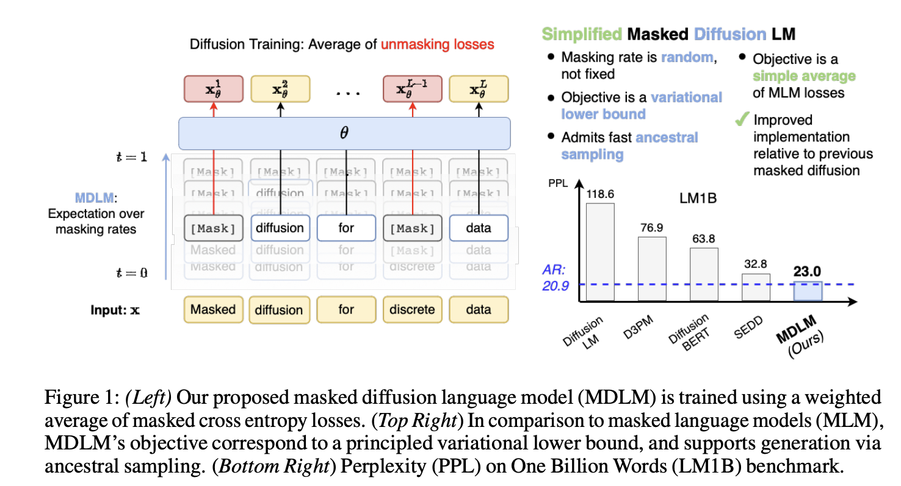
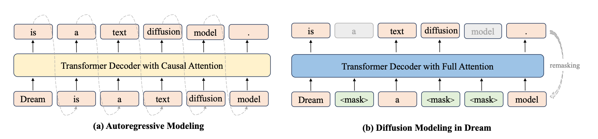
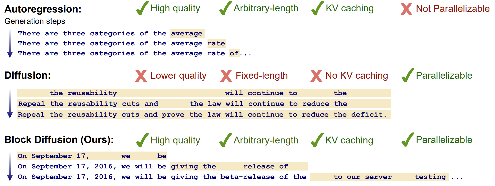
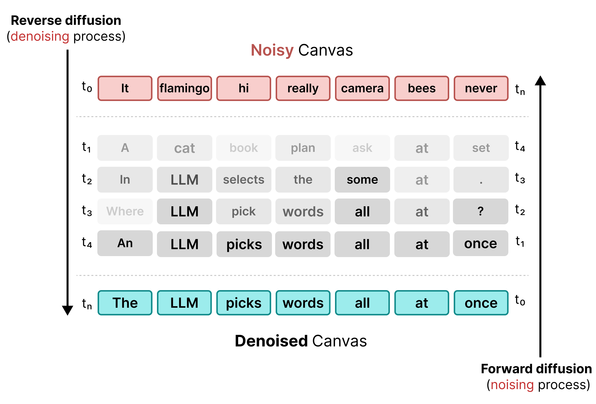

# DiffusionGemma까지 달려보기

## 논문

1. https://arxiv.org/abs/2406.07524
2. https://arxiv.org/abs/2406.04329
3. https://arxiv.org/abs/2502.09992
4. https://arxiv.org/abs/2508.15487
5. https://arxiv.org/abs/2503.09573

## 요약

### [1. Masked Diffusion LM (24.06)](https://arxiv.org/abs/2406.07524)

- Diffusion은 이미지에 주로 쓰다보니 가우시안 노이즈를 주기 쉬웠음 (픽셀은 연속값이니까.). 근데 LM에는 주기 힘듬
- 따라서, 2가지 방법이 존재했음. 하나는 Embedding에 noise주기, 하나는 Token에 Noise주기. Token을 단 랜덤 토큰으로 치환하던가 하다보니, Entropy(PPL)이 높아지는 문제가 발생함. (모델이 잘 못함)
- Diffusion은 크게 Loss가 3개인데(Recon + Diffusion + Prior), Noise를 [MASK]로 줬더니, Recon, Prior날라가고 Diffusion loss마저도 일반 CE Loss로 일반화됨.
- 즉, 앞으로 Diffusion LM은 [MASK]로 랜덤하게 주고 BERT맹키로 Masked LM으로 학습시킨다음에, 첫 시작때 전부 MASK주고 뺑뺑이 돌리다보면, 예측이 잘 될것!
  - **여기서 문제는 이미 예측된 문자열을 바꿀 수가 없으니**, 모델이 멍청하게 시작하면 문장이 반드시 고장남 -> 이후 DiffusionGemma에서 해당 문제를 개선함.
- 또한, Inference에서 긴 문장을 예측할때 예를 들어, 4개씩 계속 mask를 붙혀서 예측시키면, Multi Token Prediction처럼 Semi AR 처럼 예측 가능할 것! -> 이후에 Block Wise Inference에서 다룸.

### [2. Simplified and Generalized Masked Diffusion for Discrete Data (24.06)](https://arxiv.org/abs/2406.04329)

- 비슷한 시기에 나온 논문이지만 Google DeepMind에서 썼고, 대부분의 핵심골자는 거의 완전히 유사하다.
- 다만, 이쪽이 조금 더 수학적으로 LLM의 Diffusion이 왜 CE Loss에 근사하는지 더 구체적으로 작성되어있다. (Diffusion Gemma를 이해하기위해 이걸 다 증명하고있을 필요는 없다고 생각됨.)
- 중요한건 MDLM은 **Inference Sampling이 하이퍼파라미터로, 사람이 입력하지만, MD4는 이마저도 Scheduler로 고민을 했다는 큰 차이점**이 있다.
  - 한번에 많은 양을 선형적으로 증가하며 예측시키면 Conflict가 나니까, Cosine같이 점차적으로 문장이 완성되어감에 따라, 더 많은 토큰을 예측할 수 있도록 하는게 좋았다는 얘기
  - 그리고 time step역시 고민을 하는데, 그냥 균등하게 자르는게 제일 좋았다고함.
- MDLM은 모든 토큰이 균일한 가중치로 오픈되는데, **어떤 토큰은 우선순위가 더 높을 수도 있고, 이걸 학습으로 해결할 수 있다.**(다만 Gradient Graph가 깨지는 방법론이라, 굉장히 구현적으로 어려움....;;, 왜냐면 vocab에 해당하는 learnable w 1차원 행렬로 베르누이 분포로 뽑는데, 결국 w는 float라서, 이녀석이 0.0001올랐을때 샘플링된 결과는 어떻게 연속적으로 변할껀데? -> 이걸 계산할 수 없는 방식이라 미분 불가능함.)
- 이 논문은 **자연어 뿐만 아니라 모든걸 Discrete하게 해석할 수 있다고 주장**하며, 이미지를 Discrete하게 치환하여 했는데, 일반적인 이미지모델보다 성능이 훨씬 좋았다고함.
- 구현을 굉장히 유심히 해야함을 명시하는데, Categorical Sampling을 할때, Softmax를 사용하는데, JAX의 경우 Gumble Softmax를 사용하면서, 의도치 않은 Numerical Stablity에 의한 오차가 발생한다고함. (vLLM같은거 구현 잘못하면 모델 학습 잘해도 Inference에서 성능이 개 떨어져보일 수 있으니 조심하라고함.)

### [3. Large Language Diffusion Models (LLaDA) (25.02)](https://arxiv.org/abs/2502.09992)

- 세훈이가 리뷰했던 그 논문 (자세한건 노션 확인)
- 1,2번은 그냥 일반 Decoder에 대해 논하지만, 3번은 LLM식으로 SFT학습을 할 수 있다고 하는 것.
- 방식은 그냥 Input은 마스킹 안하고 Response에 대해서만 MDLM 공식을 적용하면 됨.
- 다만 특별한 점은, 여기는 Inference에서 토큰 N개를 예측하는 기준을, 일단 전체 토큰을 Inference한 다음, Token Prob이 낮은 하위 M개에 대해서 마스킹으로 두어, 다시 예측할 수 있도록 한다.
- 즉, 여기도 이미 뽑힌 토큰에 대해서 수정은 불가하며, 뽑히기 전에 단순히 확률이 상대적으로 낮은 토큰들은 패를 안까겠다는 전략.

### [4. Dream 7B: Diffusion Large Language Models (25.08)](https://arxiv.org/abs/2508.15487)

- LLaDA는 LLM을 Scratch부터 Pre Training해야하니 개빡세다!!! -> 그냥 AR모델 가져다가 Diffusion으로 마개조하면 안됨? -> 실제로 잘됨. (토큰 거의 4배 미만으로 씀)

- 다만 이 방식은, AR로 강하게 학습되어있으니까, Diffusion Model은 t 타임에 t를 예측하지만, Diffusion Concept을 따르되, t타임에 t+1을 예측하도록 학습시킨다. (Shifted Prediction; 말이 어렵지 그냥 label shift임)
- loss 설계도 좀 다른데, 근처에 토큰이 많이 열려있는 경우와 그렇지 않은 경우 난이도 차이가 있으니까, Context-Adaptive noise Rescheduling at Token-level(**CART**)로 보정을 시켜준다. 각 token별 label prob에 가중치를 주는 형태로 한다.

### [5. Block Diffusion: Interpolating Between Autoregressive and Diffusion Language Models (25.03)](https://arxiv.org/abs/2503.09573)

- Block을 걸어서 Block단위 Auto-Regressive하게 Diffusion을 진행하면, 앞 Block까지는 KV caching이 사용 가능하니까 개꿀이다. 단, Block을 잘게 넣으면 속도가 오래걸리는 문제가 발생.
- Diffusion 로직은 고정길이를 병렬로 처리하고 가장 처음 EOS에서 이후 문자열을 잘라내는 전략을 취하는데, Block Diffusion은 4개씩만하니까, 그 안에서 EOS가 나올때 완성문장으로 잘라낼 수 있고, 또한 최근 256 token chunk의 평균 entropy가 4보다 작으면, 생성을 중지하는 로직도 있다.

## [DiffusionGemma](https://ai.google.dev/gemma/docs/diffusiongemma/explained?hl=ko)

- Dream-7B는 Diffusion Style Further Pre-Training -> Diffusion Style SFT를 진행했는데, 얘는 어떻게 한건지 나와있지는 않음
- H100에서 초당 1000개 이상의 토큰 생성 (25.2B, MoE 3.8B)
- 생성 중에 텍스트를 평가하여, 실시간 오류 수정 가능
- Block Diffusion을 기초로 하며, 256 Token을 1 Block으로 처리함 (EOS여부로 다음 Canvas(Block) 진행 여부를 결정)
  - 한 Canvas가 종료되면 Block Diffusion과 동일하게 Causal Forward를 통한 KV Cache 수집
- 종료조건
  - Canvas의 엔트로피가 0.005보다 낮음
  - 두번 연속 argmax prediction이 동일함
  - Denoising step을 최대 수치까지 달성함

### Uniform State Diffusion

MDLM이 강력한 것은 맞다. 하지만 unmasked 되는 순간 이후에 바뀔 미래와 무관하게 고정된다. 즉 오히려 발목을 잡을 수도 있다는 사실. 그래서 최근 연구에는 옛날방식인 mask가 아닌 일반 랜덤 토큰에서 시작하는 쪽이 따로 있다. 논문들을 찾아봐도 MDLM이 강력해서 아직도 비교대상으로 사용되는 것은 사실이다...

26년 5월에는 이런 논문도 나왔다. https://arxiv.org/abs/2605.22765 Uniform Diffusion 모델의 Objective는 사실, CE와는 조금 다르다는 해석이다.

일단은 Diffusion Gemma는 각 토큰의 엔트로피 기준 특정 값 이하인 경우에만 선택하는데 일단 감마세팅은 0.1이다.
근데 한번 선택되었더라도, 고정되는 것은 아니고, 다른 토큰들이 예측되므로써, 현재 토큰의 엔트로피가 낮아진다면, 다시 noise주고 출력시킨다.

이러면 풍선효과처럼 한쪽 누르면 다른 한쪽 올라오면서 절대 안끝나는거아냐? 이런 의심을 할 수 있는데,
그래도, softmax temperature를 처음에는 높다가 점점 낮아지게 줘서, 엥간하면 첨예하게 선택 가능하도록 처리한다.
그리고 1Block이 entropy 0.005보다 작은 조건을 만족해도 종료되며, 그렇지 못하다면 Diffusion Step의 Max가 있으니까 그 중 하나에는 걸려서 종료되게 된다.

### Self-Conditioning

- Step1 -> Step2로 가는 상황을 상상해보자.
- Prompt는 이미 KV Cache 되어 있을 것이고, Step1에서 [MASK], [MASK], cat, [MASK]로 결정되었다고 가정하자.
- 물론 loss를 이용해서 다음 Token이 어떨지 역전파는 줬겠다만.... 고작 스칼라 값 하나로 다음 Step에 얼마나 많은 도움을 줄 수 있을까?
- 거기다 지금 모델은 cat으로 확정된 상황마저도 바뀔 수 있는 모델이며, 심지어 [MASK]도 아니고 일반 토큰으로 noise되어있다.
- Step1의 output을 Step2의 Denoising 과정에서 도움되도록 사용할 수 있을까?
- 우리는 Step1의 Prob은 알고 있을 수 있다. 예를 들어, 2번 Seq Index가 cat:0.5, dog:0.4, fox:0.1 라고 가정. -> 그래서 cat이 결정되었다.
- vocab 개수가 10이라면, step1의 token prob은 4x10으로 나올 것이다. (Index 2번에는 0.5, 0.4, 0.1 등등이 들어있을 것)
- embedding weight는 10 x hidden_size로 나온다.
- 두개를 행렬곱해버리면, 마치 확률분포로 weighted된 embedding lookup을 하는것과 비슷하게 Seq_2=0.5E[cat]+0.4E[dog]+0.1E[fox]+⋯ 이런 느낌쓰를 낼 수 있겠지? (상대적으로 cat과 유사한 )
- 그 값(self-conditioning된 값)을 Step2를 Denoise하기 위한 Embedding projection에 더해버린다.
- 이렇게되면 기대되는 효과는 weighted lookup된 값이 들어가니까, 이전에 cat으로 선택된 seq_2는 cat에 대한 신호 혹은 cat이나 dog과 같은 적어도 동물인가보다... 하는 등의 condition이 추가되면서 좀 더 안정적으로 step2 denoising을 할 수 있다는 장점이 있다는 것이다. (예를들어, E[왕] - E[남자] + E[여자] = E[여왕]. 이런 계산을 본적이 있는가? 그 것과 정확히 비슷하게 동작하는 것을 기대하는거다.)

하나는 알고 둘은 몰랐다고, token_prob을 이렇게 활용하는건 좀 신기했다. 실제로 이 구간때문에 USDM(Uniform State Diffusion Model)의 형태를 가져도 잘 되는게 아닌가? 하는 생각이 든다.

## 결론

- 실제로 벤치마크를 보면 아직은 Diffusion Model이 AR을 따라가기엔 좀 한참 멀어보인다.
- 하지만 DeepMind에서 제시하는 것은, Full Attention과 AR의 느낌을 동시에 가져갈 수 있어서, 이 것에 특화된 Task에서만큼은 또 AR보다 잘한다고 한다.
  - 예시를 스도쿠로 들었는데, 스도쿠 말고도 이미지와 같은 상하좌우 근접 데이터를 봐야 하는 경우가 대표적이겠다.
- 실제 사용 후기로도, 성능이 조금 조악해도 속도가 너무 중요한 경우라면 메리트가 있을거같다는 얘기가 있었다.
- 계속 다양한 고도화 방법론들이 제시되다보면, AR과 근사한 무언가가 나올수도 있지 않을까 기대가 된다.

