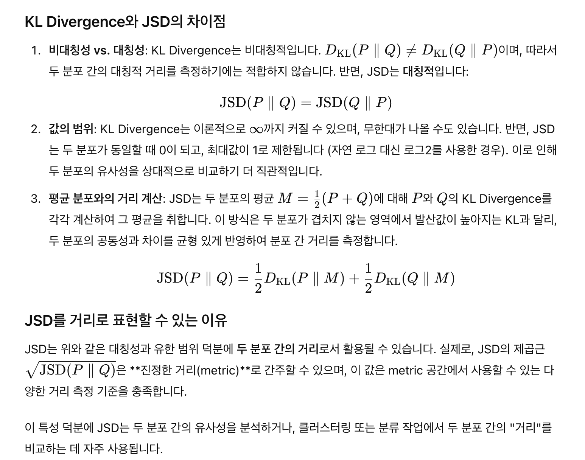
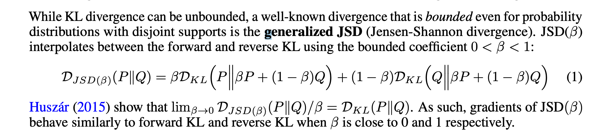
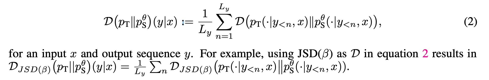
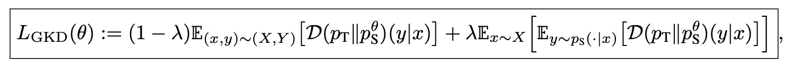
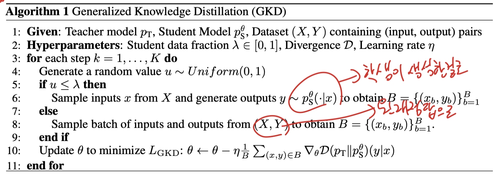

# On-Policy Distillation Of Language Models: Learning From Self-Generated Mistakes

## 논문

https://arxiv.org/abs/2306.13649

## 요약

### 기존의 한계

- LLM은 커서 학생이 선생을 곧 죽어도 못따라갈 수 있음 (내가 과거에 실패했던게 이거때문인거 같았음...젠장!)
- 고정된 데이터로 학습해야하나, LLM Style 스럽지 않음.
  - LLM은 템퍼러쳐등으로 매번 샘플링되어 새로운 문장을 만드는데, 정작 학습은 고정된 데이터로 하는게 불합리하다는 의미 아닐까 싶다.

### 간단한 제안책

- 이 방식은 대화형 전문가를 모방하는 학습으로 볼 수 있다. (이런 당연한걸 전제로..?)

  - 교사의 output을 전문가 레이블이라고 생각하고 고정된 출력 시퀀스가 아닌 자체 생성된 시퀀스처럼 학생을 훈련시킨다.

    고전의 Distill Learning은, 교사와 학생의 분포만 조지고, 실제 레이블은 학생과 레이블의 Cross-Entropy만 본다. 따라서, 아마 해당 학습은 마치 DPO처럼 교사의 Output을 Win으로 보겠다는 것과 흡사하지 않을까?

### 2. Preliminaries

알파이자 오메가: Jensen-Shannon Divergence (JSD)

아.. 이걸 왜 모르고 있었을까...!

나는 크게 KLD와 Reverse-KLD로 학습을 주로 하려고 했었다. -> 실패함.

실제로 WandB가 남아있진 않으나, 학습을 해보면, 전~~~~~혀 수렴하지 못하거나, 이상하게 빨리 수렴하는 듯한 모습을 볼 수 있다. -> 이상하게 빨리 수렴하는경우에는 찍어보면 완전히 모델이 망가짐.

그래서 느낀게, 분포의 차이가 너무 커서 따라가지도 못하던가, 그냥 어디 한곳 안에만 있으면 되니까 호다닥 들어가서 학습을 끝내버리는구나! 라고 느꼈고, 이걸 최대한 완화하고 싶어서 ReverseKLD에 temperature를 강하게 썼었다. -> 발산하는 느낌의 학습이 되어버림 (같은말 반복하고 이상해짐)

그래서 뭔가 뭔가 이 한곳으로 분포를 쳐박아버리는 현상만 해결하면 학습이 잘 될거 같은데....라는 생각을 했는데, 생각해보면 이게 KLD의 비대칭성을 각 한켠만 보고 학습시키려고 노력했기때문에 학습이 잘 되지 않았었나 싶다. (loss를 KLD+ReverseKLD+Student CE로 해볼껄...!!)

여기서는 비슷한 방식으로 JSD를 사용하는데, 이게 사실상 두 분포간의 평균오차를 구하는 수식이라 정말 심플하게 두 분포의 차이를 대칭적으로 구할 수 있게 해준다.

그리고 재밌는점은 베타를 사용하여, loss Function의 유연성또한 제공한다.

베타에 아주 작은값 이나 거의 1과 같은값을 넣어보면, P의 입장에서 바라보거나(Forward), Q의 입장에서 바라보게되므로(Reverse) JSD의 그라디언트는, `behave similary`하게 된다고 표현하였다. (이걸 이해하려면, Taylor expansion or first-order 근사를 이해해야함)

일단은 나도 Reverse-KLD+Student CE 혹은 KLD+Student CE를 했었을때, 잘 안됐는데, 위에 내용대로면 뭔가 KLD나 ReverseKLD로도 충분히 수렴시킬 수 있다는 얘기처럼 들리는데, 이후의 내용을 더 살펴보도록 하자. (내가 잘못한게 아니겠지?)

### 3. Distillation For Auto-Regressive Sequence Models

#### 문제의 정의

일단 학습가능한 학생, Freeze한 선생

학생은 선생의 출력을 따라하길 기대하며, 그 분포는 JSD로 최적화한다.

#### 3.1 Generalized Knowledge Distillation (GKD)

대뜸, 일반적인 KD 접근방식은 고정된 label을 사용하고, 그래서 Train-Inference 추론 분포가 맞지 않는다고 한다.

(기존의 모델이 학습된 분포와도 unseen label은 차이가 상당히 있을것이고, + 70B등의 엄청 똑똑한 모델의 Output과 분포를 맞추라고 강제하면, student에게 어려운 task일수밖에 없게 느껴지긴함)

**Imitation Learning(IL)**을 제안하는데, 이건 이전에도 있었던 내용으로, 학생의 출력을 모아서, 학생 출력을 전문가가 보정하고, 그걸 Label로 삼아 학습하는 방식을 일컫는다고한다.

이것은 학생이 틀린 토큰에 대해 피드백을 받을 수 있고, 결과적으로 전문가를 따라가게 만들면서도 학생의 오차도 줄일 수 있는 방식이라고 한다.

학생이 학습이 잘 진행된다면, label의 퀄리티가 점점 더 올라가는 효과도 기대할 수 있다.

**GKD는 교사 모델이 생성했거나, 정답 데이터인 고정된 데이터셋 label을 학생 모델이 생성한 시퀀스로 대체하여 사용하는 방식이다.**

앞에 항은 X,Y를 사용한다. (실제 label), 뒤에 항은 student의 output을 Label로 사용한다는 의미로, X만 존재해도 된다.

정확히는 배치에 일부데이터는 (1-람다), 일부데이터는 람다로 되어야하는데, 실제 코드 구현에서는 한배치 전체를 사용한다.

위에 슈도코드대로 코드가 작성되어있음.

##### Remark.

SFT모델에 RLHF를 하듯이 online RL fine-tuning 감성으로 학습한다. SFT를 학습시킬수있지만, DPO를 대체하는 감성이 되는 것이다. JSD를 사용하는 이유는, forward KL은 전부를 카바해야 loss가 낮아지니, 다 평탄해져서 할루시네이션이 많이 나오는 모델이 나오고, reverse KL만 쓰면, 한쪽에만 치우쳐서 특정 능력을 크게 잃는다고 한다.

#### 3.2 RL FINE-TUNING + ON-POLICY GKD

RL objective와 혼합해서 사용할 수 있고, 이렇게되면 정렬을 다시 맞추다가 손해보는 부분도 감소될 수 있어서 좋다고한다. 하지만 구현체가 없으므로 이부분은 생략

### 4. Experiments

요약, 번역, 산술근거, 인스트럭트 튜닝에 대해서, 실험을 진행하는데, 당연히 GKD가 더 잘된다.

다른 증류학습 방식보다 훨씬 잘된다. JSD 0.9는 거의 포워드만 쓰는건데, 전체적인 성능이 조금 떨어지는 경향이 있다. (아마도 teacher 따라가기 급급하다가 원래 잘하던 능력도 잃어버린듯)

### Conclusion

GKD는 단순히 증류학습 뿐만아니라 강화학습에서도 좋은 효과를 보일 수 있는 기술이다.

현재 논문을 기준으로 더 많은 확장이 있기를 기대한다.

## 마치며

좋은 방법이긴한데, DeepSeek GRPO와 비슷한 시점에 공개되어 완전 묻혀버렸다.

실제로 TRL에 코드가 있으나, logits를 써야하고, 그래서 vllm같은걸 쓸 수 없고, Deepspeed를 쓴다면 inference도 좀 골치아파질 수 있다. 그래서 불필요하게 Deepspeed 클래스를 벗겼다 씌웠다 하면서 엄청 비효율적으로한다. 즉, 증류학습은 GPU 효율화가 핵심인데, 그게 제대로 안되어있어서 선택가능한 모델의 사이즈가 매우 제약되는 단점이 있다. (FSDP도 제대로 구현이 안되어있었음.)

유용한거같긴한데, 포맷이 특정되어야하거나, 매우 도메인에 특화된 경우 큰 사이즈 모델도 잘 못할 수 있어서, 사용하기 애매한 기술일 수도 있다. (일반적인 robust한 모델을 만든다고하면 유용할듯.)

펑션콜링 학습에나 써볼까 싶기도하고...
