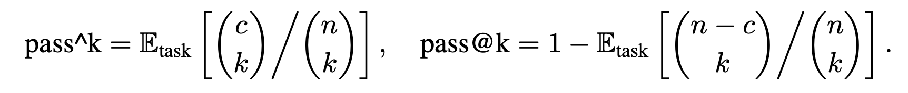
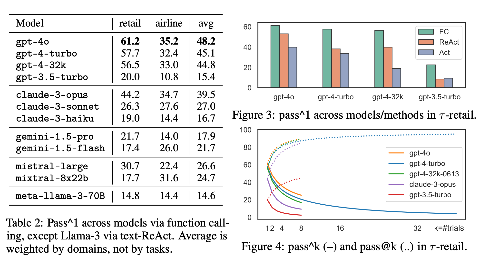
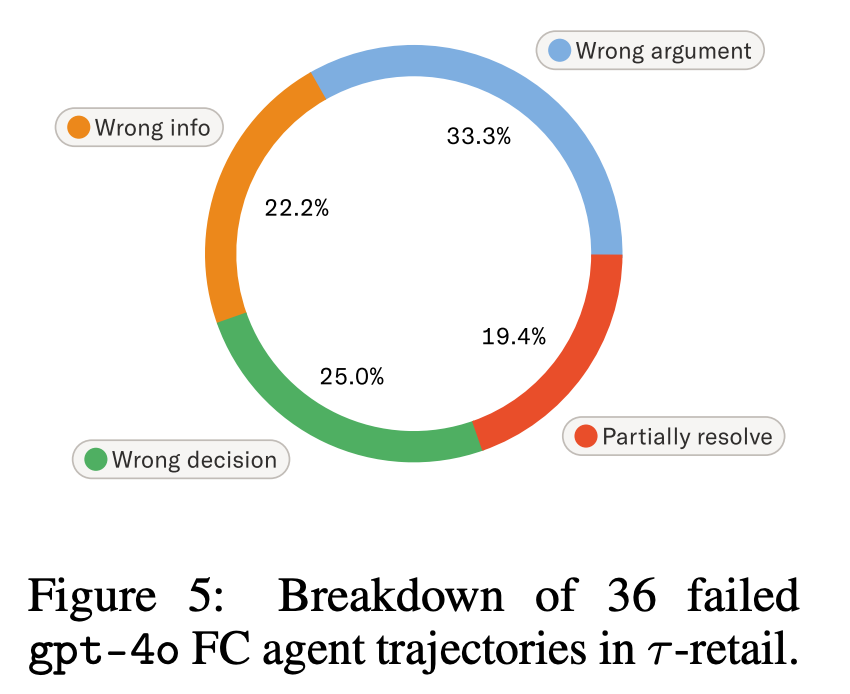

# τ -bench: A Benchmark for Tool-Agent-User Interaction in Real-World Domains

## 논문

https://arxiv.org/abs/2406.12045

## 요약

### 기존의 한계

- 기존의 벤치마크들은 인간과 에이전트간의 상호작용을 측정하지 않음 (턴이 짧은듯)
- 기존의 벤치마크들은 도메인별 규칙에 의거한 평가 지표가 없음
- 문제는 gpt-4o조차도 전체 작업에 50%미만만 성공하고, 일관성 또한 낮게 측정된다는게 문제긴함 (여러번 시도해도 동일한 결과가 나와야 하나 pass^8기준 25%미만으로 측정됨.)

### 3. τ -bench: A benchmark for Tool-Agent-User Interaction

1. 데이터베이스가 있어야함. (기존 계약정보 같은거)
2. API Tool을 정의하고 개발하여야함
3. 도메인 규칙에 대해 정의되어있어야함
4. User의 지시와 예상되는 action 및 결과 substring이 있어야함 (평가를 위한 Label) 그리고 이거로 LLM을 이용하여 user인것처럼 데이터를 증강시킴 (gpt-4-0613 사용)

##### 평가는 2진 평가를 진행함.

맨 마지막 호출은 가급적 DB를 변화시키는 instruction으로 종료되게 세팅하여야함

=> 당연한 이야기처럼 들리는게, 당연히 가입, 구매, 예약, 수정, 취소 등 최종적으론 DB수정이 이루어질것 같음

**최종 Calling으로만 평가하며, (함수와 아규먼트를 잘 입력하였는지 and 결과에 대한 답변에 펑션 결과를 잘 뱉었는지 substring조사) 로 0,1 이진 평가를 진행함**

##### Pass^k metric

코드같은 벤치에서 pass@k라고 있는데, k번 시도해서 몇번 성공하냐임

real-world 에이전트는 같은 요청에 대해서는 같은 신뢰도있는 답변을 계속 제공하는게 더 중요함.

따라서, pass^k를 제안함. 이것은 k번 시도했을때 k번 성공해야 성공으로 쳐줌.

n번시도, c번 성공임.

n=10, c=6일때, pass^3는

6개중에 3개를 고르는 경우의 수 6! / ( 3! * ( 6 - 3 )!) = 20 

10개중에 3개를 고르는 경우의 수 = 120

20/120 =0.167 (참고로 pass@3은 0.9667이됨)

1번 시도해서 성공했는가? (pass^1), 1번중에 하나라도 성공했는가? (pass@1)가 동일하기때문에, 논문에서는 그냥 이거로 보고해도 나쁘지 않겠다고 정의함.

### 4. Benchmark Construction

다음과 같은 구성요소로 되어있다.

1. 다양한 도메인
2. Json파일로 된 도메인 특화 데이터베이스
3. 데이터베이스를 다루는 python code
4. 전체적인 설명 (펑션, DB 설명 등을 의미하는듯)
5. 도메인 정책
6. 작업요소

각 도메인은 3-스테이지로 구성된다.

##### 1. 데이터 스키마, APIs, 정책들의 수기 설계

실제 사례를 좀 단순화해서 가장 단순한 형태의 데이터베이스 스키마, API, 정책을 공동 설계하는것부터 시작한다.

논리적 일관성과 수기작업의 용이성을 고려하면 단순성이 매우 중요하다.

이는 현실과 괴리가 있을 수 있고, 충분히 도전적인 과제가 될 수 있다.

tool 함수 정의하는건 좋은데 여기선 펑션의  `__info__`에 function description을 정의하는게 좀 인상깊었다. (논문 14페이지 참고)

정책 정의가 되게 긴데, 할 수 있는 모든 행위에 대한 상세 정책을 다 우겨넣어서 좀 길게 느껴진다.

##### 2. LM들을 이용한 자동 데이터 생성

(참고로 여기서 말하는 데이터 생성은 DB에 들어갈 가라 데이터와, 해당 데이터를 수정할 수 있는 python 코드를 의미하는 것 같다. 깃에 데이터 제너레이션 코드를 공개해놨다고함.)

예시 항목을 만들고, gpt-4를 이용하여 확장 가능한 데이터 항목을 생성할 수 있는 체계적인 코드 스니펫을 작성한다.

코드에 존재하는 사소한 버그들은 수작업으로 수정한다.

=> GPT로 데이터를 만들라는게 아니고, 랜덤샘플링을 이용한 분포기반의 가라유저, 가라상품을 만드는 코드를 작성하게 시키라는 말임

##### 3. agent를 실행하여 수작업 labeling 및 검증

초기 사용자 지침을 작성한 다음, gpt-4-turbo를 이용해서 전체 시나리오를 작성하고 다듬는 작업을 한다.

이때 사용자의 LLM은 temperature 1.0, 에이전트 역할의 LLM은 temperature 0.0이다.

최종 결과 도달까지의 경로는 사용자마다 다를 수 있기 때문에 gpt를 사용하는게 더 편리하다. (논문에서는 각각의 task에 40회초과로 돌려가면서 모든 task중 성공률이 낮거나 0인 task들은 직접 점검했다고함)

Label을 작성할때, assistant의 행동과 출력을 복사,수정하면 좀 더 쉽게 진행할 수 있다.

#### 4.1 Domains

유통과 항공이 제품, 가격, 항공편과 같은걸 쉽게 합성할수있고, 정책도 제품 반품, 수하물 허용량 등 '상식'에 기반한 정책을 설정할 수 있기 때문이다. (우리가 풀려고 하는 문제는 '상식'기반으로 접근 가능한가? )

**타우-리테일**

새로운 주문을 하는 것은 없음. (주문 취소, 수정, 반품, 교환, 사용자 정보 수정)

보류 중인 주문은 한 번만 취소 혹은 수정이 가능함. 배송 완료된 주문은 당연히 한번만 반품하거나 교환할 수 있어야함. (당연한 반례를 놓치지 않아야 할듯함)

항목은 당연히 바꿀 수 없는 값임 (스테인리스 물병 A의 재질을 유저가 플라스틱으로 변경할 수 없음 -> 최고가입한도 등을 바꿔달라고 하는 요청이 있을 수 있을까?)

**타우-에어라인**

여기선 새로운 예약을 만들 수 있음. 또한, 수정, 취소, 환불을 지원해야함.

20개 미국 도시간에 300개의 항공편을 구성하고, 비행 시간과 가격이 설정되어있음, 직항 및 경유 항공편등 타우-리테일보다 훨씬 복잡하고 결제 수단 조합, 위탁 수하물 허용량, 항공편 변경에 대한 정책 등 다양한 특수 제약또한 존재함. 또한 이런 제약은 회사 내부의 회원 등급이나 객실 클라스에 따라 달라질수도 있어, 복잡한 다단계추론을 요구하는 Task임

#### 4.2 Key Chracteristics

도메인의 데이터 스키마, API, 규칙은 실제 도메인에 비해 단순화 되었지만, 매우 다양하고 개방적인 풍부한 세트들을 포용할 수있다는 장점이 있음.

신중하게 labeling을 하는 덕분에 평가는 신뢰성 높고 믿고 돌릴 수 있다.

### 5. Experiments

최대 턴수는 30회로 제한(유저 인풋 포함)

Table 2를 보면, gpt-4o 마저도 리테일에 61.2, 에어라인에 35.2 수준임. 그 외에는 다 고만고만함.

Figure 3을 보면, 펑션콜링을 하는게 텍스트 포맷 기반 에이전트보다 훨씬 잘되고, 추론 과정이 추가되면 그나마 나음. `<think>`도 추가해서 해봤지만 미미했음.

Figure 4를 보면, 반복해서 시도할수록 성공횟수가 점점 줄어드는 경향이 있음. 강건성있는 결과를 받을 수 있도록 모델을 만드는게 중요함.

**1개나 그 이상의 아규먼트를 틀려먹는(Wrong argument):** 없는 사용자나 제품을 사용하거나함.

**요청한 정보를 잘못 제공한 경우 (Wrong info):** 계산을 틀려먹거나, 송장번호 달라그랬는데 안줬거나하는 오류. 

이 두개가 합쳐서 절반을 조금 넘는데, 모델의 전체적인 일반 상식과 수학적 추론 능력 향상이 필요함을 시사한다.

위에 2개 사례는 정책이랑 상관없이 그냥 틀리는거고, **Wrong decision**은 **도메인 특화 지식이나 규칙을 잘 몰라서 잘못된 tool call을 했을때 발생**한다. **예를 들어, 주문 교환 또는 수정은 한 번만 호출할 수 있는데, 사용자가 "몇 개의 항목"을 수정하고 싶다고하면, 각 항목당 한번씩 수행해주면되나, 여러번의 수정호출로 인식되어 수정이 불가한 케이스이다.**

실제로 도메인 정책을 '소거'하는 방향으로 실험을 해봤을때, 리테일은 성능 감소 폭이 아주 작았다(-4~5%). 즉 정책을 거의 활용하지 않는다는 의미이다.

좀 더 복잡한 정책인 에어라인에서는 gpt-4o는 매우 크게 감소(-22.4%)했는데, gpt-3.5-turbo는 감소폭이 크지 않았다(-1.2%).

모델에 따라서도 정책을 그나마라도 알아먹는 모델과 그렇지 않은게 있다는 의미.

이런경우는 파인튜닝이나 에이전트 코드 스캐폴딩 기법으로 완화할 수 있지 않을까 생각한다.

**Partially resolve**는 턴 수가 길어질수록 이전 정책이나 사용자의 조건을 누락시키는 경우가 발생한 것이다. 모델이 더 long-context나 memory 능력을 강화해야함을 시사한다. 또는, 사용자가 '모든' 주문의 주소를 수정하고자하나, 에이전트가 1개의 주문만 처리해주는 암묵적인 액션 누락도 포함한다.

### 6. Discussion

논문 저자들이 생각하는 아쉬운부분

1. 유저는 오타를 낼 수도 있다. 이런 부분도 반영이 될까?
2. 실제로 직원마저도 도메인 지식이 적어서 실수를 하는데.... agent가 실수하면 이건 무조건 안된다? 흠...
3. 당장에 가장 좋다고 생각하는 LLM마저도 추론, 계산, 장기 문맥 기억, 정책 프롬프트 정렬에서는 부족한 성능을 보임을 이해하여야한다.

이거 생각보다 labeling이 오래걸리고 힘들다. LLM으로 평가할 수 있지는 않을까?

**Agent의 도전과제**

Agent는 현실 세계 응용을 신뢰성있게 수행하기에는 아직 일관성과 정책준수에 대한 부분이 미흡하다.

이런 부분을 해결하려면, real-world task를 자동화하고, human-in-the-loop interaction을 통해 개선할 수 있다. (내 생각에, 어떤 펑션들은 좀 바꿔서 LLM의 정책 부하를 감소시키고, 실제 직원이 뭔가 과정에 참여해서 줄여야하지 않겠냐는것으로 해석된다.)

구체적으로 Agent가 개선해야될 능력은 장기기억능력과 의사결정 시 올바른 정보를 맥락에서 파악하는 능력 (특히 상충하는게 있을때)으로 보인다. 