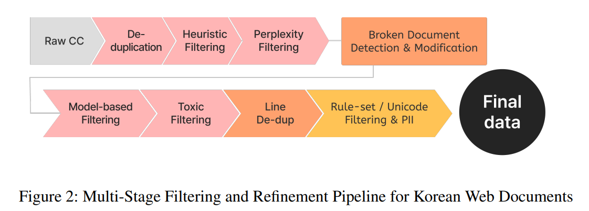
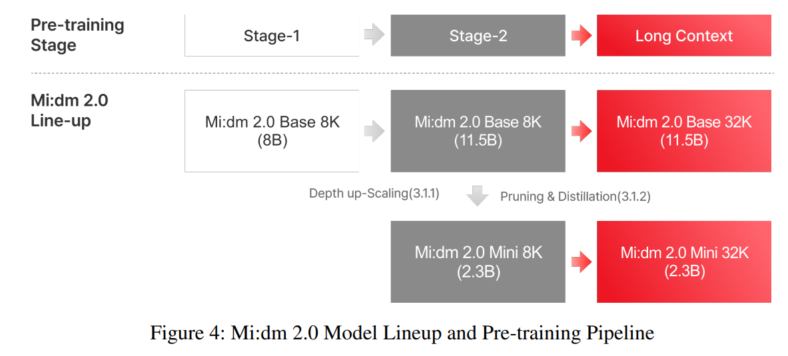

# Mi:dm 2.0 Korea-centric Bilingual Language Models

## 논문

https://arxiv.org/abs/2601.09066

## 요약

### 기존의 한계

- 한국어 데이터는 일단 구하기가 어렵다.
- 문맥적 일관성이 있고, 가독성이 높으며, 유해성이 없고, 형식적으로 잘 구성된 문서를 사용해야하는데!
- 고품질의 데이터를 솎아내고, 효과적으로 모델을 학습시키는 방법론에 대해서 다룬다.

### 2. Data

- 언어, 도메인차원, 데이터 출처, 합성데이터여부, 언어적 문체 어조로해서 최대 5개의 분류속성 태깅을 한다.

이전에는 Instruct Set을 만들때, 개떡같은 질문을 찰떡같이 알아듣는 모델로 만들기 위해, 질문은 조금 엉망으로 번역되어있더라도, 답변은 반드시 좋은 품질로 번역된 데이터를 써서 좋은 성과를 낸 적이 있는데, 이와 같은 경우라면 번역도 굉장히 좋은 품질로 되어야할 것 같다.

합성데이터가 14%밖에 되지 않는다는게 대단한 것 같다.

- 일관성 있는 데이터로 필터링한다.
- 부족한 데이터를 데이터 품질로 해결하기위해 노이즈나 가독성이 떨어지는 등 안좋은 데이터를 선별 제거하는데 큰 공을 들인 느낌

1. **문서 중복 제거(Document De-duplication)**: TF-IDF 벡터 간 코사인 유사도를 기준으로 중복 문서를 제거합니다.

2. **휴리스틱 필터링(Heuristic Filtering)**: 선행 연구[3]를 참고하여 수작업으로 설계한 규칙을 적용하고, 해시태그, 과도한 말줄임표 또는 비정상적인 문장부호가 포함된 문서를 걸러냅니다.

3. **퍼플렉서티 필터링(Perplexity Filtering)**: 비정상적인 n-그램 퍼플렉서티를 나타내는 문서를 품질이 낮거나 문맥적 일관성이 부족한 것으로 판단하여 제거합니다.

4. **손상 문서 탐지 및 수정(Broken Document Detection and Correction)**: 유니코드 손상과 깨진 문자 시퀀스를 탐지하고 수정합니다.

5. **모델 기반 품질 필터링(Model-Based Quality Filtering)**: 고품질 문서와 저품질 문서에 대한 주석 데이터를 활용하여 이진 분류기 앙상블을 학습합니다. 이 앙상블은 일반적인 품질 기준으로 학습한 분류기와 선행 연구[12, 13]를 참고한 교육적 품질 기준으로 학습한 분류기로 구성됩니다.

6. **유해 콘텐츠 필터링(Toxic Content Filtering)**: KT가 자체 개발한 한국어 유해성 및 편향 분류 체계를 기반으로 학습한 이진 분류기를 사용하여 유해하거나 공격적인 콘텐츠를 제거합니다.

7. **문장 단위 중복 제거(Line-Level De-duplication)**: 문서 내부에서 반복되는 줄이나 문단을 제거하여 중복성을 줄입니다.

8. **최종 규칙 기반 정제 및 개인 식별 정보 익명화(Final Rule-Based Refinement and PII Anonymization)**: 한국어 특화 형식 오류를 수정하고, 보이지 않는 유니코드 토큰을 정규화하며, 탐지된 개인정보를 제거하거나 익명화하는 최종 정제 과정을 수행합니다.

합성데이터는 교과서 형식의 설명문, 논리적으로 구조화된 추론 과정 등을 다룬다고 하는데.... 어떻게 만들었을지? LLM에 그냥 프롬프트 주고 시켰거나, 어떤 구조화된 템플릿을 돌려쓰는 형태이지 않을까 싶은데...

웹 도큐먼트 크롤링의 경우 품질이 낮지만 데이터는 많아서, 일단 많이 날라가긴하는데, 그중 일부는 재활용 가능해보여서 재활용을 한다. 프롬프트를 이용해서, 중심 주제와 인덱스를 가진 메타 데이터를 추출하고, 해당 내용으로 발췌해서 재작성된 문서를 새로 만든다. (주제와 내용이 일치하는 꽤 괜찮은 것이 나올 것 같음.)

영어 지문을 한국어 화법 및 작문으로 틀어서 자연스러운 한국어 문제로 확장될 수 있도록 처리함.

### 3. Pre-training

#### 3.1.1 Depth Up-Scaling

계층 입력 전,후의 코사인 유사도를 이용하여 코사인 유사도가 높으면 입력정보를 잘 유지한다고 가정하고 복사 대상으로 선택.

7~29까지가 안정적이었다. 이 구간을 복사해서 늘린듯.

#### 3.1.2 Pruning, Distillation

width pruning을 하고 Distillation한다고 하는데, silu activation output에서 0에 가까운 힘없는 output을 만드는 weight를 프루닝하고, 증류학습하지 않았을까하는데, 조금 불안정한 상태로 답변따라하게하면 잘 못할수도 있으니까 logits base로 KLD하지 않았을까 싶기도하고...(이정도 작은 모델들은 2개 띄워도 A100 8장에서도 뜰거같아서...; 물론 GPU더 많이 썼겠지만...)

#### 3.1.3 Long-Context Extension

RoPE세팅으로 32K로 늘리는걸 목표로 65K까지의 데이터로 학습을 시키고, 짧은건 패킹시켜서 학습시켰다고한다. (그냥 붙혀서 학습시킨듯)

### 4. Post-Training

영어와 한글, 그리고 번역에 해당하는 다양한 데이터 종류를 비율로 섞어서 학습하고, Merge를 적극적으로 활용한 것으로 보인다. safety에 집중해서 dpo를 추가로 학습시킨거같다.

#### 4.3.1 General Chat

멀티턴에 대해서는, 각 턴의 코사인유사도 평균을 썼을까? 전체로 하면 뭔가 대화가 중간에 바뀌는 그런 케이스에 대해서는 잘 안됐을거같은데...

#### 4.3.2 Instruction-Following

응답 쌍 구성한 부분이 공감이 되는게 이전에, SFT한 모델이 내뱉은 출력을 reject로, GPT-4가 뱉은 응답을 Chosen으로 해서 DPO를 성공시킨적이 있는데 비슷한 컨셉으로 학습시킨 것 같다.

#### 4.3.3 Reasoning

뭔가 reasoning인데, OpenThoughts에서 검증된 q,r,a에서, r만 빼고 학습시켰다는거같은데, reasoning의 trajectory는 그냥 답을 맞추면 괜찮다고생각하고, SFT가 아닌 GRPO형태의 학습을 진행한걸까? 흠...

#### 4.3.5 Tool Use

Multi-turn Dialogue Generation에서 마치 한대화를 풀로 생성하는것처럼 느껴지는데, 이전에 삼성리서치 논문에서도 한번에 생성한다고 봤던것같아서, 롤플레잉하듯 생성하는건 별로 안좋아서 안쓰는건가? 하는 생각이 들게한다.

#### 4.3.6 Safety

RL Based로 한게 성능이 엄청 좋았다고한다. 실제로 SFT에서는 극소량만 넣고, RL을 돌리는게 더 좋았던 경험이 있다.

#### 4.3.7 Long Context

설명은 RAG관련 데이터만 되어있는거같다. 사전학습때 사용된 긴 문서에서 토큰길이와 청크위치를 적절히 분배해서, 긴 문서에 어느구간에 데이터가 있어도 잘 찾아내도록 학습을 유도한 것 같다.

## 마치며

데이터의 중요도가 다시금 강조되는 논문이었다. 또 그런의미에서 굉장히 지난한 작업들이 필요로 할 수 있을 것 같아서, 개인이나 2~3명이 만들기는 더욱 어려워지지 않았나... 이런 생각도 들었다.
