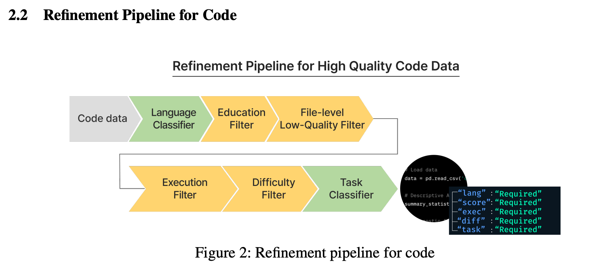

# Mi:dm K 2.5 Pro

## 논문

https://arxiv.org/abs/2603.18788

## 요약

### 2. Data

- 한국어 말뭉치를 추가로 습득함
- 다국어 데이터는 한국어 기준 3~10%정도. 번역 데이터셋도 구축해서 교차언어 정렬을 촉진함
- STEM, 코드, 에이전트 데이터는 상업적 라이센스 계약과 파트너십 등을 통해 추가로 확보 (이래서 공개가 안된지도...?)

#### 코드데이터

프로그래밍 언어 식별 -> 교육적 적합성 및 품질 기준 평가 -> 소스 및 파일 수준의 오류 데이터 제거 -> 실행가능성 필터링 -> 난이도 라벨링 -> Task 분류

로 하고, 구조화된 메타데이터를 부여해서, 다단계 학습 과정에서 활용한다. (데이터 혼합 스케쥴; 커리큘럼 러닝했나?)

**프로그래밍 언어 식별**
프로그래밍 언어는 markdown 형태를 먼저 따거나, 혹은 분류기를 만들어서 분류한다. 명확하게 분류 가능한건 분류하고 아니면 other로 다 뺀 모양

**교육 적합성 점수 필터**
말그대로 모델 교육에 쓸만한 자료인가를 판단하는거같다. 너무 일부분만 있거나, 제대로 실행되지 않는 코드들을 1차적으로 필터링하는 것 같음.

**소스 및 파일 수준의 오류 데이터 제거**
동일 파일 내 제대로 동작되는 코드라인이 많거나, 혹은 자연어 처리가 많아서 코드는 사실 몇줄 안되거나, 관련없는 함수들이 섞여서 샘플을 명확하게 정의하기 어려운 저품질 데이터 제거

**실행가능성 필터링**
실제로 실행 되는 코드인지 판단하는 것 같음.

**난이도 라벨링**
알고리즘 기준으로 카테고리를 나눠서 난이도를 산정한다.

**Task 분류**
각 코드별 과업을 명확하게 정리해서 이 카테고리별로도 데이터 관리를 해야 고품질을 얻어낼 수 있다.

여기서 얻어진 메타데이터들을 전부 저장하여, 학습 단계별 샘플링 비율 조정이나 데이터 분포 균형제어에 사용된다.

#### 수학 데이터

수학은 개념은 쉬워보여도 그 개념을 위한 연관된 지식이 어렵다면 추론과정에서 어려워질 수 있어서, 표면적인 큐레이션으로는 판단하기 어렵다.

미국 교육과정을 참고해서 구성되었다고한다. (난이도 구성)

수학도 종류별 난이도로 보면, 초~고등학교에서 다루는 내용들이 현저히 많고, 대학교 이상에서 다루는 복잡한 데이터는 많이 없어서, GSM8K같은거에서 초반에 빠르게 상승하다가 정체되는 이유가 거기에 있을 수도 있다고 시사한다.

Imbalance 데이터는 합성을 통해 생성하는데, 핵심 개념을 조건으로 추론 깊이를 통제하면서 생성함.

#### 다차원적 기준과 상호의존성

정량적, 정성적, 유용성을 생각해서 판단되어야하며, 상호 의존적이다. 정량적 성능이 정성적인 점수에도 영향을 줄 수 있다는 얘기 (복잡한 프롬프트를 잘 알아듣는 것이므로). 안전성과 유용성 사이에는 상충관계가 있을 수도 있다.

따라서 데이터 품질은 종합적으로 판단되어야 한다.

#### 데이터 품질 평가 프레임워크

인간 참여형 반복 개선 절차를 통해 LLM 기반 평가모델을 개발한다.

데이터 샘플링해서, 인간이 평가하고, 프롬프트 개선을 반복하는 형태인듯. (프롬프트 엔지니어링을 극한까지 하는것인가..., 근데 이러다가도 뭔가 아노말리한 데이터가 나올 수도 있을 것 같은데.)

샘플에 대해 사람이 먼저 평가하고 -> 프롬프트 튜닝한 LLM의 평가결과를 보고 -> 이게 비슷해질때까지 샘플들 이용해서 프롬프트 튜닝하는듯

이거로 다되면 한꺼번에 돌리는 느낌 (일반화를 엄청 잘시켜야할거같은데....)

### 3. Pre-training

#### 3.1.

### 4. Post-Training

#### 4..

## 마치며

