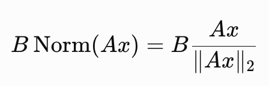
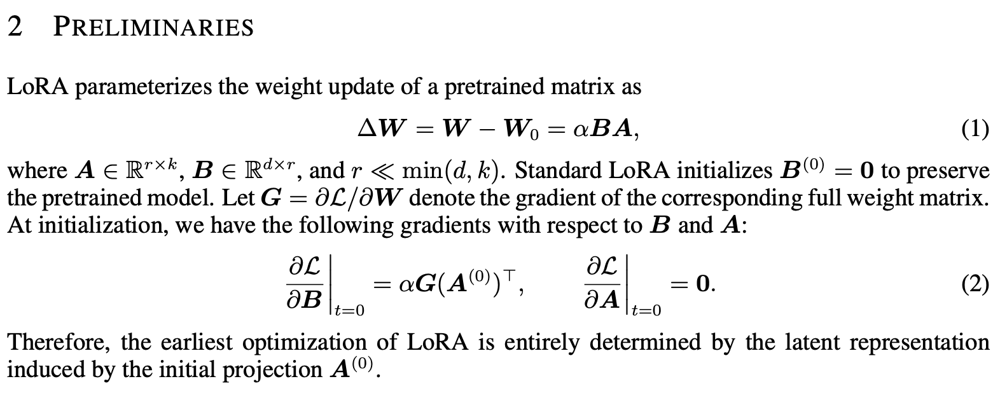
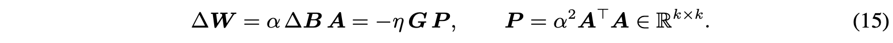
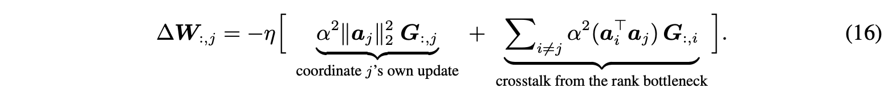
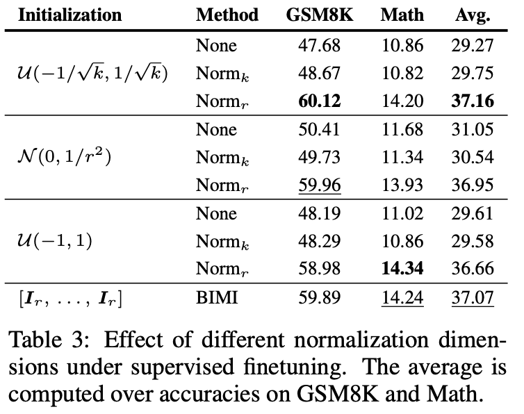
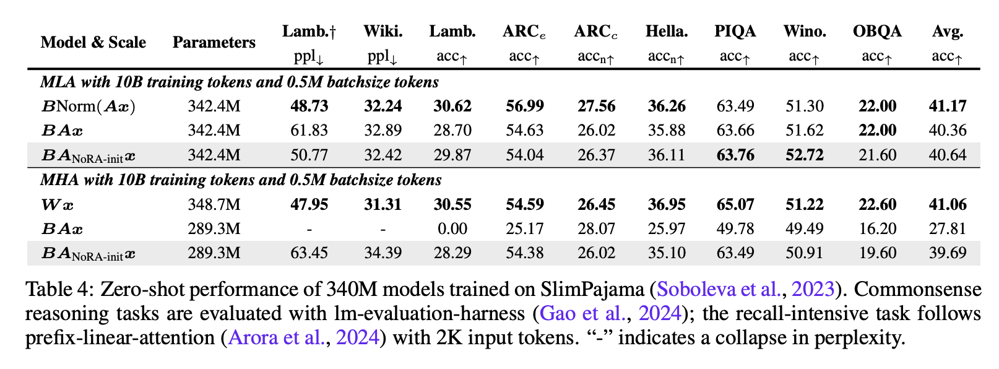
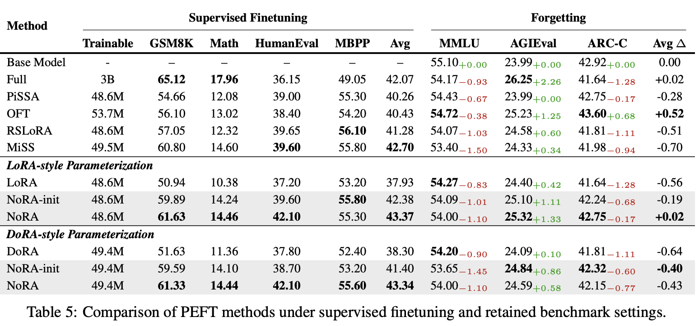
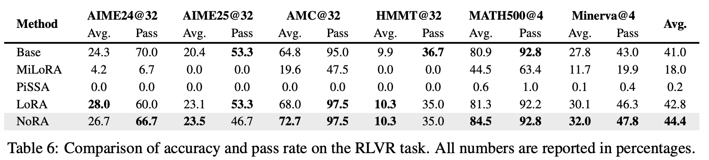

# Normalized Low-Rank Adaptation

## 논문

https://arxiv.org/abs/2608.31036

## 요약

### 기존의 한계

- LoRA는 B를 0으로 초기화하고, A로부터 첫 학습을 진행하게되므로, A의 영향을 많이받는다.
- 그래서 A를 잘 초기화하면 좋지않을까?
- 사실상 기존의 한계라기보단, Multi-head Latent Attention을 보다가, 엇 Down Projection -> Up Projection하는 꼴이 LoRA랑 똑같네? 그럼 한번 적용해보면 잘되겠지? 로 접근한다.
- 이 논문의 방법을 쓰면, SFT도 RL도 풀파인튜닝과 차이를 기존 LoRA보다 더 줄이면서, 카타스트로피 포겟팅도 완화가 됐다고 한다. -> 그래서 읽어봄

### 1, 2장

크게 특별 할 것 없는, LoRA에 대한 설명과 A를 왜 초기화를 잘해야 되는지에 대한 명분을 쌓는 부분이다.

단 MLA는 원래 레이어에 합치거나 할 필요가 없으니까, 그냥 norm(Ax) 형태로 layer output을 해서 Down Projection하면 되는데, LoRA의 경우 원래 사전학습된 레이어와 합쳐질 수 있는 것을 고려해야된다.

L2 Norm을 사용하는데, Norm 연산은 통상 비선형 연산이다. 따라서 행렬곱의 결합법칙을 사용하게 될 수 없어서, 

선형으로 결합되어야 하는 LoRA와 성격이 달라진다. 따라서 적용 방식을 변경해야하는데, 3장에서 자세하게 소개한다.

이 부분에서 내가 몰랐던 사실은 **LoRA는 사실 첫 스텝 업데이트에서는 A에 그라디언트가 흐르지 않는다는 점**이었다. 한마디로 A를 보고 전적으로 B만 학습시키기때문에, 첫 인상이 매우 중요한 방법론이고, 따라서 A의 초기화가 학습에 영향을 많이 미친다고 표현한다. 수식으로는 아래와 같다.

### 3. NoRA: Normalized Low-Rank Adaptation

방법은 무척 간단해보인다. A의 Weight 자체를 L2 Norm 시켜서 Forward하고, 그걸 B와 행렬곱한다.

그러면 수식적으로 BNorm(A)x 형태가 되므로, 결합법칙에도 위배되지 않는 형태로 학습시킬 수 있다.

학습방법을 크게 2가지를 제시하는데,

1. 처음에 Init할때만 하고 이후에는 그냥 학습하는 방법
2. 계속 A를 정규화하며 학습하는 방법

1번만해도 학습이 꽤 좋아진다고한다. 그리고 MiSS라는 방식이 나오는데, 이 방식이 실제로 분해해보면 NoRA와 같은 사상이었고, 그래서 NoRA-init 방식은 MiSS방식을 사용한 정규화 초기화 방법으로 진행하며, 그것을 **B**lock **I**dentity **M**atrix **I**nitialization(BIMI)라고 표현한다.

#### 3.3. Why Does NoRA Work? A Preconditioning Perspective

논문의 수식을 보면, 결국 LoRA의 학습은 원래 그라디언트 G에 P가 붙는 형태다. P는 A행렬의 가중치때문에 나오는 부산물로, 

A 값이 전체적인 학습에 큰 영향을 미치게 된다고 볼 수 있다.

근데 문제는 A를 랜덤하게 초기화하며, r때문에 되게 작은 랜덤값으로 초기화되게 된다. 그러면 결과적으로 해당 인덱스가 중요한지 중요하지 않은지 알지도 못한 상태에서 아주 작은 값의 차이로도 상대적으로 크거나 혹은 작게 느껴질 수 있다는 문제가 생긴다.

NoRA는 이 부분에서 초기화를 정규화해서 하게되기 때문에, 적어도 크기는 안정화시킨 상태로 학습을 진행할 수 있다고 소개한다.

또한, A_T x A의 P는 사실상 어찌보면 러닝레이트와 같은 역할이기도 하다. 만약 P가 0.01이 나온다면, 그라디언트를 1/100으로 움직이는거고, 2가 나오면 2배 크게 움직이라는게 되기 때문이다. 결국 모델 본인의 그라디언트 크기를 본인의 일부가 영향을 주게되는 형태가 되는데, 이걸 랜덤으로 초기화한다? 랜덤한 러닝스케쥴러 값으로 모델 스텝을 밟아나가는 것과 다르지 않다는 의미가 된다.

근데 이걸 **Diag(P)로 만들어서, I와 동치가 된다면, 결국 계수가 1이라고 볼 수 있기 때문에, 계수의 악영향을 상쇄할 수 있다**는 논리이고 **그래서 L2 Norm으로 초기화한 A Weight가 좋다**고 표현한다!

위의 방법으로는 Diagonal Scale 문제는 해결할 수 있는데, off-diagonal crosstalk문제는 해결을 못한상태로 남긴다.

예를 들어 저차원으로 축소되는 경우, 해당 latent space에서 본인이 영향을 주는 부분은 위에 방식으로 해소가 되는데, 그 외에 다른 차원들에게서 영향을 받은 축소영역은 즉, gradient mixing의 영역에서 바라봤을때는 다른 차원들의 영향은 해소하지 못한 상태로 남겨놓는다. (이건 근데 저차원 projection이라면 구조적으로 어케 할지 감도 안잡힌다...)

### 4. Experiments And Results

#### 4.1 Effect Of The Normalization Dimension

k가 행, r이 열이다.

초기화를 행으로 정규화한거는 크게 효과가 없었고, 열로 정규화한게 효과가 좋았다. 그냥 아무렇게나 초기화 하는 것이 아니라, 열의 norm을 1로 맞추는게 중요함을 다시금 강조한다.

#### 4.2 LLM PreTraining

뭐 잘 된다는 얘긴데 특히 MHA의 경우 LoRA는 아예 모델이 망가지는데, 그나마 NoRA를 사용하면 학습이 되긴 되는 모습이다. 같은 low rank adaptation 방식을 쓰는데, initialize에서 이런 큰 차이가 발생한다는 것은, capacity부족만으로는 설명 부족하고, geometry 자체를 잘 잡는게 중요하지 않겠냐고 해석한다.

#### 4.3 Supervised Finetuning

NoRA가 LoRA보다 낫다. 카타스트로피 포겟팅은 기존 지표들에서 얼마나 차이가 발생했나를 보는데, 포겟팅이 어떤 이유에서 완화되었는지는 분석을 깊게 하지는 않는다.

또한 DoRA에서도 적용이 잘 되는걸 보았을때, Low Rank 기반의 어떤 방법론에는 사용해봄직한 방법론이라고 볼 수 있겠다.

#### 4.4 RLVR On Mathematical Reasoning

학습신호가 불안정할 수 있는 강화학습에서도 NoRA가 잘되더라!

pretrained weight의 singular-value decomposition에 의존하지 않으면서도 standard LoRA의 전체적인 성능을 일관되게 개선하였다. 라고 표현한다.

### Concluding Remarks

이 연구는 LoRA의 성능이 단순히 rank에만 의존하는 것이 아니라, down-projection의 geometry와 scale에도 크게 의존한다는 것을 보여준다.

MLA의 normalized latent representation에서 영감을 받아, 저자들은 latent normalization의 장점을 LoRA의 linear structure와 exact mergeability를 잃지 않으면서 가져올 수 있는지를 질문한다. 이 질문에서 NoRA가 나온다.

NoRA는 down-projection을 rank dimension 방향으로 정규화함으로써 input-to-latent mapping의 scale을 제어한다. Preconditioning 관점에서 보면 LoRA는 down-projection AA에 의해 결정되는 low-rank input-side preconditioner 아래에서 full finetuning을 수행하는 것처럼 해석할 수 있다. NoRA의 rank-dimension normalization은 이 preconditioner의 바람직하지 않은 scale imbalance를 보정하여 더 잘-conditioned된 optimization geometry를 만든다.

NoRA는 pretraining, supervised finetuning, 그리고 RLVR 전반에서 convergence, training stability, downstream performance를 일관되게 개선할 수 있다.

## 마치며

거저먹는 방법론 잘 찾은거같다. 모델 사이즈가 커지면서 LoRA가 실무에서 다시 대두될거같은데 반드시 사용해봐야할 테크닉으로 사료된다.
