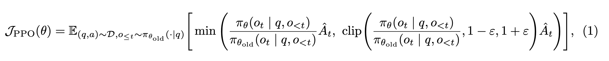
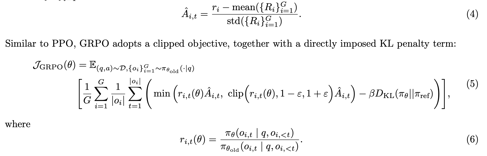
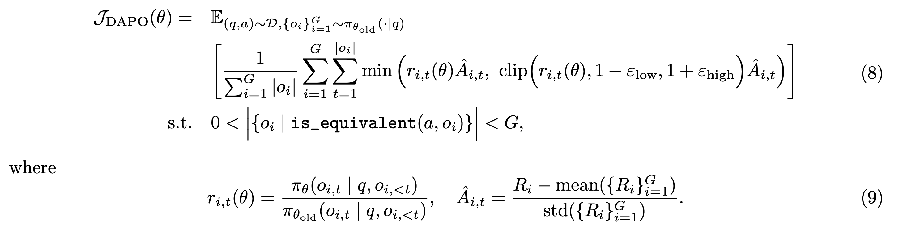
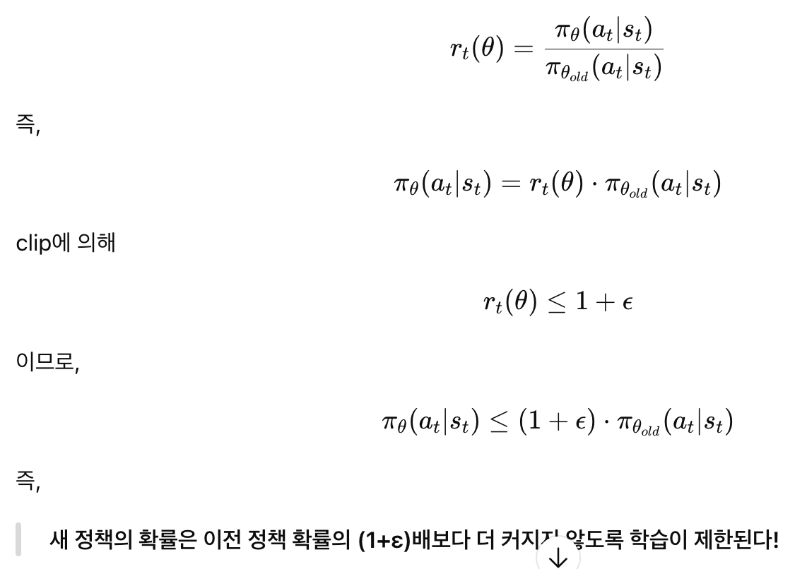
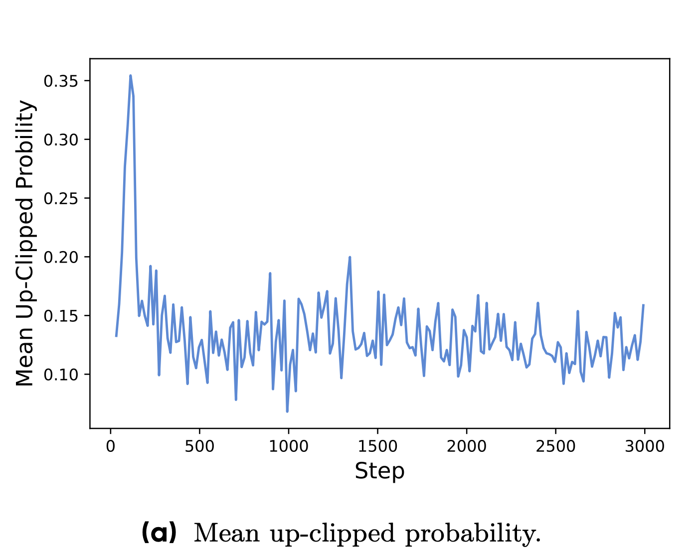
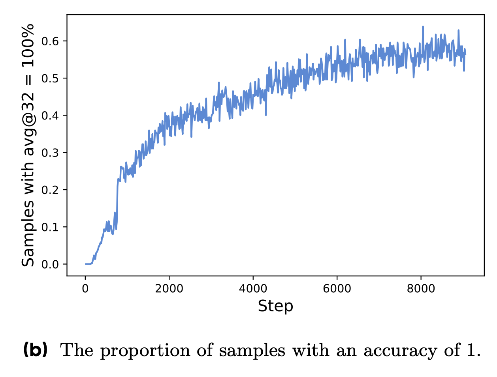
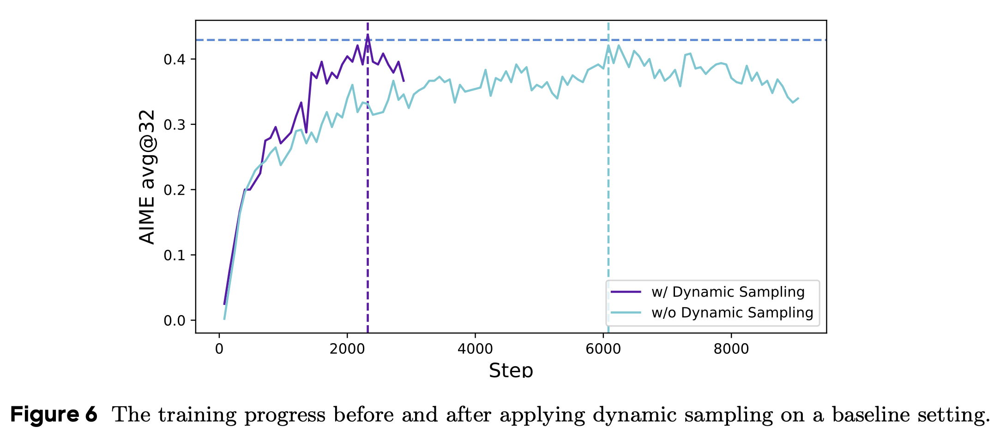
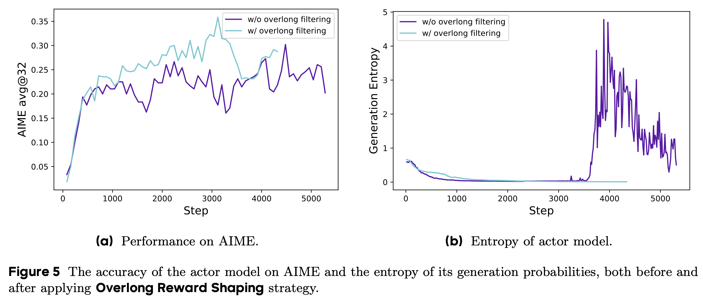
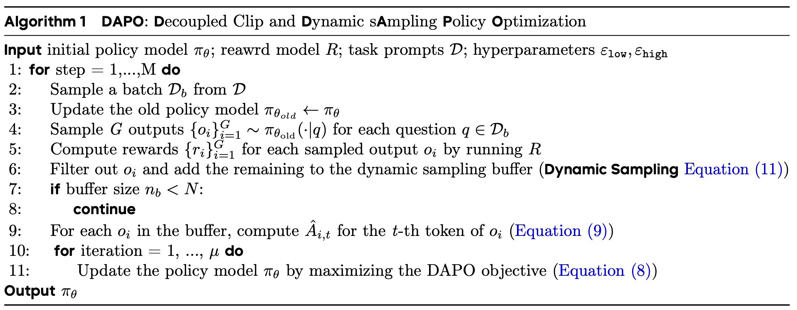
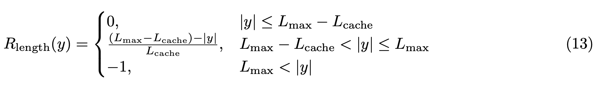

# DAPO: An Open-Source LLM Reinforcement Learning System at Scale

## 논문

https://arxiv.org/abs/2503.14476

## 요약

### 기존의 한계

- Reasoning 모델은 강력하지만, O1이나 DeepSeek-R1 같은 모델들의 RL 방법론을 재현해보면 실제로 잘 재현되지 않음
  - 참고로 DeepSeek-R1 그대로 재현하면 AIME 30점 정도 나옴, 근데 논문에서는 47점이라고함.
  - 면밀하게 따져보니 GRPO는 엔트로피 붕괴, 리워드 노이즈, 훈련 불안정성과 같은 문제를 겪고있었음
  - 이는 DeepSeek-R1에서 누락된 무언가가 있음을 시사할 수 있음
- ByteDance팀은 기존의 RL을 개선할 수 있는 몇가지 Key-Point들을 적용하여 RL을 더 안정적으로 진행할 수 있었고 해당 방법을 공유하고자함

### 1. Introduction

1. Clip-Higher: 다양성을 촉진하고, 엔트로피 붕괴를 막을 수 있는 방법
2. Dynamic Sampling: 학습 효율과 안정성을 증가시키는 방법
3. Token-Level Policy Gradient Loss: long-CoT RL 시나리오의 핵심
4. Overlong Reward Shaping: 리워드 노이즈를 줄이고 학습 안정성을 증가시키는 방법

### 2. Preliminaries

#### 2.1, 2.2 PPO랑 GRPO살펴보기

Loss에서 Policy를 위한 Clip을 소개한 논문이다. 새 정책이 이전 정책에서 과하게 멀어지지 않도록 제한하는 방식으로, 안정적인 학습과 샘플링 효율을 증가시켰다.

q,a는 질문,답변세트, D는 데이터 분포, 엡실론은 클리핑 범위, At는 타임 t에 대한 어드밴테이지.

At는 통상 리워드모델 값을 그대로 사용하진 않고, 정규화 작업을 거친다. PPO는 GAE라는 작업을 거침. GRPO는 평균,표준편차 정규화를 진행함.

GRPO도 clip과정이 있는걸 알 수 있음. 그리고 GRPO는 참고로 샘플을 구해서 샘플의 평균을 사용한다는 점도 인상깊음. 다만 이 평균에 함정이 있음. 섹션3.3에서 설명함.

#### 2.3 Removing KL Divergence

Base와의 KL은 좋지않음. 모델이 더 길게 뱉을 수 있는걸 강제로 막아서 Base에서 더 변화되는걸 수용해야만함.

#### 2.4 Rule-based Reward Modeling

모델을 이용한 리워드 계산은 해킹 위험이 높음. 따라서 룰베이스로 사용하도록함. GRPO와 다른것은 0,1이아니고 -1,1로 사용

### 3. DAPO

보면, GRPO랑 똑같은데 KLD가 빠졌고, 샘플링 평균내는 부분이 조금 바뀐걸 알 수 있음, 앱실론의 표현방식도 바뀌었다.

#### 3.1 Raise the Ceiling: Clip-Higher

일반적인 PPO나 GRPO에서 엔트로피의 매우 빠른 감소를 경험할 수 있었다. 이것은 탐색이 제한되며 초기 결정론적으로 정책이 설정됨을 의미하고, 확장성이 줄어드는 결과로 귀결될 수 있다.

실제로 new가 old보다 큰 경우, potential이 더 낮을 수 밖에 없는데, 그 이유는 수식에서 설명 가능하다.

old가 이미 낮았던 0.01과 같은 토큰은 앱실론이 0.2일때, 0.8 * 0.01, 1.2 * 0.01이 되므로, 0.012, 1.08 범위에 갇히게된다. (new policy token의 확률이 최대 8%까지밖에 증가하지 못한다.)

반대로, old가 0.8이고, new가 0.9인 경우, 0.2 * 0.8, 1.8 * 0.8이 되므로, 0.16, 1.44로 new policy token이 최대 44%까지 더 증가할 수있다.

즉 0스텝부터 생각해보면, base모델이 이미 낮게 생각하는 토큰은 학습이 이루어지더라도 절대로 선택되지 않을 가능성이 높다!

실제로 관찰해봐도, 아주 초기스텝이 아니라면, 대부분 up-clipped에 걸리는 사례들이, 낮은 prob을 가지는 토큰에서 발생함을 알 수 있다.

따라서, Low 앱실론은 그대로 두고, high 앱실론만 약간 올려서 적용하도록 한다. (0.28로 0.08올린다고 하며, 이 것은 너무 올리면 학습이 분산될수 있기 때문에 트레이드 오프를 상정해서 설정한 것이라고 한다.; 0.28의 의미는 낮은 토큰도 최대 28%까지는 변화할 수 있도록 하겠다는 것이다.)

Low 앱실론은 그대로 두는 이유는, 낮추면 점점 0에 근사하도록 토큰이 갈 수 있어서, 어느정도는 값이 있어야하고, 높이자니 낮춰져야할 토큰도 점점 높아질 수 있기 때문인 것으로 보인다.

#### 3.2 The More the Merrier: Dynamic Sampling

현존하는 RL 알고리즘은 애큐러시가 1일때, 기울기 하강 문제를 겪는다고한다.

GRPO의 경우, 모든 샘플의 결과가 1일경우, 어드밴티지는 0이된다. (평균-표준편차 정규화하면 0나옴)

즉, 어떤 한 배치에서 4개중에 1개의 값이 0이 되버리는꼴. 이러면 결국 전체 배치에서는 노이즈로 작용할 수 밖에 없다. (긴+짧은토큰 크로스엔트로피 이슈랑 비슷한 문제)

실제로 샘플링에 대해 1점이 나오는 샘플이 스텝이 증가할수록 점점 증가함을 알 수 있다.

전체적으로 배치평균을 하는걸 상정해보면, 이런 0값이 많아지는거는 노이즈로 작용할 여지가 있다. (기울기가 사실 많이 쳐야되는데 못치게 되는 상황)

**결과적으로, 무작정 틀릴때까지 혹은 맞을때까지 뽑자! 가 논점이다. 따라서 GRPO와는 다르게 배치의 데이터 포인트마다 서로 다른 개수의 샘플링이 이루어질 수 있다.**

이러면 학습속도가 느려지지 않겠느냐 싶긴한데, 어짜피 모델이 어느정도 동기화되기 전까지는 틀린값이 금방 나오기도 나오거니와, 전체 성능을 훨씬 빨리 도달시킬 수 있어서, 결과적으로 큰 손해 없다고한다.

#### 3.3 Rebalancing Act: Token-Level Policy Gradient Loss

GRPO를 보면, 각 샘플에 대한 평균을 구하고 (rollout 10이면 10으로 나눔), 샘플간 손실을 집계하는 과정을 거친다. (배치가 4면 4로 나눔)

여기서 각 샘플이 동일한 가중치를 부여받게되고, 이게 길게 답변해야하는 CoT 문제에서 여러가지 도전과제를 야기한다는 것을 발견했다.

긴 데이터는 통상 횡설수설하거나(패널티를 줘야하거나), 답변을 내기위해 긴 설명을 필요로 하는경우가 있음(칭찬을 줘야되거나) 이런 경우들이 모두 동일한 가중치를 받는 것은 불합리함.

토큰과 배치의 loss를 전부 더하고, 해당 배치에 들어가있는 모든 토큰수로 나눈다. (샘플에 대한 평균이 아닌, 샘플에 대한 토큰수로 나눔 = 길어지더라도 로스가 정확하게 산정됨)

참고로 이 방식은 긴 응답을 충분히 수용하므로, 어드밴티지나 이런 상호작용과 맞물려서, 좀 더 길게 뱉는 모델이 나올 수 있다고 경고한다. (CoT가 길어져서 답을 잘맞추고, 그래서 학습이 금방 끝나서 좋은 모델이랍시고 나왔는데, 사실 내가 원하는건 긴 응답을 원하는게 아니었을 수 있음.)

#### 3.4 Hide and Seek: Overlong Reward Shaping

통상 max length를 결정해서, RL훈련에서는 긴 샘플을 자르게되는데, 그 부분에서 부적절한 보상 형성이되고 잡음을 유발할 수 있다는 점을 발견했다.

기본적으로 잘린 샘플은 징벌적 보상을 적용한다. 근데 옳바르게 긴 토큰에도 과도한 길이로 징벌적 보상을 받을 수 있다. 모델은 옳게 추론했는데 벌을 받는 헷깔리는 현상을 야기할 수 있는 것이다.

절단된 샘플의 손실을 마스킹하는 Overlong Filtering 전략을 적용한다.

실제로 훈련 손실이 안정적으로 변하는것을 알 수 있다. (리워드에 너무 긴 패턴 혹은 잘린 부분들에 대해 패널티를 부여)

알고리즘을 따져보면, GRPO와 비슷한데, 다이나믹 샘플링을 위해서 배치를 먼저 만드는게 아니고, 다이나믹 샘플링의 조건에 부합하는 세트만 배치에 담는다. (그 전까지는 계속 컨티뉴)

그리고 각 수식에 맞춰 역전파하면 끝이고, base모델 kld가 없기때문에, 그 부분에 대한 것이 빠졌다.

Soft Overlong Punisiment라는 것도 제안한다.

|y|는 전체 길이, L_max는 최대 허용 길이, L_cache는 soft punishment 적용 구간이다.

충분히 짧은 구간 L_max - L_cache는 패널티가 없다.

max보단 작지만 꽤 긴 구간은 |y|가 커질수록 0에서 -1까지 간다. (|y|가 L_max면 -L_cache만 남아서 -1됨 같으면 0되고...)

L_max보다 크면 그냥 -1

이렇게하면 지나치게 긴 응답은 처벌받아서 덜 나오게 된다.

#### 3.5 Dataset Transformation

적절히 GRPO처럼 할 수 있게 데이터 수정했다는 의미고, 17K 썼다고함.

### 4. Experiments

#### 4.1 Training Details

학습 세팅은 생략. GPU 만 제외하고 매우 자세하게 나와있음

#### 4.2 Main Results

DeepSeek에서 제안했던 것 대비 50%의 훈련단계만 가지고, 이미 DeepSeek-R1-Zero-Qwen-32B를 능가하였음.

논문에 더 자세히 나와있지만, 제안한 방법은 모두 적용하는 것(Soft Overlong Punishment까지)이 점수가 제일 높았음

3.3의 token level loss는 점수를 비약적으로 향상시키진 않지만, 학습의 안정성을 보장하고, 데이터 길이를 길게 가져가도 학습이 잘 되었다고 함

#### 4.3 Training Dynamics

- 응답 길이가 늘어난다는 것은, 일반적으로 더 복잡하고 다양한 형태로 모델이 응답하고 있음을 시사할 수 있습니다. 다만, 응답이 짧아지는 구간도 있을 뿐만 아니라, 검증 정확도는 어떻게 될지 모르므로 같이 사용함으로써 모델이 횡설수설하고있지 않은지 판단할 수 있습니다.
- 보상은 정상적으로 통상 잘 증가되었으며, 종종 검증세트와 상관관계를 보이지 않는 경우가 있었는데, 그럴 경우 대부분 과적합이었음
- 엔트로피가 낮아지면, 통상적으로 모델이 첨예하여, 탐사 능력을 상실했음을 의미합니다. 지나치게 엔트로피가 높다면 횡설수설 하고 있음을 가정해볼 수 있습니다. 통상 엔트로피가 느린 상승 추세를 보였을때 좋은 모델을 얻을 수 있었습니다.

#### 4.4 Case Study

추론 패턴이 강화되는 현상을 경험할 수 있었으며, 기존엔 없던 추론 과정도 생겨나는 것을 알 수 있었다.

예를 들어, 초반에는 성찰하는 과정이 거의 없었는데, 후반부로 갈 수록 잘못 이야기한 경우 반성과 역추적의 뚜렷한 행동을 보였다.

### 5. Conclusion

SOTA RL 퍼포먼스를 낼 수 있었다.

## 마치며

GRPO는 완전히 사용하지 않아도 될 것 같다. 기존에 GRPO에서도 의문점으로 가지고 있었던, 배치에 0인게 나오거나 1인게 나오면 어떻게되지? 문제에 대해 실제로 짚었으며 그 부분이 해결되었고, 긴 아웃풋에 대한 불합리한 문제도 해결되었다.

사실상 GRPO에서 놓쳤던 부분들을 수정한 완벽한 대체품이라고 할 수 있겠다.

다만 문제는 verl을 꼭 사용해야하는데 이게 ray, hydra config기반이라 조금 어려운데 한번 써봐야겠다.

GRPO형태의 RL은 알고리즘형태로 리워드를 사용해야하는데, 이게 참 답이 정해진 문제가 아니면 적용하기 어렵다. (포티투마루는 어떻게 일반 Task에서도 한다는거 같음)

그래서 차라리 앞으로는 DPO 파생 RL들을 위주로 알아볼까 싶다.