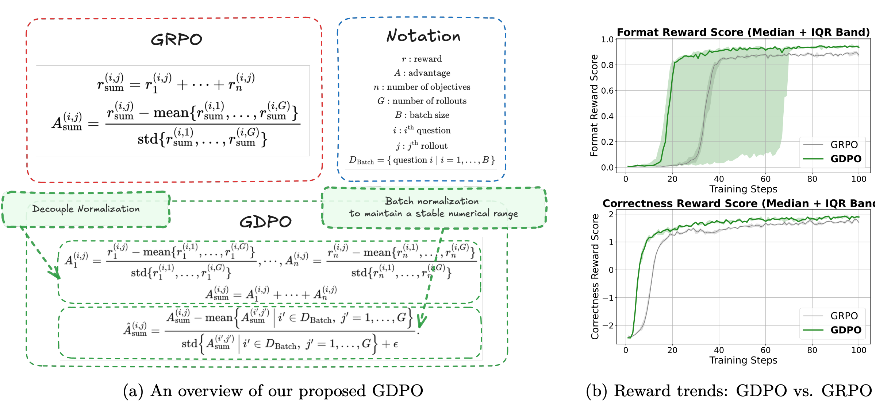
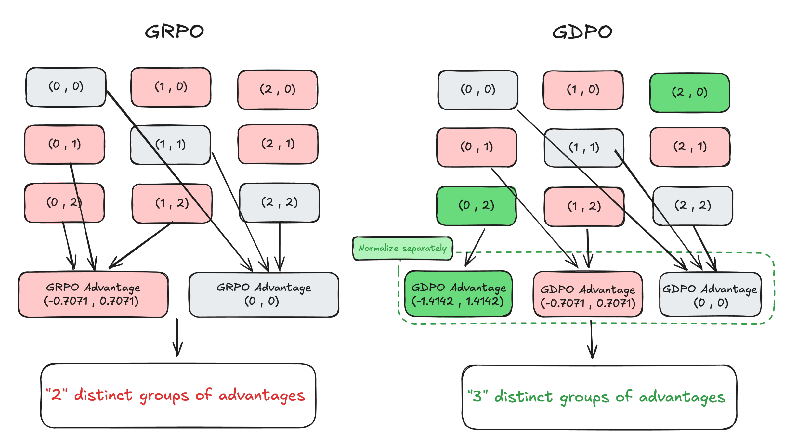

# GDPO: Group reward-Decoupled Normalization Policy Optimization for Multi-reward RL Optimization

## 논문

https://arxiv.org/abs/2601.05242

## 요약

### PPO Reward 되새기기

- 어드밴티지 계산할때, Sequence Reward Total - Value(critic)를 진행한다.
- 근데 LLM은 AR하기 때문에 사실상 직전 Sequence까지는 의미가 없고, 맨 마지막 token만 Reward에 관여한다. 즉, Sequence Reward 'Total'이 의미없고, Last만 보면된다.
- Value(critic)역시 마찬가지인게, '지금 시점에선 이정도는 예상한 정도'를 빼줘야되는데 결국 맨 마지막 Token에 대한 숫자만 신경쓰면되니까 사실상 거의 상수항에 근접하다.
- 그래서 이 어드밴티지를 그냥 시퀀스 전체의 단순 reward로 치환하고, 그걸 평균/분산 정규화 해서 적용하자는게 GRPO사상이다. (Reward가 0,0,0,0,1 이런 경우에 학습을 안정적으로 하게 하기 위함)

### GRPO를 만약 Multi Reward로 진행하면?

진행할 수 있는데, 문제는 어드밴티지 계산할때 이런걸 고려하지 않았기 때문에, 무식하게 전체 평균/분산 정규화를 때려버림.

**=> 여기서 생기는 문제가, 모델이 영어는 겁나 못하고, 수학을 겁나 잘하면 정규화되면서 오염이 발생함.**


### GDPO



어드밴티지를 각각 reward 종류별로 해서 적용하자.



### 어드밴티지는 결국 Loss나 다름이 없는건데, 이거 벡터로 나오면 어쩔건데?

Sum하면 그만이다. 결국 미분은 편미분이라 각자 어드밴티지를 찾아서 그라드가 적용됨.

#### 요즘은 Gradient 입장에서 문제를 바라봐야 하는 논문이 많이나오는듯.

모듈형 학습이 참 좋은게, [DAPO](https://github.com/AILAB-H/paper-review/tree/master/LLM/RL/DAPO)의 경우, 어드밴티지를 건들지 않는데, 따라서 GDPO의 adv를 사용하고, DAPO의 reward 방식을 사용함으로써, GRPO의 완전히 안정적인 구조를 완성시킬 수 있다.

```python
@register_adv_est("gdpo")
def compute_gdpo_outcome_advantage(
    token_level_rewards: torch.Tensor,
    response_mask: torch.Tensor,
    index: np.ndarray,
    token_level_scores_per_reward: list[torch.Tensor] | None = None,
    epsilon: float = 1e-6,
    config: Optional[AlgoConfig] = None,
    **kwargs,
) -> tuple[torch.Tensor, torch.Tensor]:
    """Compute advantage for GDPO (Group reward-Decoupled normalization Policy Optimization).

    Each reward component is independently normalized via group-wise mean/std, then summed
    and batch-wise whitened. This preserves more distinct advantage groups than GRPO when
    multiple rewards are combined, yielding a richer training signal.

    Reference: https://arxiv.org/abs/2601.05242

    Args:
        token_level_rewards: `(torch.Tensor)`
            shape: (bs, response_length) — aggregated reward (used as fallback when
            token_level_scores_per_reward is not provided)
        response_mask: `(torch.Tensor)`
            shape: (bs, response_length)
        index: `(np.ndarray)`
            group index array (uid per question)
        token_level_scores_per_reward: `(list[torch.Tensor] | None)`
            list of per-reward tensors, each shape (bs, response_length).
            If None, falls back to single-reward GRPO-style normalization on token_level_rewards.
        epsilon: `(float)`
            small value for numerical stability
        config: `(Optional[AlgoConfig])`
            algorithm config (unused, kept for API compatibility)

    Returns:
        advantages: `(torch.Tensor)` shape (bs, response_length)
        returns:    `(torch.Tensor)` shape (bs, response_length)
    """
    if token_level_scores_per_reward is None or len(token_level_scores_per_reward) == 0:
        # Single-reward fallback: identical to GRPO
        return compute_grpo_outcome_advantage(
            token_level_rewards=token_level_rewards,
            response_mask=response_mask,
            index=index,
            epsilon=epsilon,
        )

    with torch.no_grad():
        bsz = token_level_rewards.shape[0]
        A_sum = torch.zeros(bsz, dtype=token_level_rewards.dtype, device=token_level_rewards.device)

        for reward_tensor in token_level_scores_per_reward:
            scores = reward_tensor.sum(dim=-1)  # (bs,)

            id2score: dict = defaultdict(list)
            id2mean: dict = {}
            id2std: dict = {}

            for i in range(bsz):
                id2score[index[i]].append(scores[i])

            for idx in id2score:
                group = id2score[idx]
                if len(group) == 1:
                    id2mean[idx] = torch.tensor(0.0, device=scores.device)
                    id2std[idx] = torch.tensor(1.0, device=scores.device)
                else:
                    t = torch.stack(group)
                    id2mean[idx] = t.mean()
                    id2std[idx] = t.std()

            normalized = scores.clone()
            for i in range(bsz):
                normalized[i] = (scores[i] - id2mean[index[i]]) / (id2std[index[i]] + epsilon)

            A_sum = A_sum + normalized

        # batch-wise whiten to stabilise scale independent of reward count
        A_token = A_sum.unsqueeze(-1) * response_mask  # (bs, response_length)
        advantages = verl_F.masked_whiten(A_token, response_mask) * response_mask

    return advantages, advantages
```

