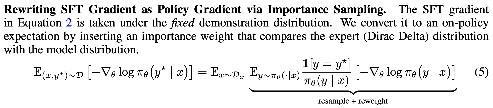
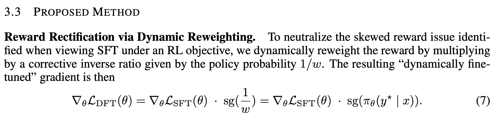
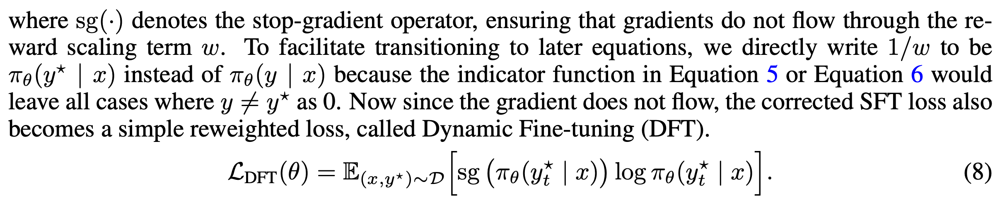
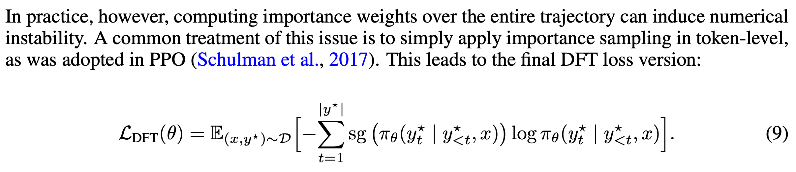
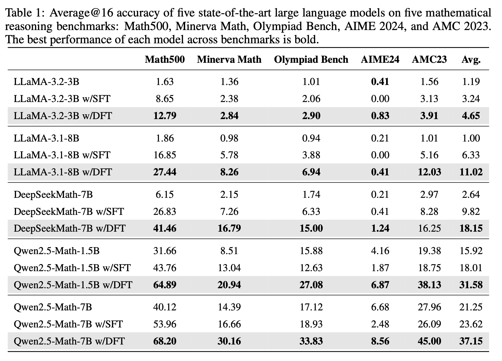
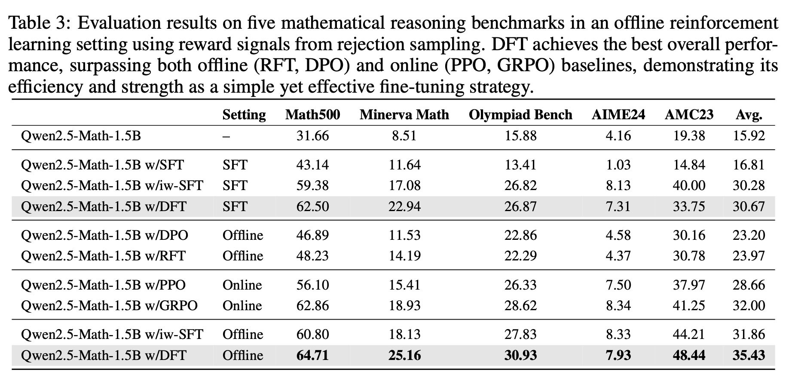
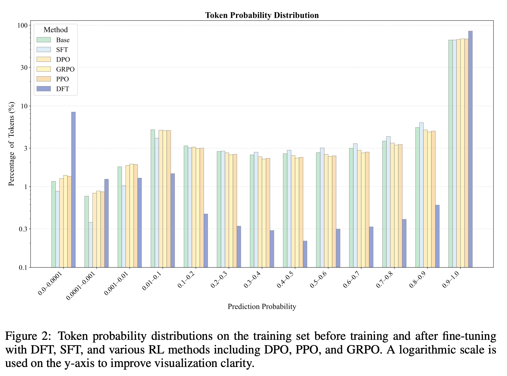
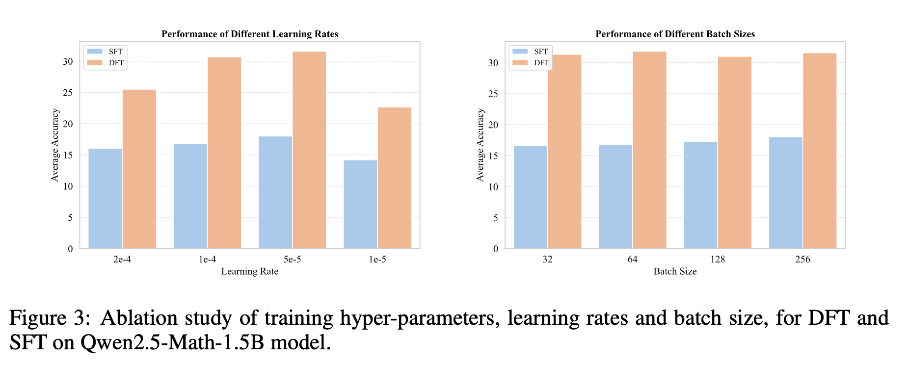

# ON THE GENERALIZATION OF SFT: A REINFORCEMENT LEARNING PERSPECTIVE WITH REWARD RECTIFICATION

## 논문

https://arxiv.org/abs/2508.05629

## 요약

### 기존의 한계

- 기존에 sft는 수학적으로 일반화 능력을 심각하게 제한할 수 있는 문제적 보상 구조를 지니고 있다.
- 각 토큰에 대해 목표함수를 재조정해서 그라디언트를 안정화 시킬 수 있다.
- 단순히 SFT 랑 비비는게 아니라 RL까지 된 놈이랑도 비빌 수준으로 된다.

### 1. Introduction

SFT는 post-training으로 모델을 조정하고, 새로운 task를 학습시킬 수 있지만, 그럼에도 불구하고 RL대비 일반화 능력이 떨어지는 것은 사실이다.

RL은 명시적인 보상 혹은 신호를 주어서, 모델이 다양한 전략을 탐색할 기회를 모색해준다. 하지만 RL은 컴퓨팅 리소스가 많이들고, 모델 학습이 불안정한 등 여러가지 단점을 내재하고 있다.

RL은 종종 잘 되더라도, SFT대비 어려울 수 있는 전문가 행동 패턴을 찾는데는 어려움을 겪는 경우 또한 있다. (어려운 것을 학습시키기에는 SFT가 더 강력하다는 것일수도 있을 듯)

하지만 SFT자체를 근본적으로 개선할 수 있을까? SFT는 음성 샘플이 없고, 검증 모델이 없는 경우가 대부분이다.

SFT도 따지고보면 우리가 원하는 토큰에만 1을 부여하는 암묵적 보상이 있는 RL과 같다고 볼 수 있으나, 자칫해서 오히려 더 전문가적인 패턴이 나왔음에도 label과 달라 0을 줘버림으로써, 분산이 증가하는 효과를 낼 수도 있다.

위의 문제를 해결하기 위해, **SFT를 목표로 하되, 토큰당 확률을 rescale해서, inverse probability weighting을 중화**시킬 수 있고, 그로써 편향, 학습불안정 등의 문제를 해소한다.

SFT 모델의 토큰 분포를 보면 training set의 토큰과 거의 강하게 결합되지만, DFT를 하면 어떤 토큰들은 오히려 training set과 멀어지는 토큰들도 있으며, 대부분의 토큰들은 training set에 가깝게 유지되는 경향을 보였다.

### 3. Method

SFT Gradient펑션을 RL에 fitting 시켜보면, 위와 같은 수식으로 치환된다.

SFT는 정답 데이터분포에서 학습시키므로, 사실 y == y\*이고, 무조건 1이다, 파이세타(y|x)도 정답분포니까 그냥 1이고, 우측항에 y도 y\*로 치환되면 바로 SFT Cross Entropy항과 동일해진다.

**즉, SFT는 예측값 y가 1이기만 기대하는 RL과 동치로 표현할 수 있다. (다른 rl들과 다르게 비선호(0)인 값을 가지고 학습하지 않음)**

RL로 변경하기 시작하면서, 정답분포가 아니고 내가 모르는 어떤 모델의 분포가 되기 때문에 (요즘 RL은 샘플링을 하기 때문에 어떤 모델의 분포로부터 학습(여기서 어떤 모델은 내가 학습시키려는 모델)해야한다는 점을 명심하자.)  Importance Sampling이  필요해지고, Importance Weight가 생긴다.

여기서 **파이세타(y|x)가 정답이길 기대하는 확률분포의 Weight 곱**이라고 생각하면된다. (확률은 0.7과 같이 나오니까 나눠지는게 곧 곱해지는것임.) -> 논문에서도 Importance Sampling을 언급하며, 확률통계에서 흔히 사용되는 개념이니 이해가 잘 안되면 GPT와 함께 이해해보는 것을 추천 (나도 100% 이해했다고 장담못하겠음)

#### 여기서 이제 수학적 문제가 발생되는데, 정답이 1이길 기대하는 문장이 사실 되게 낮은 확률의 조합이라면? (낮은 확률값인데 뚫고 이게 정답으로 잘 잡혔다면)

분자는 1, 확률은 0.01이면 **당장에 그라디언트에 100을 곱하는 효과가 나버린다!!!**

grad_norm이 갑자기 뛰는 값들이 종종 sft때 있을 때가 있었는데, 이런 경우였을까? 싶은 느낌도 있다.

이게 문제가 되는게, 당연히 정답인데 낮은 확률로 맞췄으니까 그걸 끌어올리기위해 모델에 역전파를 쎄게주는게 맞긴한데, 이러면 모델이 너무 크게 바뀌고(일반화 능력이 매우 크게 떨어짐) Gradient 폭발 문제가 발생할 수 있다는 점이다.

이것을 RL관점에서 따지고보면, loss에 연산되는 reward가 너무 커지는 효과와 같다고 볼 수 있으며, 이는 **모델의 분포를 전혀 고려하지 않은 상태로 내가 학습시키고자 하는 label에 딱 맞추기만을 목표로 과적합될 우려를 내포한다고 볼 수 있다. (그로 인해 일반화 성능이 떨어진다.)**

실제로 Random으로 주거나, Base가 생성한걸 주거나 한 것 보다, Synthesizer가 만든걸 줬을때 훨씬 잘한다. 즉, Base가 만든거부터 잘한다는 것은, 위의 실험결과와 엮여서 실제로 잘 만들고 도움도 되는 고품질의 Instruction을 잘 만들었다고 볼 수 있다. (**Base한테 퓨샷주고 하는 검증 기법은 뭔가 다른 곳에서도 유용하게 쓰일 수 있을 것 같으니 잘 기억해놓으면 좋겠다.**)

#### 3.3 Proposed Method

정리해보면

**SFT 이거 사실 RL과 비슷한거같은데? -> 수학적으로 대입해보니 RL이랑 진짜 비슷하네? 근데 이거 분모때문에 SFT는 학습자체가 원래 일반화가 잘 안되겠는걸? -> 분모를 없애려면? -> 곱해버리면 그만이다.**

라는 사상의 흐름으로 논문이 전개된다

당연히 한 모델에서 뽑을때 인퍼런스 2번되면 그라디언트 망가지니까, sg(stop gradient) 시켜놓고 한다.

간략화 해놓으면 위와 같은 함수로 정리 가능한데, **stop gradient의 label token에 해당하는 softmax 조건부확률을 cross entropy loss에 곱해주면 되는거 아닌가 싶다?**

여기서도 Token Level Loss로 접근한다. 나는 이부분 이해를 못했는데, 반드시 이해해야될 부분일거같다.

### 4. Experiments

성능 증가 폭이 무시무시하다. 

Online(GRPO), Offline(DPO) 계열들보다도 잘한다

SFT를 보면, 낮은토큰 확률은 낮게, 높은 토큰확률은 높게 가져가려는 경향이 강하다. (실제로 낮은 부분에 우리가 원하는 답이 있을 수도 있는 것임.)

DFT는 양극화가 보이는데, 그 것은 버릴 토큰은 아예 버리고, 사용할 토큰들은 아싸리 확 사용하는 경향을 보인다는 것이다.

낮은 토큰 분포에 있는 값들을 실제로 찾아봤는데 온점, 콤마, 조사 등 별로 중요하지 않은 단어들에 집중되어있다고 한다.

이러한 결과는 견고한 학습이 꼭 모든 토큰을 균일한 신뢰도로 맞추려고 해서는 안되는 것을 시사한다. (점수는 겁나 올랐는데 이정도로 양극화가 발생했으니.)

LLM은 단순히 문장을 잘 만드는 것 보다, 문장 안에서 중요한 토큰을 잘 잡아내는 능력이 더 중요함을 시사할 수 있습니다.

이 개념은 학생들이 공통 연결 단어를 완벽하게 하도록 가르치는 것 보다, 실질적인 문장의 개념에 집중하도록 가르치는 인간 교육학과도 일치한다고 설명한다.

#### 4.3.2 Training Hyper-Parameters Ablation (LLM 학습에 러닝레이트가 중요할까?)

배치 사이즈에는 큰 변화가 없지만, 러닝레이트에는 큰 변화가 있었다. 둘다 너무 작거나 너무 큰 러닝레이트를 쓰면 좋지는 않음. 그리고 이런 효과는 SFT에서 더 극명하게 나타났음.

### Limitations

1. 언어모델로만 실험되었음. (VLM같은거로 할 의향이 있음)
2. 수학만 해봤고, QA나 코드생성 등으로 확장해보진 못했음.

## 마치며

이런 시도 자체에 의의가 있었다고 본다. 또한 RL과 SFT를 융합하려는 시도가 계속 나오는 점이 흥미진진하니 기대가 된다.
