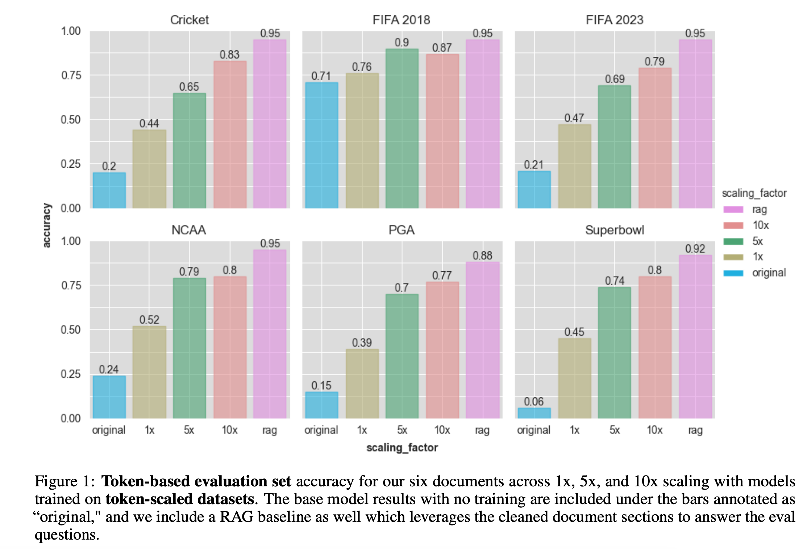
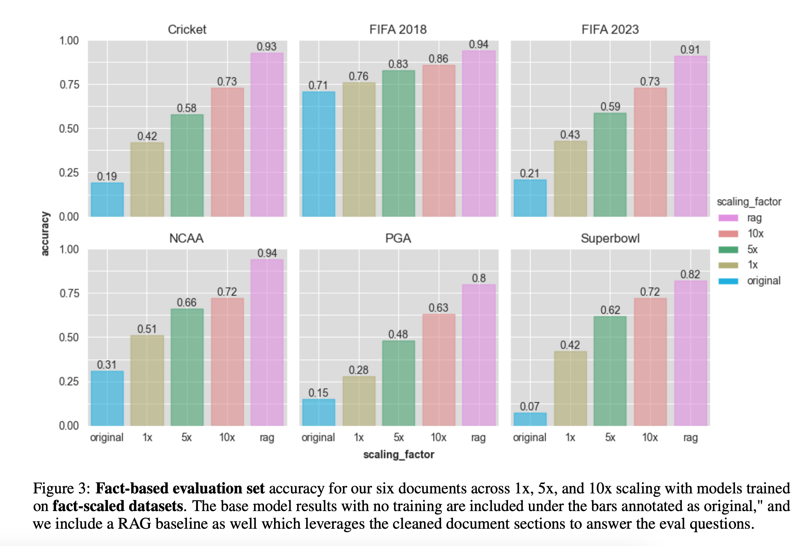
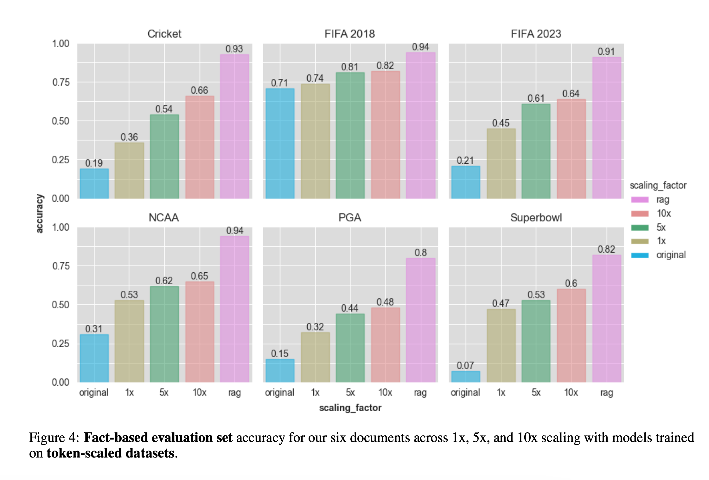

# Injecting New Knowledge Into Large Language Models Via Supervised Fine-Tuning

## 논문

https://arxiv.org/abs/2404.00213

## 요약

### 기존의 한계

- 지식을 주입한다는 것 자체가, 프리트레이닝을 이어서 하고, 거기에 지식에 대한 QA도 가능해야되니까 SFT도 해야되는 2개의 연속적인 작업으로 이루어져있음.
  
  현재 논문은 스포츠 이벤트에 대한 한정이지만, SFT만으로 그게 가능함을 보이기로함.

- 끝내주게 프리트레이닝이 된게 있는데, SFT를 우리 데이터로 하면 뭔가 느낌적인 느낌상 손해보는 느낌이 강함
- 그리고 도메인 스페시픽하면, 위의 현상이 더 심해지고, 지식은 무한하게 생겨나므로 모델에 타임 컷오프등을 지정해야하는 불합리한 구간이 생김
- RAG을 쓰더라도, LLM의 지식영역의 한계로 잘 안되는 것도 무시못함.

### 3. Dataset 생성하기

**위키피디아에서 스포츠항목을 이용했는데, 그 이유가 기간의 변화가 뚜렷하고, 승/패와 같은 결과의 사실이 분명하기 때문이라고함.**

#### 3.1 Token-based

동일한 사실을 다양한 방식으로 학습할 수 있도록 한다. 특정 표현에 내재화되지 않고 스케일이 넓어지도록 한다.

- 일단 수기로 질-답 1쌍을 시드로 사용한다.
- 시드를 가지고 각 세션을 조사하며 gpt4의 titoken library로 토큰 수를 계산하여, 총 답변의 토큰 수가 섹션의 10배가 되는 구간까지 반복한다.
- 10배 토큰으로 만든 세트를 시드로 하여, 1배, 5배 데이터셋을 만든다. 모든 질문은 정확히 일치하는지에 대한 관점에서 유니크하면 된다. (질문의 내용이 비슷하더라도 뭔가 물어보는 방식이 달라도 ok라고 보는듯)
- 이렇게하면 최초 시드로 만든 10배, 10배의 질문을 시드로하는 1배,5배를 만들 수 있다.
- 위에를 train set으로 하고, test set는 1배 토큰 스케일로 질문이 겹치지 않게 새로 구성한다.

#### 3.2 Fact-Based

중요한 사실이나 특정 정보를 놓치지 않게 하기 위한 학습이다.

- 도큐먼트에 포함된 `핵심 사실` 리스트를 만들어야한다. GPT4를 이용하여 각 섹션별로 핵심 사실을 정확하게 추출하도록 유도해서 만든다. 10개의 유니크한 세트를 생성한다.
- 여기선 표현 자체로 중복을 제거해야한다. 한마디로 같은 주제의 질문을 제거해야한다는 것
- 마찬가지로 10배 5배 1배 세트를 만든다. (여기서 배수는 질문-답변의 개수이다.)

GPT로 만들때 프롬프트로 skip 하는 기능을 이용했다고 한다. 그래서, 간혹 위키피디아에 러시아를 표현할때 '나치와 싸우다 몇백만이 죽은 나라'라는 표현이 인용에 들어가있는 경우 이런 표현은 전부 skip가능했다고 한다. (주제에 정확히 잘 맞는 질-답세트로 만드는게 중요함을 의미하는 걸로 보인다.)

검증세트는 skip기능이 없이 만들어진 세트로 구성했다고 한다. 따라서 '나치와 싸우다 몇백만이 죽은 나라는?' 이라는 질문에 답변할 수 있어야 한다는 것이다.(기존 능력 손실을 방어하기 위한 확인기제로 사용가능할듯하다.)

Appendix C에 샘플과 프롬프트가 있다. (**이걸 직접 쓰기보다, 어느정도 질문의 표현이 확장되는 것과 중요한걸 질문하는 것으로 SFT데이터를 만든다.를 응용하는게 차라리 더 낫지 않을지...**)

##### ------ 참고로 해당 논문에서는 Token Based와 Fact Based를 각각의 모델로 학습하고 검증한다. (Token Based는 사실을 전부 담지 못할 가능성이 있음을 앞에서 이야기하였음)

### 평가

#### 6.1 Token-Based Scaling

크리켓같은건 5배에서 10배 차이가 좀 있는데 그렇지 않은 구간들도 있다.

중요한건 1배라도 한것이 전반적으로 오리지널보다는 많이 향상된다는 것이다. (FIFA 2023은 근데 위키 학습해서 올라간거 아닌가?)

다만 FIFA 2018에서의 결과로 좀 분석 가능한데, 이미 잘하던 능력에서 대단히 더 잘해지지는 않는다. 오히려 편향이 생겨서 일반화 능력이 떨어진거로 해석될 수 있다고 보고있다.

#### 6.2 Fact Coverage in Token Datasets

10배수로 생성을 하더라도, 중요한 표현에 대해 담지 못하는 경우가 20%까지도 있었다. 따라서 Token-Based 생성방식은 중요한 지식을 잘 학습하지 못할 여지가 있으며, GPT4로 생성했기 때문에, GPT4로 생성하더라도 사용자의 분포에 더 잘 맞기위해, 대체적인 데이터 생성방식이 필요함을 시사한다.

#### 6.3 Fact-Based Scaling

이것까지 보면, FIFA 2023에서 축구를 잘 알지 몰라도, 컷오프 이후의 데이터는 out-of-domain으로 보는게 맞다는 결론을 확실하게 내릴 수 있다.

그래프가 모두 다 비례하게 증가하는 것으로, 해당 방법론의 커버리지가 더 높다는 것을 보여준다.

#### 6.4 Cross-Validating Token-on-Fact

Fact-Based test-set에다가, Token-Based로 학습한 모델을 해봤을때의 결과

5배와 10배가 크게 차이가 안나는 것도 Token-Based의 특징을 그대로 따라가고, Token-Based는 지식의 깊이에 대한 고민을 많이 안하고 만드는 경향이 있어서, Fact-Based에서 커버리지되지 않는 질문들에 대한 성능이 떨어지면서 전체 성능이 떨어진 것으로 볼 수 있겠다.

### Limitations and Future Work

하나의 도메인에 대해서만 해석했으며, 현실은 더 다양한 사례를 고려해야되기때문에 조금 아쉬운 실험이었다. (카타스트로피 포게팅이 있을텐데, 그런걸 고려하지 않고 한 실험이니까.)

에포크를 6으로 늘렸을때 유의미한 성능증가가 있었다고 한다. (이거는 LoRA라서 가능한 이야기같다. 카타스트로피 포게팅의 영향이 좀 적으니까.)

그리고 자동생성이다보니 검증셋 질문에 대한 실제 다양성을 포함하고있느냐도 아쉬운점이 있었다고 한다.

## 마치며

기대하고 읽었는데 개인적으로 무척 아쉬운 논문이었음.

왜냐하면 대부분의 LLM개발자들은 기존 능력을 유지시키면서 새로운걸 얻어가고 싶어하나, 해당 방법론은 뭐랄까...self-instruct 논문에 좀 더 개선된 느낌이 강하다.

그리고 지식에 이미 없는 토큰정보에 대한 개선이 얼마나 이루어졌는지 조금 더 면밀한 조사가 되었으면 좋겠다고 생각하나, 그런점은 부족했다.

예를 들어서 '납입면제'에 대한 질문 세트가 original에서는 점수가 낮았고(별로 못봐서 잘 못함), 학습을 했더니 월등히 좋아졌다면, 일부러 도메인 단어사전을 주입하기 위해 CP를 할 필요가 없음을 증명할 수 있었을텐데...

중요한건 Token-Based방식과 Fact-Based방식을 잘 섞는게 중요할 것 같고, 2023년에는 선수들 이름이라던지, 꽤 관련없는 분포의 단어들이 나오더라도 모델이 헤메지 않고 잘 강건하게 학습됐을 것을 추상적으로 미루어보았을때, instruct tuning을 잘하면 도메인 지식을 효과적으로 주입할 수 있다! 정도로 얻어갈 수 있는 논문일듯하다.

이 논문으로부터 2달뒤에 사전학습을 대체하는 SFT논문이 나왔고 이걸 이후에 읽어서 리뷰하도록 하겠다.