# Instruction Pre-Training: Language Models are Supervised Multitask Learners

## 논문

https://arxiv.org/abs/2406.14491

## 요약

### ~~기존의 한계~~ -> 한계 개선보다는 이렇게하는게 응당 더 잘되겠지? 를 배경으로 깔고감

- 어짜피 지시를 통해 학습해야하는 모델인데, 그렇게 하지 않을 이유가 있을까?
- 사전학습도, 지시학습도 결국 다 CausalLM인데, 우리의 말뭉치에서 이런 세트를 만들 수 있다면 달성하지 않을까?
- 이런 가정과 의심으로부터 논문이 시작됨

해당 방식은 `명령어 합성기`라는 것을 가볍게 오픈소스 모델로 만들어서, 가지고있는 코퍼스에서 질-답을 만들도록 유도한다.

### 2. Instruction Synthesizer

이 놈이 알파이자 오메가이다. Appendix에 학습한 데이터셋도 다 알려주는데, 한번 보면 왜 알려주는지 알 수 있을 수준이다.(너네 할 수 있으면 한번 해봐 수준) - 서로 다른 34개의 데이터셋을 전부 전처리해서 사용함....(전처리 방식은 물론 논문에 구체적으로 없다)

사실 여기서 김 좀 샜음...

##### 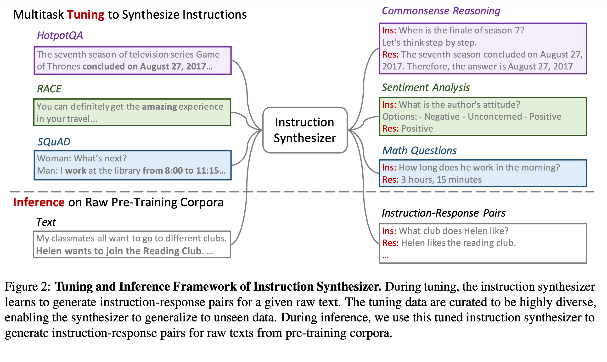

실제로 이렇게 동작하는 모델을 만든것이다. (말뭉치를 넣으면 ins와 res구성으로 만들어줌)

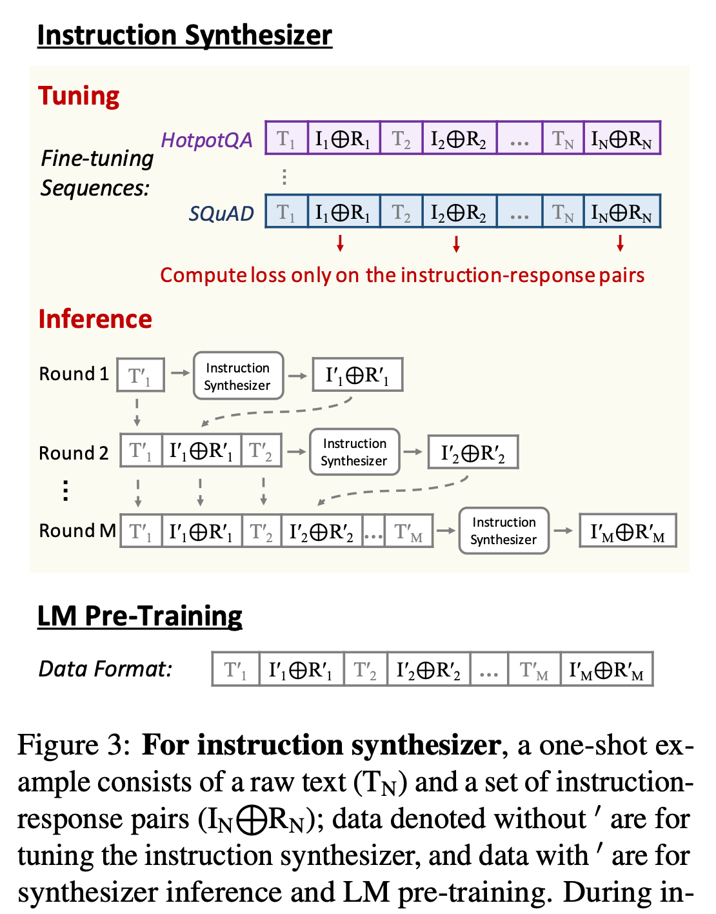

이런식으로 만든다. T는 말뭉치, I와 R은 말뭉치에서 나온 지시와 응답이다. 이걸 단순히 concat시키는데, 단순히 concat하면 뭔가 연관없는 퓨샷이 생겨날 수 있을 것이다. 그래서 task나 category등으로 묶어서 그 안에서만 저렇게 생성한다고 한다.

I와 R은 새로 만드는게 아니고, 데이터셋이 보면 QA 데이터셋인데, 그 이유가 context를 말뭉치로 보고, QA를 각각 I와 R로 보는 것 같다.

Loss도 T에는 주지 않고, I하고 R만 준다. (그래서 T는 회색인가보다.)

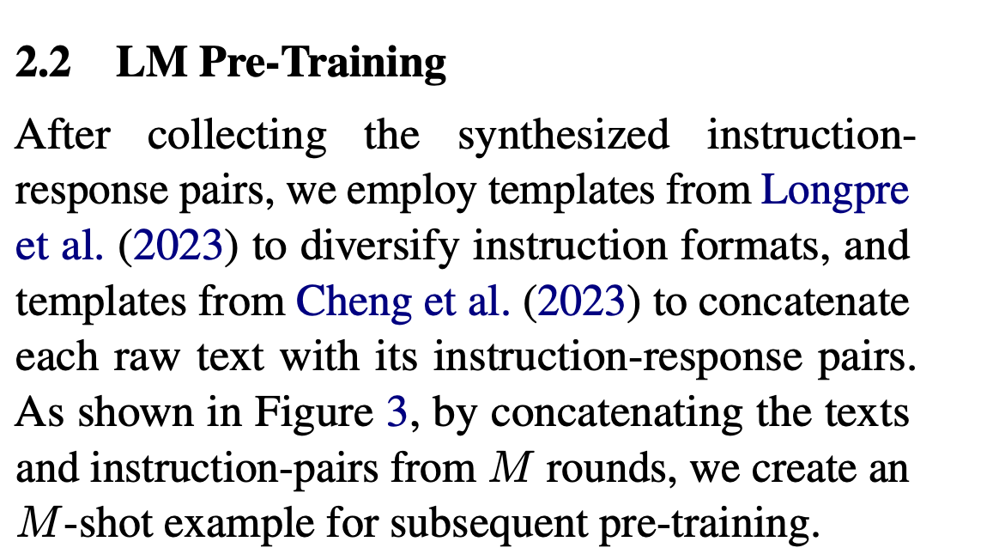

I하고 R은 위에서 이야기한 논문의 포맷을 이용하여 확장한다고 한다. **MRC 데이터셋 확장하려면 위의 논문을 보는것도 괜찮을듯**

### 평가

#### 4.1 General Pre-Training From Scratch

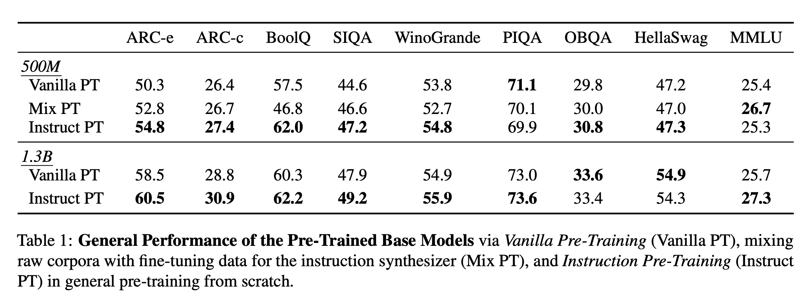

Lm-eval-harness 결과인데, 참고로 이거는 토큰 아웃풋을 보고 채점하지 않는다. Bos 이후의 첫 토큰의 prob이 해당 문제들의 정답 토큰에 시작과 같은지를 비교한다. 따라서, 해당 지표는 각 테스트셋의 템플릿을 알고 있을 것 같느냐?는 중요하지 않다. (잘하면 진짜로 잘하는거란 이야기)

실제로 더 잘된다. 신기한건 Mix PT한거보다 Instruct만 넣은게 더 잘한다는 것이다. (raw 말뭉치는 필요가 없단 이야기)

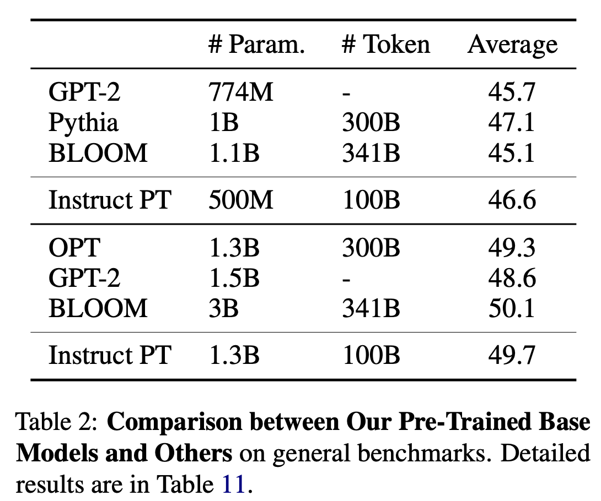

데이터 역시 더 적게 말아도 훨씬 잘한다.

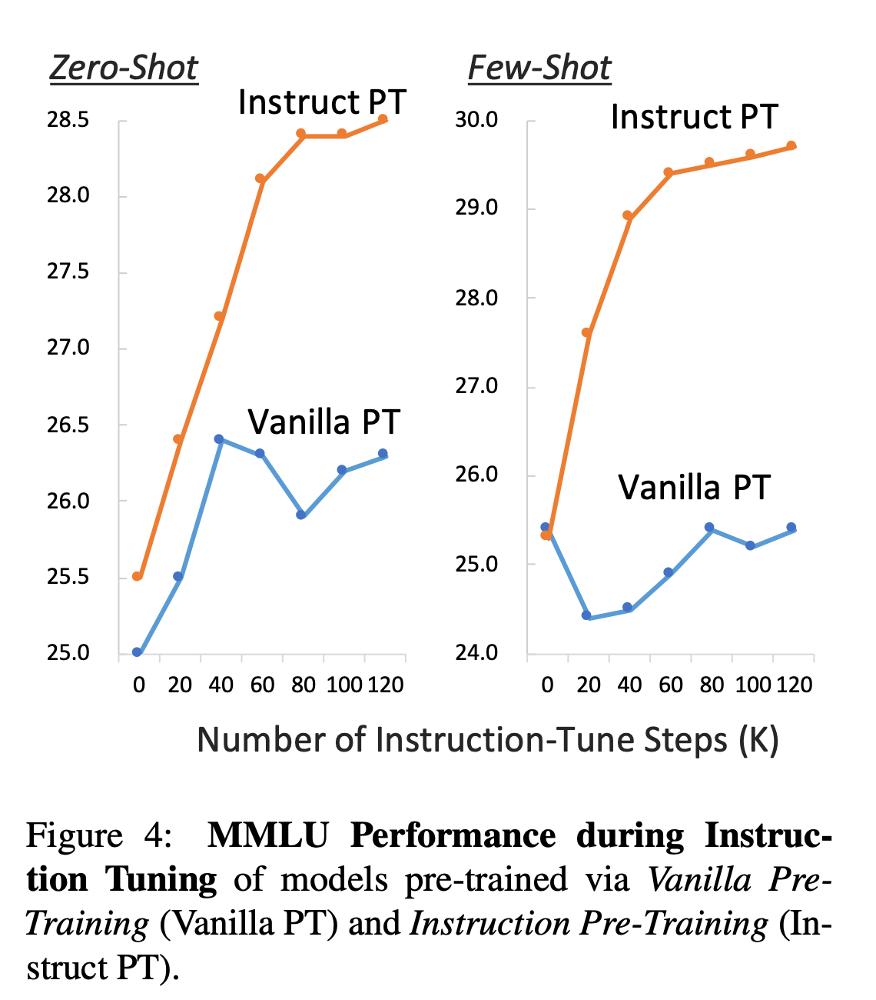

이어서 SFT를 해도, 더 안정적으로, 더 빠르게 수렴한다.

#### 4.2 Domain-Adaptive Continual Pre-Training

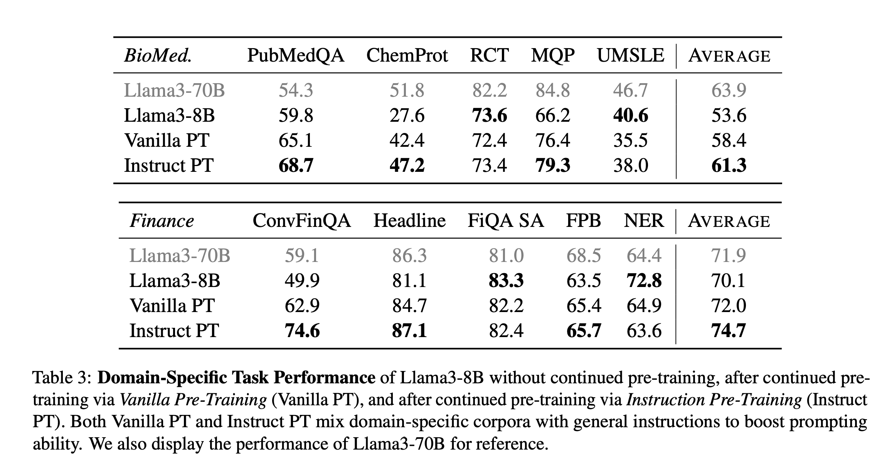

라마3-8B(인스트럭트 아님)에다가 한건데 라마3-70B를 능가하는 것도 있다.

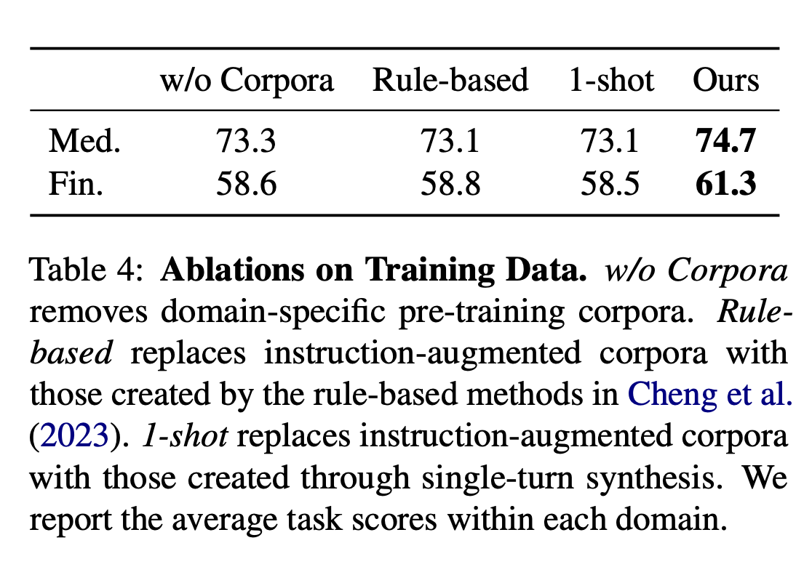

Abalation인데 여기 아주 주요한 내용이 있다.

- w/o Corpora의 경우 해당 도메인의 코퍼스를 다 뺀거다. 빼니까 좀 더 못하고, 넣으니까 잘하는거보면, **Instruct 형태로 도메인의 지식주입은 가능하다.**
- Rule-based로 생성한건, 어떤건 떨어지고 어떤건 올라간다. 룰베이스로 Instruct를 만들면 다양성이 저하되서 좋지 않음을 시사한다.
- 1-shot은 단일턴만 넣고 학습한거다. 지시사항이 복잡할수록 성능이 더 올라갈 여지가 있음을 의미한다.

### 5. Instruction Synthesizer 분석

말뭉치와 task를 주고 응답을 잘 내뱉는지에 대해 검수하는 것으로 검증한다. (아마 뭐 학습한 데이터셋들의 test나 eval set에 대한 I,R을 가지고, 현재 모델이 예측한 I,R과의 f1 스코어를 매기는 모양이다.)

근데 이건 사실 당연할거같은게, base가 못할수밖에 없다. 이놈은 Next Token Pred로만 학습된거일텐데, 이런걸 아무리 퓨샷이라고 한들 잘하기 힘들어보인다.

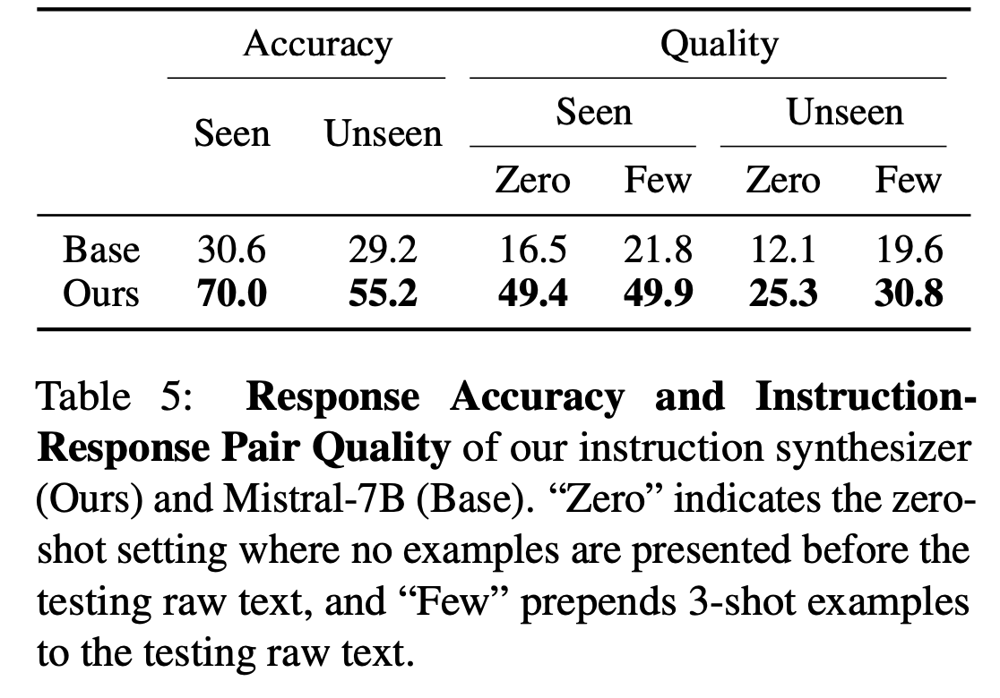

아래 도표는 Synthesizer가 만든 instruct가 실제로 도움이 될까?에 대한 실험이다. 따라서 base모델한테, Synthesizer가 만든걸 few-shot으로 줘보고, 그냥 랜덤으로 선택해서 줘보고 그런식으로 실험을 했을때인데,

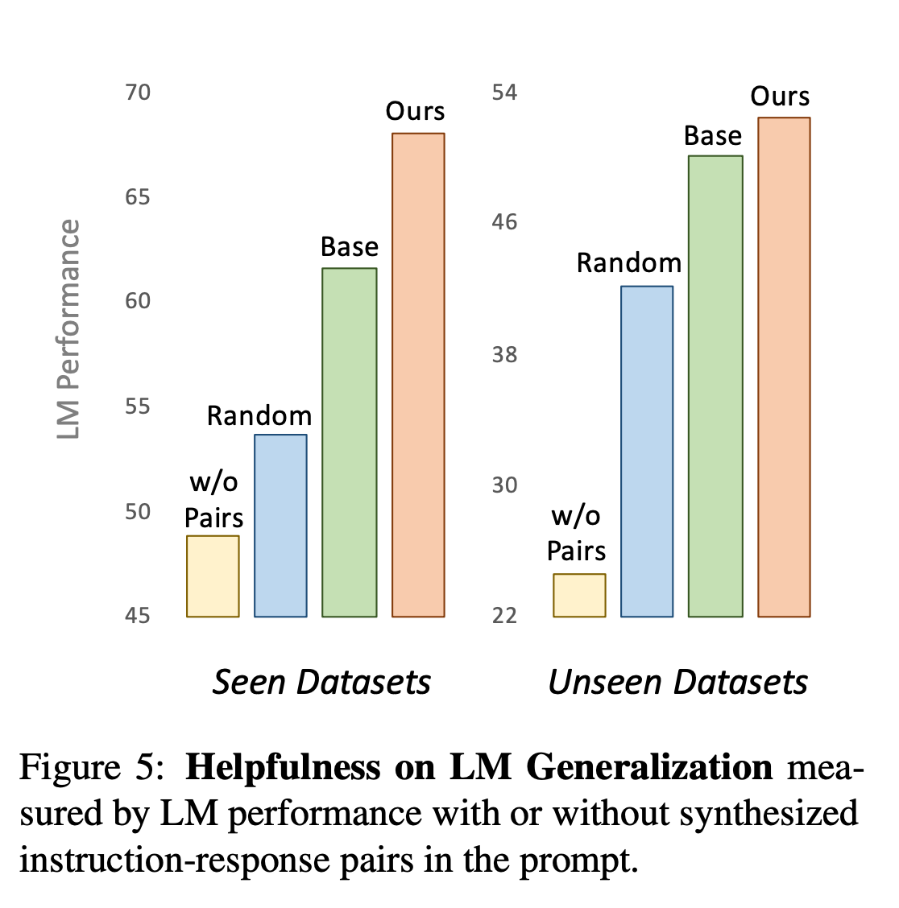

실제로 Random으로 주거나, Base가 생성한걸 주거나 한 것 보다, Synthesizer가 만든걸 줬을때 훨씬 잘한다. 즉, Base가 만든거부터 잘한다는 것은, 위의 실험결과와 엮여서 실제로 잘 만들고 도움도 되는 고품질의 Instruction을 잘 만들었다고 볼 수 있다. (**Base한테 퓨샷주고 하는 검증 기법은 뭔가 다른 곳에서도 유용하게 쓰일 수 있을 것 같으니 잘 기억해놓으면 좋겠다.**)

#### 5.2 Instruction-Augmented Corpora

애가 이상한걸 만들어낸다면, GPT-4로 Context와 질문과 답변이 서로 연관성이 없게 나올것이다. 그래서 GPT-4를 통해서 그걸 검증한다.

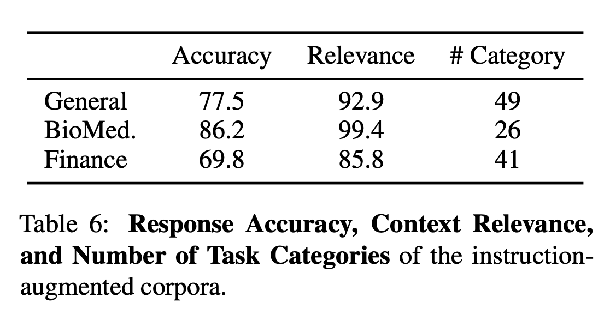

85% 이상의 연관성을 가지고, 70점 정도의 정확도를 가진다. (꽤 잘 만들어지는 것 같음)

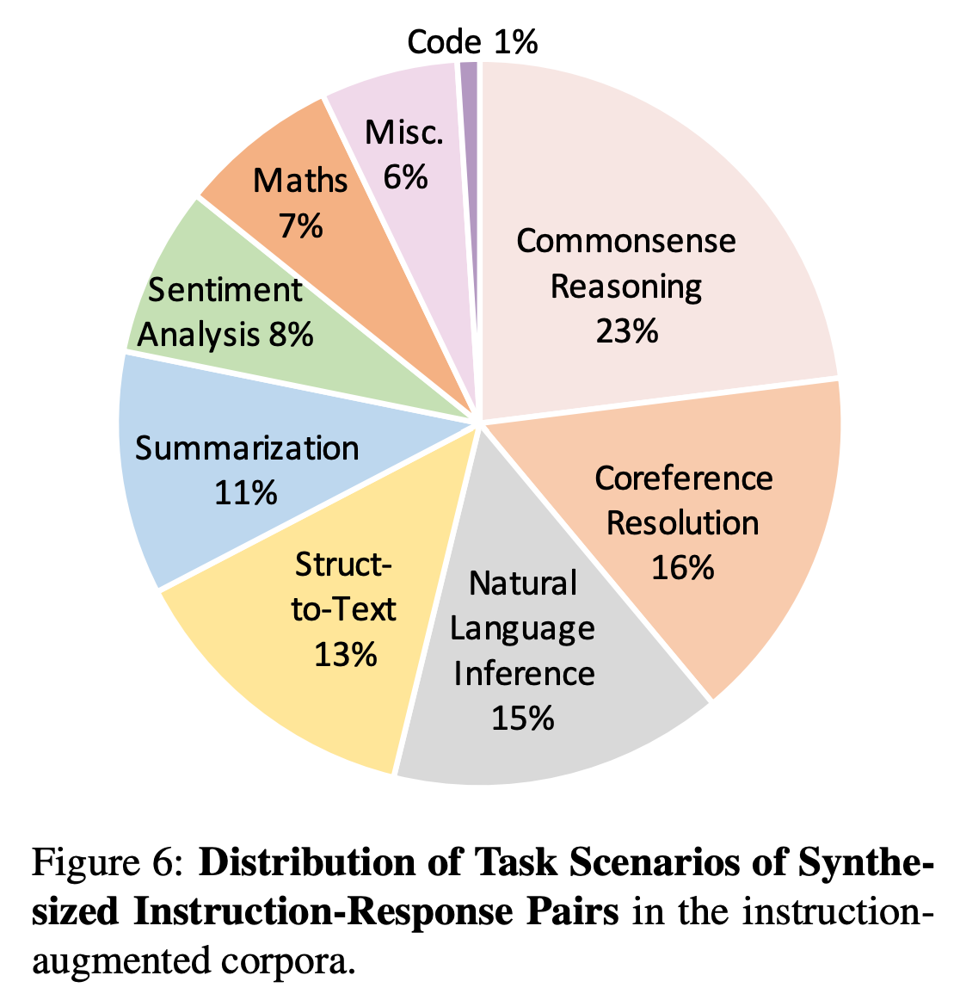

본인들의 말뭉치에서 실제로 만들어보면 위와같은 카테고리들의 데이터들이 만들어진다는 것이다. **즉 그냥 아무런 말뭉치나 보더라도 너무 하나의 치우치지 않고 곧 잘 만든다는 이야기다.**

#### Data Curation for LM Pre-Training

사전학습 데이터를 만드는데는 수집, 청소, 정리등이 필요하고, 대부분의 데이터는 인터넷에서 모아지므로 저품질이나 중복 컨텐츠등 문제가 많다. 다양한 방법론으로 이런걸 제거해야되고, 데이터 조직이 많은 것들을 수행해야한다. 하지만 현 연구는 이런걸 좀 보완할 수 있는 것이라고 자신있게 소개한다.

### Conclusion

Instruct Pre-Training은 단순한 Scratch 뿐만 아니라 Further의 도메인 녹이기에도 아주 효과적이며, 적은 데이터로 좋은 성과를 낼 수 있는 방법론이다.

현재 논문을 기준으로 더 많은 확장이 있기를 기대한다.

### Limitations

1. 합성기조차 LLM이라 거기서 환각이 발생하여 이상한걸 학습할 수 있음
2. 여기선 억단위 토큰으로 했는데, 요즘엔 그냥 Scratch를 조단위로 올려서 이거보다 잘된 사례가 많음.

## 마치며

금융영역에 대해서는 성과가 그렇게 좋지 않으며, 심지어 논문 말미에는 해당 데이터만 제외하고는 다 공개하겠다고한다. (실제로 되어있고) 이게 무슨 의미일까? 보험에서 적용한다면 잘 될까?

실제로 내 가설이 어느정도 맞음을 증명한 논문이다. 다만 Instruct에서 Further를 한게 아니고 Base에서 Further를 했기에 나중에 뭔가 해본다면 이 관점에서 뭔가 잘 해봐야 하지 않을지, 전회사에서도 많은 도메인 프로젝트에 말뭉치를 그냥 조금 밀어넣어서 CP를 하고 SFT를 하니까 더 잘했는데, 같은 방법론을 조금 바꿔서 위의 방식을 꼭 한번 써봐야겠다.

Synthetizer는 꼭 만들어야 할까? GPT-4o mini나 이런걸 써도 잘할거 같은데....(이 부분만 타개 가능하다면 정말 무궁무진할듯)