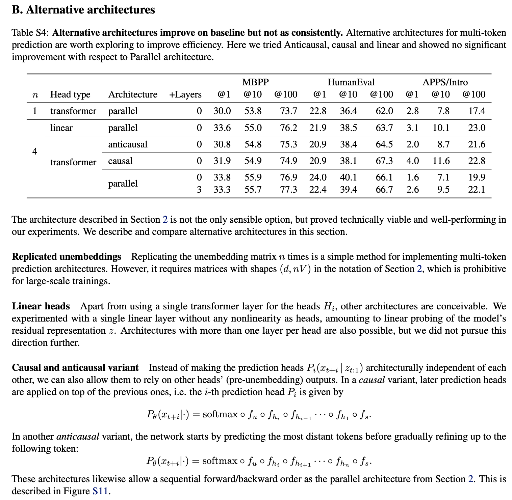
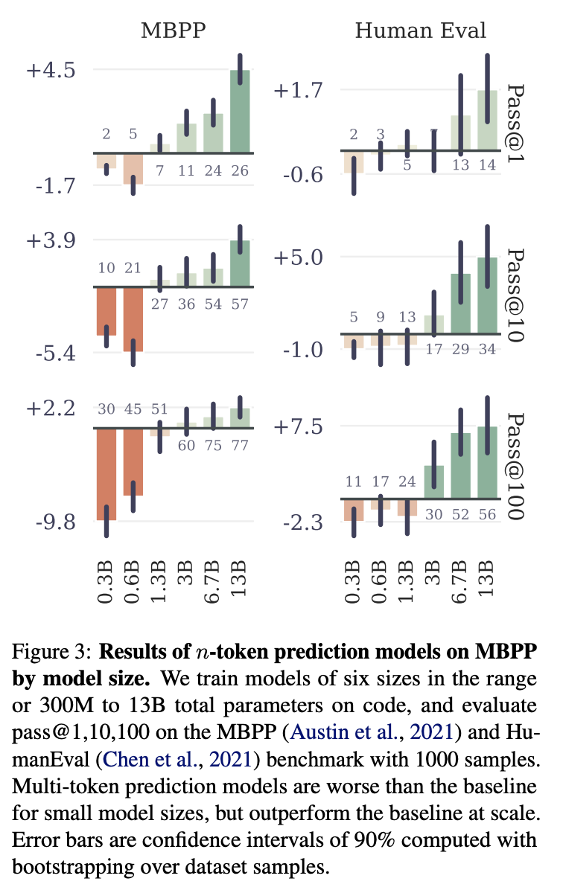
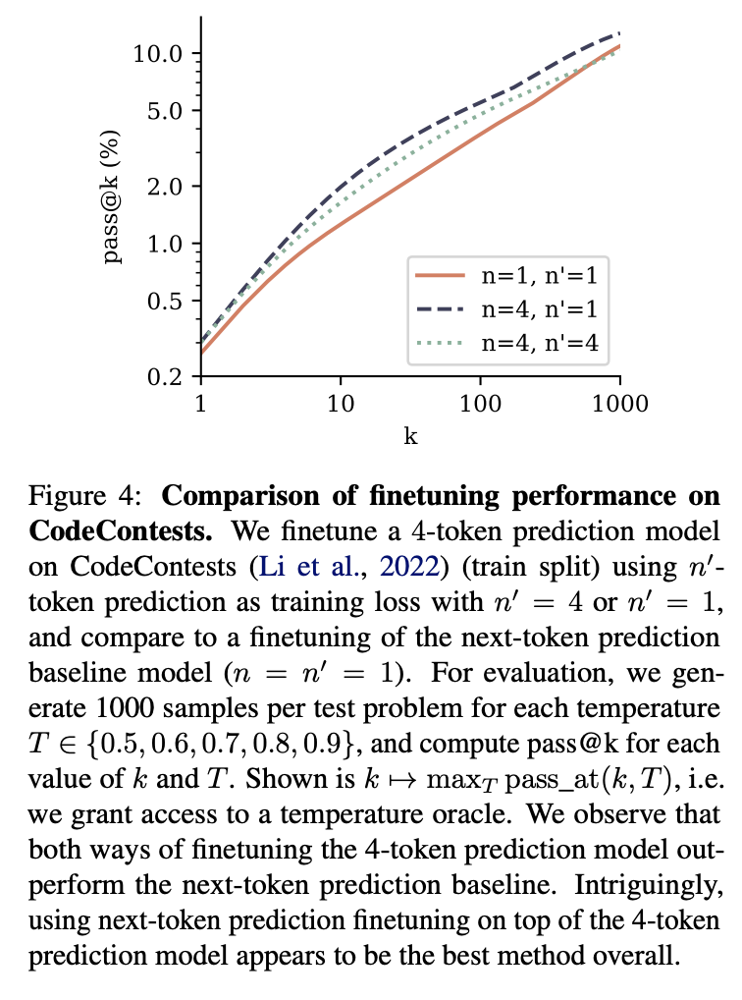
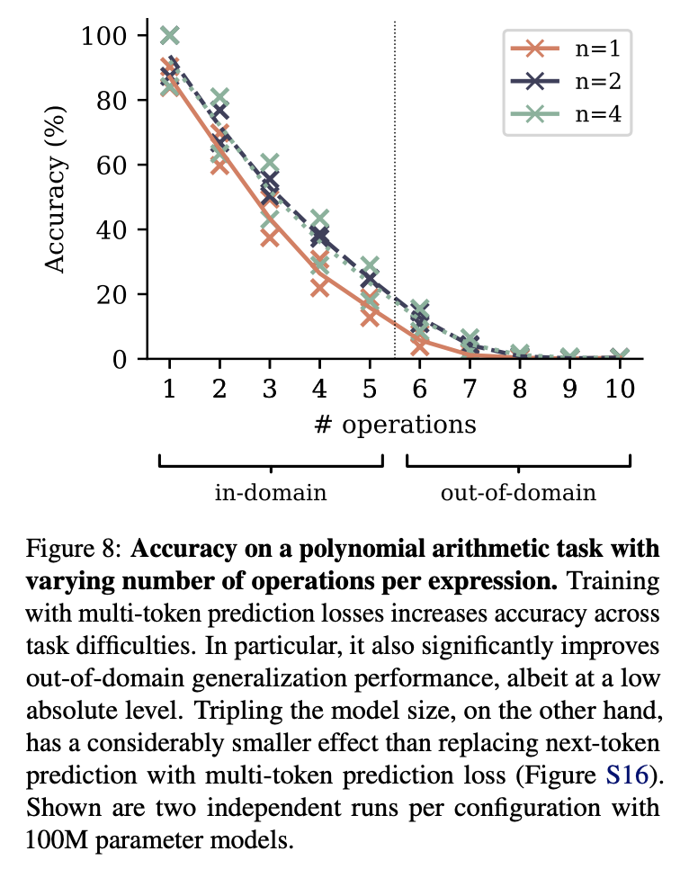
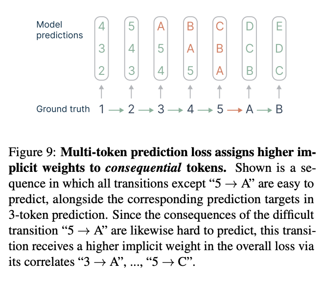
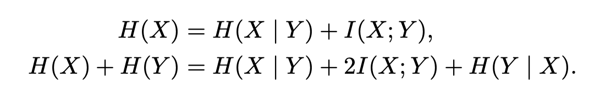

# Better & Faster Large Language Models via Multi-token Prediction

## 논문

https://arxiv.org/abs/2404.19737

## 요약

### 기존의 한계

- Next Token Prediction은 너무 토큰이 지역적으로만 보게되고, 속도도 느리다!

### 1. Introduction

MLP Layer까지는 그대로 두고, 거기서 나온 hidden_state(z)로 n개를 동시에 예측시키자!

이러면 n개를 잘 예측하는 z가 학습될테니까, 결국엔 LLM이 다중 토큰 문맥에 대해 강건한 모델로 학습될 것이다.

### 2. Method

구현 방법이야 여러가지가 있겠는데,

n 1에 transformer parallel은 그냥 ntp 기본모델이다.

n 4에 linear parallel은 논문에서 제안하는 방식으로, mlp까지는 동일한걸 쓰고 lm_head만 4개를 예측시키는 방식

n 4에 transformer를 붙히는 방법도 있는데, causal은 block 1개로 t+1로 t+2를 뽑고, t+2의 z로 t+3을 뽑고, t+3의 z로 t+4를 뽑는 방식이다. anticausal은 역방향으로 하는 방식이다.

n 4에 transformer parallel은 각각의 n에 각각의 transformer block을 붙히는거고, layer를 3개까지 늘려보냐 마냐 하는 차이이다.

참고로 Qwen3.5는 n 4에 transformer causal인데, z로만 뽑으면 오차누적 등의 문제가 있어서 그런지 전체 sequnce의 hidden_state를 rms_norm해서 concat해서 condition처럼 사용한다.

내 생각엔 parallel이 제일 좋긴한데, transformer block이 추가되니 속도도 속도고, 느리기도 느려서 그런거 아닐까 싶다.

#### 3.1 모델이 커질수록 MTP 효과가 좋다.

#### 3.2 Inference 이점이 최대 6.4배!

self-speculative decoding가 가능하니까, 일단 MTP로 우다다다 뽑아놓고, 본인의 lm_head로 speculative decoding하면, 작은모델도 필요없고 훨씬 빠르게 가능하다.

#### 3.3 Byte Level Tokenizer에서 조금 더 성능향상이 뚜렷함.

그도 그럴게, byte token은 너무 raw해서 의미를 같기 어려운데, mtp하면 byte가 한 단어로 완성될 여지가 있다. 8 byte까지 해도 효과가 있었다고함. (한국어에는 희망적일지도?)

#### 3.4 n이 그러면 8이 제일 좋더냐?

바이트때는 그랬고, 일반적인 경우 4가 제일 좋았다.

#### 3.5 MTP가 엄청난 데이터를 봐도 계속 잘하는게 맞냐?

이건 아마도, MTP가 다양한 패턴을 보다보면 수렴하지 못하는 문제가 생길 수도 있어서 그럴거같은데, 실제로 200B 토큰 이상에는 최적의 n이 4가 아니었다고하며, 그래도 에포크가 진행되도 유의미한 성능향상이 있다고 보고하였다.

#### 3.6 Next Token Prediction보다는 잘하던가?

실제로 잘하고, MTP를 한 모델을 NTP로 학습시켜도 성능향상이 있었다.

가장 효과적인건 사전학습을 MTP로 하고 task를 NTP로 한게 좋았다.

#### 3.7 일반 자연어 task도 잘하는가?

일반적인 자연어 벤치마크에서는 잘 못함 -> 근데 자연어 벤치마크의 채점 방식이 불합리하다고 이야기함

요약에서는 조금 성능이 올라가는 부분이 있었음.

수학의 경우 적은 데이터에서는 n이 2일때 잘하다가, 데이터가 많아지니 NTP가 더 잘됨. n 4는 그냥 계속 못했다.

수학은 아무래도 연쇄적인 논리해석이 중요하다보니, 적은 데이터에서는 NTP가 잘 못하고, n이 2일때 잘하는 것 처럼 보이다가, 데이터가 많으면 역전되는 것 같다고 해석함. 따라서 MTP는 이런 토큰을 여러개 봐야하는 부분에서 데이터 효율적일 수 있음을 어필함.

### 4. Ablations on synthetic data

#### 4.1 Induction capability

토큰 패턴을 잘 학습할 수 있냐?

Alice likes apples.
...
Alice likes → ?

이런거 next token prediction하면, 중간에 다른 스토리때문에 잘 못하는데, MTP는 잘한다. 따라서 어떤 특정 토큰 패턴에 대해 귀납적 추론을 한다고 보는데.... 이 부분은 그냥 패턴을 잘 외운거 아닌가 싶기도하고...

그리고 큰 모델은 그냥 잘해서 크게 차이가 없었다고 한다.

#### 4.2 Algorithmic reasoning

다단계 symbolic computation에서 좋은 성능을 보이며 어떤 경우에도 MTP가 NTP보다 좋았다고한다.

Out-of-distribution generalization 환경에서도 더 좋았다고한다. (연쇄를 5개만 학습시킨다음, 6개 10개를 계산시켜도 잘 맞추더라.)

여러 토큰을 뱉었을때 신뢰도 있게 학습해야되기 때문에, 이런 수학적 추론을 학습할때 조금 더 내부 회로를 계산을 잘 유지할 수 있도록 학습한다고 주장한다. NTP는 비교적 이런 경우 현재 기준에서 멀리 내다봐야하는 representation에서 부담이 생기기 때문에, 다항식 계산같은 경우에 큰 차이를 만든다고 표현한다.

모델 사이즈를 3배 늘리는 것 보다, MTP를 사용하는게 더 나았다고한다.

### 5. Why does it work? Some speculation

직관적으로 보면, 교사강요와 추론시 자기회귀간의 분포 불일치를 줄인다고 얘기한다.

= 학습은 이전 시퀀스가 무조건 정답인데, 추론때는 사실 그렇지 않음. (kv cache같은거에 오류들까지 포함하면 더 심해질거 같기도 함.)

#### 5-1. Lookahead reinforces choice points

굉장히 직관적인 설명인데, next token prediction은 한 토큰씩만 보니까 5->A를 한번 밖에 볼 기회가 없는데, MTP는 Rail 가듯이 하나씩 밀면서 학습하니까, 5->A를 뭐가됐던 3번 볼 기회가 생긴다.

중요한 변화점이 있는 부분에서 옳바른 선택을 할 수 있도록 모델이 학습되기를 기대할 수 있다고한다.

#### 5.2 Information-thoretic argument

정보이론학을 알아야 이해가 쉽게 되는데, I(X;Y)는 Mutual Information이라고 상호정보량이라고, 얼마나 둘간의 관계가 강하게 묶여있느냐를 의미하는데, X가 next, Y가 next+1이지만 H(Y)의 경우, 현재상태에서 Y는, 연쇄적으로 X에 대한 불확실성을 가진 상태에서 Y를 고민해야되기때문에, 정보이론 관점에서 X를 알고있을때 Y의 불확실성 H(Y|X)와 X와 Y의 상호정보량은 I(X;Y) 이걸 그냥 더한 수식이 된다. 즉 H(Y) = H(X|Y) + I(X;Y). 즉, 멀티토큰을 보게되면 2I(X;Y)가 되며, 즉 토큰간의 관계를 MTP는 Output들 끼리도 더 자세히 보게된다는 것이다. (증명은 논문에 따로 Lemma가 있는데 직관적으로 이해가 안되진 않는다.)

### L. Additional intuitions on multi-token prediction

정보이론학 관점에서 Cross Entropy를 분해한다.

Lemma L.3.이 핵심인데, MTP를 증명하려면 일단 Y(next+1)까지 강제로 수식에 들여놔야하는데, p(x,y)logq(x)로 하면, 현재 데이터 label이 next+1까지 있다고 하더라도, 결국 q(x)로만 채점하니까, X만 예측하는 그냥 일반 크로스엔트로피와 동일하다고 볼 수 있다. (동시에 이런 상황이 사실 교사강요 상황 아닐까?)

그렇게 놓고 확률과 통계를 이용하여 분해하다가 위에 나온 정보이론 항으로 치환하면, 결과적으로 `현실과 모델의 X,Y의존성을 잘 뽑으면서`, `Y를 알았다면 X를 잘 맞출 수 있을까?`의 문제로 분해할 수 있다. 즉 크로스 엔트로피 자체가 X만 보고 답을 맞추는 것 같지만 은연중의 의미로 정보이론학 관점에서는 교사강요로 썰려나가는 Y까지 dependency가 있다는 걸 알 수 있고, MTP는 그 문제를 자연스럽게 해소시켜주기 때문에, 수학적으로도 이게 일리가 있다. 뭐 이런 의미로 해석해볼 수 있겠다...

## 마치며

방식자체는 심플한데, 수학적으론 꽤나 심오한 내용인 것 같다. Qwen3-next나 Qwen3.5는 이 방법과는 조금 다르게 변형해서 쓴 것 같아서 나중에 모듈을 한번 까보면 좋을 것 같다.
