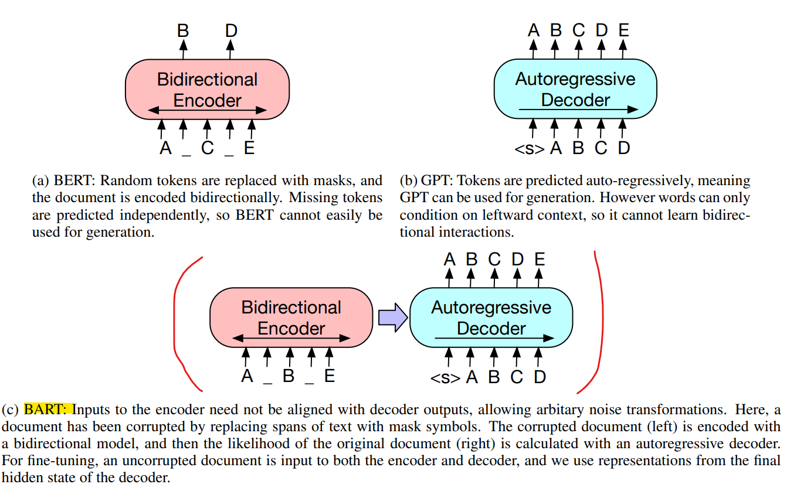
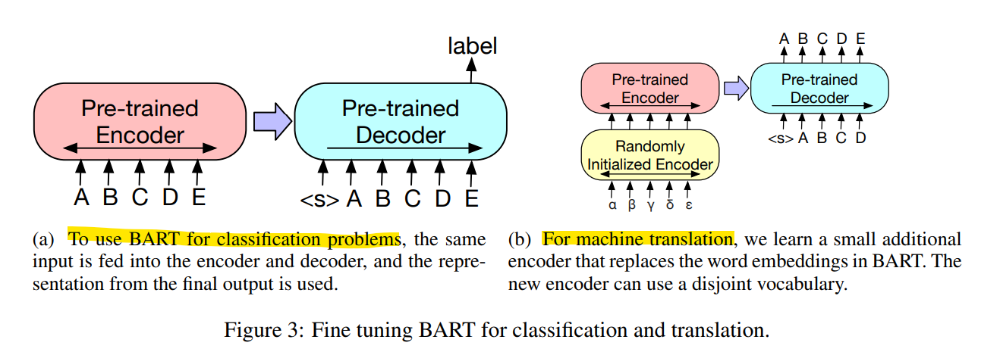
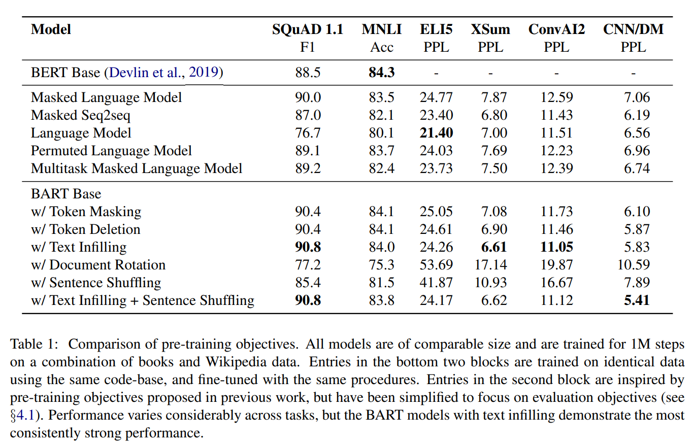
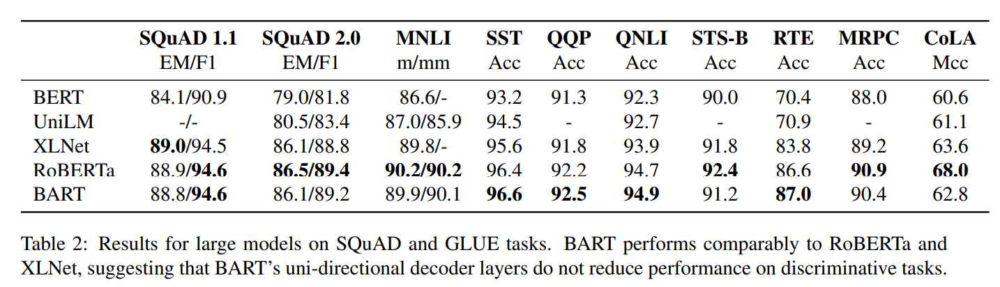

# BART: Denoising Sequence-to-Sequence Pre-training for Natural Language Generation, Translation, and Comprehension

## 논문
https://arxiv.org/abs/1910.13461

## 배경
1. 대표적인 NLP 모델의 특징 중 2가지는 Auto Encoding(BERT)와 Autoregressive(GPT)가 존재한다.
2. 분류와 같은 task는 전체 문맥을 보는게 좋으므로 AE형태의 모델이 잘된다.
3. 생성과 같은 task는 이전관계를 더 고려하는 AR형태의 모델이 잘된다.
4. task에 상관없이 잘 되는 일반화된 모델을 만들어보자!

## 요약
1. Seq2Seq 구조의 BART는 Encoder는 AE형태로, Decoder는 AR형태로 구성하여 BERT와 GPT의 이점을 모두 가져간다.
2. Encoder의 학습은 5가지 정도 방법론이 존재하는데, 모두 문장과 단어를 얼마나 잘 오염시키고, 원래로 되돌리는지를 판단한다.
    - Token Masking
    - Token Deletion
    - Text Infilling
    - Sentence Permutation
    - Document Rotation
3. Decoder의 학습은 Left To Right 형태의 평범한 다음 토큰 예측 문제를 해결한다. (정답과의 NLL (크로스 엔트로피) 계산)
4. 모델의 구조에 따라 fine-tuning에 제약이 있던 기존의 방법론을 크게 탈피한다. (대부분의 상황에 전부 사용 가능함)
    - [Sequence|Token] Classification
    - Sequence Generation
    - Machine Translation
    - Summarization
    - Machine Reading Comprehension

## 구조
  
앞은 BERT, 뒤는 GPT를 닮아있다. BART는 두가지 특징을 일반화 하는데 컨셉을 맞췄다.  
오염된 Encoding 결과로, 원본의 Decoding 가능도를 계산한다.  
Fine-Tuning은 양쪽에 정상 문장을 넣고, Task에 따라 특징 구역 Hidden State를 사용한다.  

## Pre-training BART
Encoding의 Token 오염에 제약이 없다는 특징이 있다. 예를들면 문장이 없는경우, 1개의 [MASK] Token이 삽입되는 것으로, 다음 토큰 가능도를 예측하는 LM과 동치가 된다.  
### Token 오염전략
1. Token Masking  
    BERT와 동일한 방식이다. (Random Token Masking)
2. Token Deletion  
    token을 지운다. 1번은 token의 개수를 알 수 있지만, 2번은 알 수 없다.
3. Text Infilling  
    포아송 분포로 랜덤 추출된 span lengths만큼의 token을 추출하여, 전체의 token을 1개의 [MASK] token으로 치환한다.  
    텍스트가 없다면, 1개의 [MASK] token을 추가한다.  
    마스킹된 token을 맞추는 것 만으로, span으로 몇 token이 가려졌는지까지 예측하는 효과를 얻을 수 있다.
4. Sentence Permutation  
    마침표 기준으로 전부 쪼개서, 문장에 대한 token을 전부 섞는다. 섞인 token을 원래 배열대로 되돌리는 문제.
5. Document Rotation  
    정규분포 샘플링으로 token 하나를 추출하여, 랜덤 문장의 시작값으로 넣고 원래 문장을 예측하게한다. 문장의 시작점에 대한 token을 학습할 수 있을 것이다.

## Fine-tuning BART
### 학습 전략
1. Sequence Classification Tasks  
    Encoder, Decoder에 원본을 넣고, Decoder의 마지막에 END token을 두어, 해당 output을 multi-class linear classifier에 넣어 예측한다. BERT의 CLS token을 활용하는 것에서 영감을 받았다.
2. Token Classification Tasks  
    Encoder, Decoder에 원본을 넣고, Decoder의 마지막 은닉층의 output을 사용한다. 해당 representation은 각 token의 representation이 된다.
3. Sequence Generation Tasks  
    새로운 Layer없이 즉시 Fine-Tuning 가능하다. Question Answering, Summarization Task에서 사용 가능하다.  
4. Machine Translation  
    
    Encoder에 임베딩 레이어를 새롭게 초기화된 Encoder를 하나로 바꾸어 사용해야한다. 때문에 BART의 원본 Encoder에서 사용되는 vocab과 별도의 vocab을 하나 더 사용해야 한다.  
    학습은 end-to-end로 진행 가능하나, freeze 방법을 변경하여 2번의 학습을 진행해야 학습이 잘 된다.  
    1. BART의 대부분을 Freeze하고, 추가된 Encoder, BART Position 임베딩, BART의 첫 input projection layer만 학습한다.
    2. 전체를 작은 반복수로 학습한다.

## 성능
  
대체적으로 BART가 유사하거나 성능이 조금 더 좋다.  
하기의 설명은 BERT Base에 대한 모델들의 간략한 설명이다.  
=> BART와 비교하기 위해 BERT 형태의 여러 구조를 테스트 했다고 볼 수 있다.  
**Language Model**  
Cross Attention을 제외한 BART Decoder Only로 GPT와 구사하게 구현함.  
Encoder가 없으니 AE를 볼 수 없는 차이가 존재한다.  
**Permuted Language Model**  
XLNet을 근간으로 하되, 1/6 token을 샘플링하고, relative positional embedding과 attention across segments는 구현하지 않았다.  
Pre-Training의 목적이 left-to-right의 조건부 가능성을 구하는데 집중한 뒤, 해당 은닉 값을 활용하는 형태지만, BART는 Pre-Training에서 left-to-right에서 이미 각 token의 예측까지 끝나므로, 학습 서순이나 목적이 약간은 상이하다.  
**Masked Language Model**  
BERT와 동일하며, 15%의 token masking  
BART는 AR도 학습이 진행되지만, 해당 모델은 진행 X  
**Multitask Masked Language Mode**  
UniLM에 처럼 만들었고, 추가적인 self-attention masks와 1/6 left-to-right, 1/6 right-to-left, 1/3 unmasked로 추출하였으며, 나머지 1/3은 처음의 50%를 마스킹하고, 나머지를 left-to-right로 마스킹한 형태를 취했다.  
BART랑 학습 구조는 비슷하긴한데, BART는 AR을 통해 이전 token의 관계를 전부 고려하지만, UniLM은 각 token을 독립적으로 본다.  
**Masked Seq2seq**  
MASS와 유사하게 구현되었으며, 50%의 token을 span으로 정해서 마스킹했다.  
BART와 가장 유사할 수 있는 녀석이지만, Decoder에도 Masking이 들어가고, Encoder와는 다른 Mask를 취한다. 때문에 BART 대비 Denoising의 의미가 약해진다.  
 
데이터에 대한 설명은 길이상 생략한다.

### 전반적 시사점
1. Performance of pre-training methods varies significantly across tasks  
    사전학습의 방식은 분명히 하위 Task 성능에 영향을 미친다.
2. Token Masking is crucial  
    Token 마스킹 방식이 결정적으로 하위 Task 성능에 영향을 미친다.
3. Left-to-right pre-training improves generation  
    마스킹을 사용하는 방식은 대체적으로 생성 Task에 약하다. (Auto-regressive를 pre-training중에 학습할 여지가 없으므로.)
4. Bidirectional encoders are crucial for SQuAD  
    양방향 모델 (Auto Encoding 방식)이 SQuAD에서 더 잘 맞춘다. (당연 질문에 대한 답변은 끝까지 들어봐야 알 것이니까.)  
    그런데 BART는 양방향 모델에 근사할 정도로 성능이 나온다.
5. The pre-training objective is not the only important factor  
    Permuted Language Model은 같은 방식의 XLNet보다 성능이 안 좋았는데, XLNet에서의 아키텍쳐 개선을 포함하지 않은 형태이기 때문이다. 즉, 사전학습 모델의 목적보다는, 아키텍쳐 개선이 더 성능에 유의미하다. (SOTA만 써도 될까...?)
6. Pure language models perform best on ELI5  
    ELI는 input 대비 output에 outlier가 많은 데이터인데(Input으로 만들어지는 Output이 관계가 강하지 않음), BART는 Input과 Output의 관계가 강할수록 학습이 더 잘된다.

### Large-scale Pre-training Experiments
  
AE 형태의 RoBERTa에 비해도 거의 비슷비슷한 성능을 내며, AR의 목표인 생성 Task는 BART가 훨씬 잘하는 것을 볼 수 있었다.  
생성모델의 작업 성능 향상이, 분류성능을 희생하진 않는다는 점이 가장 중요하다.

## 여담
1. 모델을 먼저 만들고 논문을 나중에 본 첫 케이스인데, 그 정도로 생각하는 것은 다 만들어볼 수 있을 것 같다. 생각 없이 여러 Task에 굴려볼만한 가장 무난한 모델이지 않을까. (https://wandb.ai/bart_tadev/BartForConditionalGeneration?workspace=user-bart_tadev)
2. T5와 비슷한 시기에 나왔거니와, Facebook (BART) vs Google (T5)이기 때문에, 같이보면 좋을 것 같다.
3. 후속연구로 Masking 방식을 더 다양하게 하면, 성능을 올릴 수 있지 않을까 기대해보고 있다.
4. 논문이 8장이라 길어진 것은 어쩔 수 없는데, 논문이 진짜 알차다.
