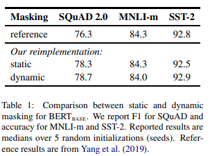
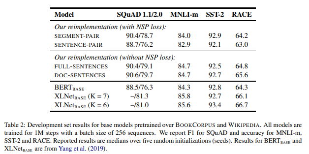
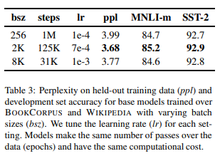
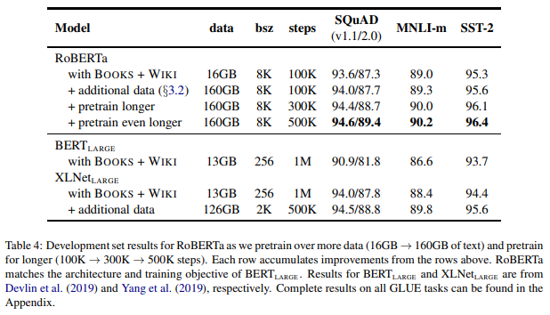
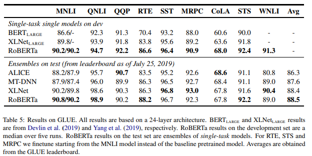
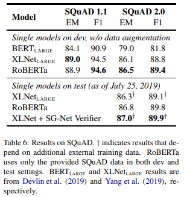
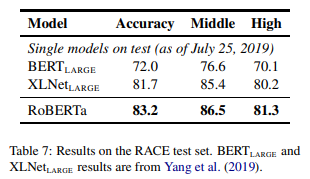

# RoBERTa: A Robustly Optimized BERT Pretraining Approach

## 논문
https://arxiv.org/abs/1907.11692

## 요약
- LM을 pretraining 하는 것은 많은 성능 향상을 가지고 오지만 pretraining 방법론에 따른 성능 비교는 조심히(주의 깊게) 측정해야 한다. LM pretraining은 코스트가 크고 hyper parameter와 dataset size는 최종 성능에 영향이 크다.
- BERT의 hpyer parameter와 dataset size가 어떤 영향을 끼치는지 연구를 하던 와중에 BERT가 under train된 것을 발견했다.
- 연구를 통해 MLM 모델의 성능을 향상 시킬 수 있는 발전된 방법(recipe)을 찾아냈다.
  1. 모델을 길게, 큰 배치 사이즈를 사용하여 학습
  2. NSP 학습을 제거 (그 결과 token_type_ids 사용 x)
  3. 긴 문장을 학습(training on longer sequence)
  4. 동적 마스킹을 사용한 학습(dynamically changing the masking pattern)
- 제안하는 방법이 다운 스트림 태스크에서 성능 향상을 가져왔다.
- 또 추가 데이터를 사용해보니 더 많은 데이터를 사용 할 수록 다운 스트림 태스크의 성능 향상이 있었다.
- (논문이 발표된 시점 기준으로) 제안 방법은 MLM 학습의 올바른 학습 디자인이다.
- 해당 방법으로 사전 학습된 BERT를 **R**obustly **o**ptimized **BERT** **a**pproach 를 줄여 RoBERTa로 불렀다.

## 실험 결과들
### 마스킹 방법에 따른 차이

### NSP와 그에 따른 학습 포맷에 따른 비교

- SEGMENT-PAIR + NSP : BERT의 학습에 사용한 방법
- SENTENCE-PAIR + NSP : 문장 페어, 같은 문서(document)의 연속된 문장이거나 다른 문서에서 sampling된 문장, 512 token보다 짧음
- FULL-SENTENCES : 문서에서 뽑아낸 연속된 문장들 (최대 512 token), 문서의 경계에서 sampling된 경우 다음 문서에서 separator token을 사이에 넣어준다.
- DOC-SENTENCES : FULL-SENTENCES와 비슷하나 문서 경계의 경우 문장을 이어 붙이지 않는다. (그 결과 512 token보다 짧다.)

이 실험에서 NSP 제거가 약간의 성능향상을 가져오는 것을 확인, 또 DOC-SENTENCES 방법이 성능이 좋았지만 학습되는 token의 갯수를 유지하려면 variable batch size를 사용해야 하기 때문에 이후 실험에서는 FULL-SENTENCES를 사용
### Batch size와 learning rate 의한 차이

- 큰 배치를 사용 할 경우 좋은 것을 확인(2k가 best)
- 추후에는 8K로 실험을 진행 했는데 별다른 언급은 없다.
- 다만 large batch size의 한계를 추후 연구 과제로 한다는 언급은 있음.
- 크면 클수록 좋은것이 아니라 일반적으로 큰 사이즈를 사용 하는 것이 좋다는 의미
### dataset size와 학습 길이에 의한 차이

## 다운 스트림 TASK 비교
### GLUE

### SQuAD

### RACE

## 여담
- 이전에 읽은 논문이지만 DSME 프로젝트로 인해 다시 읽어야 할 일이 생겼습니다.
- 저자 중 한명인 Danqi Chen 교수는 SimCSE 논문을 쓰기도 했습니다.
- 개념상 BERT와 차이는 없는 모델이지만 세부 구현의 경우 Segment Embedding Layer가 없습니다.(NSP가 없기 때문에)
- 로버타냐 로베르타냐 그것이 문제로다.