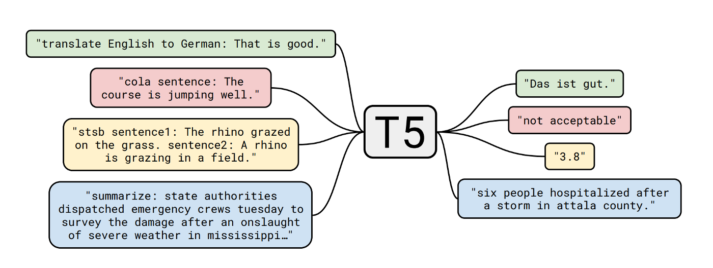
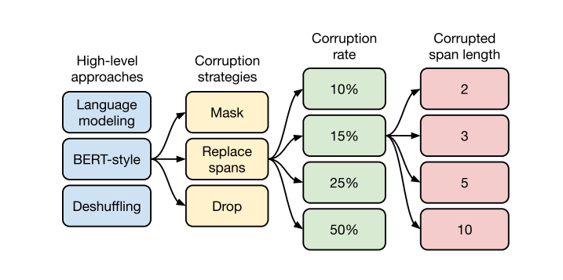

# [Exploring the Limits of Transfer Learning with a Unified Text-To-Text Transformers](https://arxiv.org/abs/1910.10683)
## Abstract
 - 우리는 <U>**여러 언어적 문제를 한개의 모델을 이용해 처리할 수 있는  T5**</U>를 소개하고자 함.   
 - 번역, 요약, 분류, ... 등 <U>**여러 테스크를 "{prompt}: {data}"와 같이 데이터에 컨디션(prompt)을 넣어 하나의 헤드에서 처리**</U>하는 것이 가능함.   
 - Finetune시 하나의 모델에 여러 테스크를 학습시켰을 때 어떤 결과가 나오는지 실험적으로 증명함.

논문을 정리한 블로그 글   
- [Exploring the Limits of Transfer Learning with a Unified Text-to-Text Transformer (a.k.a. T5)](https://inmoonlight.github.io/2020/08/29/Exploring-the-Limits-of-Transfer-Learning-with-a-Unified-Text-to-Text-Transformer/)

## Finetune
전이학습에서 finetune은 특정 분야에 맞게 설계된 Head를 학습시키는 것에 중점을 맞춰서 개발됨   
-> 특정 분야에 맞춰 학습시키다 보니 각 분야에 알맞는 Head와 추가적인 설계가 필요한 경우가 많았음   

T5는 하나의 헤드로도 여러 분야를 커버할 수 있도록 고안됨.      
위 사진과 같이 {prompt}: {data} > label이 나오는 방법으로 데이터에 컨디션으로 각 테스크를 분리하는 것이 가능하다고 봄.   

### Multi-Task leaning
    
Negativa-Trasfer, Task-Interference, OverFitting을 방지하기 finetune에 사용되는 데이터의 크기를 균등하게 만듬.
-> Negative-Transfer: 이전의 학습이 현재 학습에 영향을 끼치는 현상.
예: 모델에 classification을 학습시켰다가 동일한 모델로 QA를 학습시켰을 때 QA의 성능이 제대로 나오지 않는 현상.

결과 multi-task pretrain + single tinetune을 한 것이 성능이 좋았다.   
> 아마 multi-task finetune에서 task를 추가하면 추가할 수록 성능이 떨어지느 것은 negativa-transfer의 영향이 아닐 까 생각함.

## Pretrain
    
모델은 일반 Transformer와 같고 Pretrain방식도 비슷하다.   
shuffling, bert-style, language modeling 방법중 bert의 masking방식이 가장 뛰어나 전체 문장중 15%를 replace 시키는 마스킹을 진행함.   

# 잡설
[paust/pko-t5-base](https://huggingface.co/paust/pko-t5-base)에서 klue 데이터를 넣을 때 마다 성능이 떨어지는 이유는 Negative-Transfer 때문이지 아닐까   
논문이 60페이지가 넘어가지만 최대한 요약하기 위해 multi-task learning 부분만 추가시켰다.(이것도 최대한 요약하느라 설명이 많이 빠짐....)   
