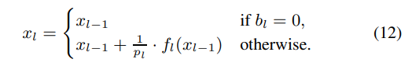
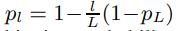
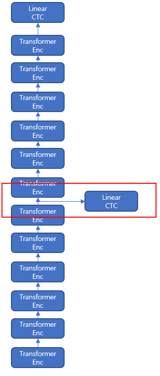
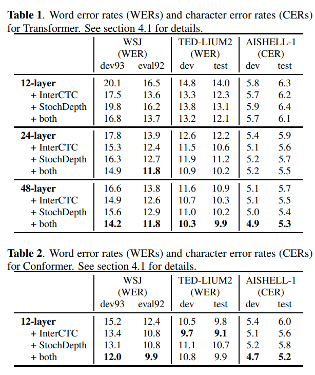
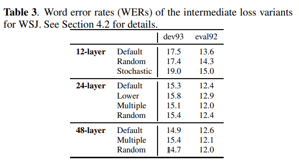
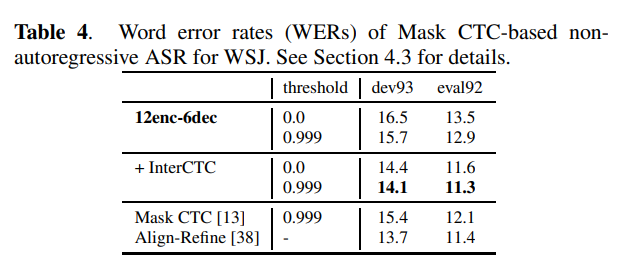

# Intermediate Loss Regularization For CTC-Based Speech Recognition

## 논문
https://arxiv.org/abs/2102.03216

## 요약
1. En-Decoder 형태의 모델로 STT Model을 학습하는 것은 정확도가 높지만 Resource, Inference Time등 Trade-Off 소요가 큼

2. Linear-CTC를 잘 학습하는 것에 집중해보자!

3. Model이 점점 더 깊어지고, 커지는 추세이니, 여기서 의도대로 학습이 잘되도록 수정해보는건 어떨까?

4. Transformer의 Residual Connection을 수정하는 것과, CTC Loss를 Encoder Layer 중간에서 활용해보는 것으로 성능을 증대시켜 보자!

### Stochastic Depth

Residual Connection을 Bernoulli Random Sampling으로 어떤 애는 비율로 주고, 어떤 애는 주지 않고 해보자. (Residual Network 정규화 기법)

L은 Encoder Layer total 갯수, l은 현재 Layer dx, pL은 하이퍼 파라미터 (논문에서는 0.7)

Test 동안에는 skip 하지 않고, 비율도 그대로(일반적인 Transformer Encoder Residual) 전부 부여해준다. (이게 잘 될지?)

### Intermediate CTC Loss

**Encoder Layer가 24개 이상일 때 통상 잘되고, 그 이하는 효과가 미미함.**

Stochastic Depth는 상위 레이어에서는 효과가 있으나, 하위일수록 효과가 미미했다.

`l (현재 레이어 index) / L (전체 레이어)` 의 효과로(상위 레이어를 12로 보는 것같음) 상위 레이어에서는 대부분이 높은 비율로 Residual 효과를 보지만, 하위 레이어에서는 약간만 보기 때문.

때문에, Encoder Layer의 중간정도를 잡아서, Intermediate Layer라고 정하고,

1) Residual의 영향을 강하게 받는 상위 레이어를 위한 CTC Linear Loss 연산과
2) Residual의 영향을 약하게 받는(이전의 State의 영향을 강하게 받는) 하위 레이어를 위한 CTC Linear Loss 연산

을 통해, 2개의 Loss를 Weighted sum 하는 것으로 Full Model 을 학습시키면서도, 2가지 형태의 모델을 각기 학습시키는 효과까지 낼 수 있다.

(느껴지기로는 탕수육 1개를 시켜서, 부먹/찍먹 먹는 방법으로 약간은 다른 맛을 느끼게 되는 효과와 비슷하지 않을까 싶다.)

### 실험

여러가지 종류에 대한 실험을 진행한다.

- 중간보다 아래로 잡는경우
- 양분하지말고, K개로 분해해보는 경우
- 랜덤 위치로 지정해보는 경우
- loss를 둘중에 하나만 랜덤으로 역전파 해보는 경우 (양분기준 상위, 하위)
- 다른 CTC Loss 형태에 적용해보는 경우 (Mask CTC)
- InterCTC만 적용, StochDepth만 적용, 둘 다 적용

## 결론

본 실험은 GreedySearch 및 Not LM으로 진행됨.

1. 12 Layer에서도 잘되는 경우가 있긴 했으나, 대체적으로 24 Layer 이상에서 잘됨
2. 둘 다 적용하는 것이 더 잘되며, 둘 중에 하나만 적용하는 것도 없는 것 보다는 나음

1. 중간보다 낮으면(Lower) 잘 안됐음
2. 2개 이상으로 나누는 것(Multiple)은 잘 될때도, 안 될때도 있음
3. 랜덤(Random)한 위치를 선택하는 것도 마찬가지
4. 3,4,5 결과로 중간으로 나누는 것이 제일 잘됨

1. 다른 CTC형태라도, TransformerEncoder를 사용한다면 유의미한 성능향상을 기대할 수 있음

## 여담
- **InterCTC 정도는, Wav2Vec 2.0의 Fine-Tuning 단계에서도 한번 적용**해볼만 하지 않을까 싶습니다.
  - **다만 논문에서 반복적으로 24 Layer 이상 일 때를 권장해서, Base는 쓰나마나일 것 같네요.**

- **상위, 하위의 개념을 사실 어디 방향으로 낮고 높다고 봐야할지 모르겠습니다.** - 논문에 Layer 방향에 대한 구체적인 설명이 없음
- Stochastic Depth는 Transformers에 메인 모델을 재정의 해야해서 구현이 어려울 수 있겠습니다.
- InterCTC 같은 경우는 Wav2Vec2ForCTC 정도만 재정의해도 될 것 같아서 구현이 쉬울 수도 있겠습니다.
- **제 지인은 InterCTC만 했음에도, 유의미한 WER 향상을 경험했다고 합니다.** (논문대로 0.3 / Layer는 Vanilla Conformer에서 4번째 것을 선택함)
- RNNTransducer에 대한 CTC 개선안도 있는데 나중에 읽어봐야 겠습니다. (https://arxiv.org/abs/2011.03109)
- Large모델을 하거나, 이후에 진짜로 시간이 남아돈다면 한번 적용해보도록 하겠습니다.
