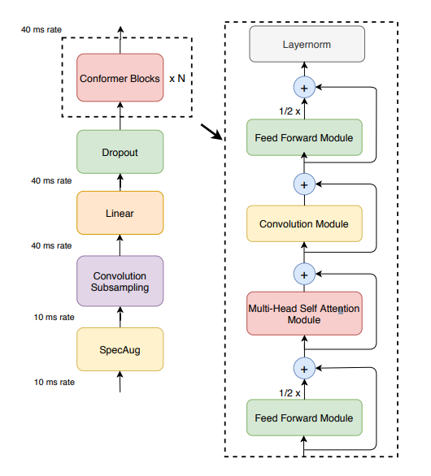
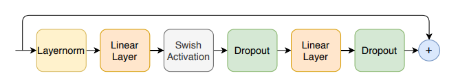
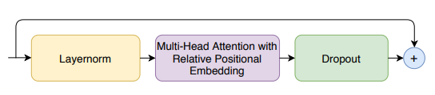
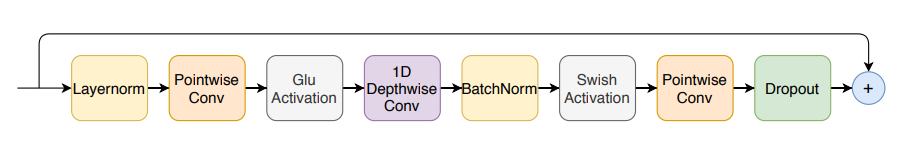
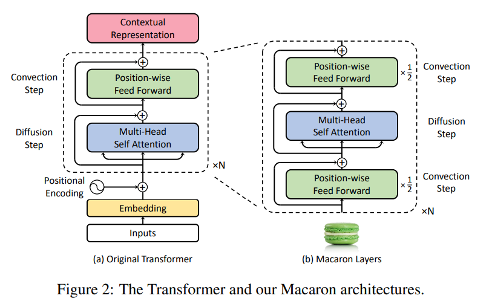
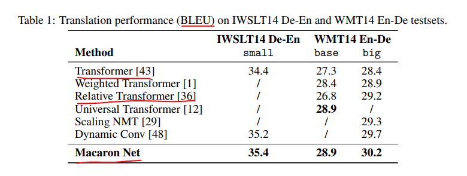
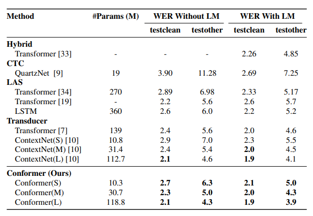

# Conformer: Convolution-augmented Transformer for Speech Recognition

## 논문
https://arxiv.org/abs/2005.08100

## 요약
1. 음성인식의 역사는 RNN -> CNN or Transformer 로 나아왔다.
2. CNN은 부분의 특징은 잘 잡지만, 전체의 특징을 잡기 어렵다.
3. Transformer는 전체적 특징은 잘잡지만, 부분의 특징을 잡기 어렵다.  
=> 그렇다면 CNN으로 부분 특징을 + Transformer로 전체 특징을 잘 잡아보자!

## 구조
  
SpecAug -> ConvolutionSubsampling -> Linear -> Dropout의 과정은  
Raw 음성데이터를 시간순으로 쪼개며, Transformer Input Shape에도 맞추게되는 일반적인 처리 과정이며,  
논문에서 주시할 부분은 'Conformer Blocks' 이다.  

Feed Forward Module이 Half-Step Residual Connection으로 샌드위치처럼 감싸져있는, Multi-Head Self Attention Module과 Convolution Module로 구성된다. (이런 구조는 MacaronNet에서 차용되었다. 아래에 설명 조금 써놓음)  

### Feed Forward Module
  
첫번째 Linear Layer의 역할은 4차로 계수를 확장했다가, 2번째 Linear Layer에서 Model 차원에 맞게 축소시킨다고 한다. (Macaron Net에서 사용된 아이디어가 고차방정식 미분해와 관련이 있어서, 해당 맥락에서의 역할을 수행하게 되는 것 같다.)  

### Multi-Headed Self-Attention Module
  
Transformer-XL에서 제안하는 Multi-Head Attention을 사용한다.
Relative Positional Embedding은 Transformer-XL에서 제안된 것으로, text 순서가 아닌, 현재 index로부터 상대적인 위치를 계산하여 가중 Embedding 시키는 형식이다. (가중시키는 방식은 여러가지가 있음)  
1. 들어오는 데이터가 음성으로 통상 기니까 있으니 Relative Positional Embedding이 더 잘되더라고 한다.
2. Layer 깊이가 깊어지니 Dropout 썼다고 한다.

### Convolution Module
  
CNN을 연속해서 쌓아놓은 일반적인 Convolution 형태이지만, Pointwise, Depthwise에 유념하자. (https://arxiv.org/abs/2004.11886 에서 영감을 받아서 만들어졌다.)  
Pointwise: 커널 사이즈가 1인상태로 통과한다. 화면의 shape는 달라지지 않지만, RGB등 채널 수를 축소시킬 수도 있다.  
Depthwise: RGB 각 채널별로 필터를 시킨다. 각 채널의 특징을 추출해낼 수 있다. 채널의 shape는 달라지지 않지만, 전체 픽셀 포인트의 Shape는 축소시킬 수도 있다.  
각 CNN별로 커널 혹은 채널에서 부분 특징을 잡아내기 위함이다.

## Appendix
#### Macaron Net
  
Position-wise Feed Forward 를 Half-Step Residual Connection로 해서 감싸는 방식은,
Strang-Marchuk splitting scheme (https://www.mdpi.com/2227-7390/8/3/302/htm) 에서 차용했다고 하는데, 나무위키 설명이랑 곁들여보면, 고차 미분방정식을 더 간단하게 해결할 수 있도록 축소하는 방법이라고 한다.  
이렇게 학습하면 transformer의 성능이 더 좋아졌다는 점 정도만 인지하고 넘어가면 될 것 같다.
  

#### 추가로 참고해야 하는 사실
80 Channel Filter Bank와 25ms Window로 10ms씩 stride 하는 기준으로 모델이 작성되어 있으니, 하이퍼 파라미터를 수정하려면 음향 기초 지식이 존재해야한다.

## 성능
  
음성 전체가 들어오는 경우 (Hybrid, CTC, LAS) 대비에는 전부다 Conformer가 좋고,  
Online-Streaming을 고려하는(Transducer) 경우 비슷하거나 좀 더 좋다.  
Abalation Studies에 레이어를 변형해가며 실험한 여러 케이스들이 있는데, 너무 길어질 것 같아서 생략한다. 논문을 확인해보면 쉽게 확인해볼 수 있고, **현재 작성되어있는 기준으로 하는 것이 가장 성능이 좋다.**

## 여담
1. **Vector Space에서 지역적, 전체적 특징을 전부 다 감안해가며 학습을 해야한다면, Transformer 보다 더 좋은 선택지가 될 수 있다.**
2. Wav2Vec2 와 같은 일반적인 Transformer 형태보다, 내부의 CNN Block이 더 존재하므로, Input의 차원이 Output이 되었을때 더 작아진다. 그 말은 확실히 CTC Loss로 계산할때 Input Length가 Output Length보다 작아질 여지가 존재하며, 필터링 필요할 수 있다. (CTC Loss는 logit Length < label Lenght 인 데이터가 있으면 학습이 잘 안됨)
3. 2~3개의 논문의 내용을 차용해서 합쳐놓은 형태라, Conformer 논문만 읽어서는 확실히 이해의 한계가 있었다. (조금은 설명이 부족한 것 같다...)
4. 인용된 논문 중 Macaron Net은 거의 Attention, FFN의 레이어의 미분과정을 따져가며 수학적으로 접근한 논문이라 필자도 제대로 이해하지 못한 점이 있다.
5. 내용 길이조절에 실패
