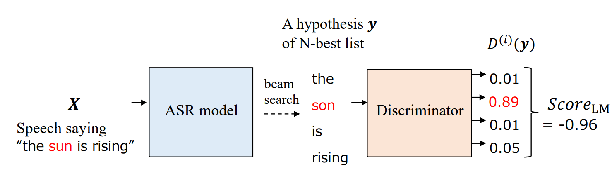
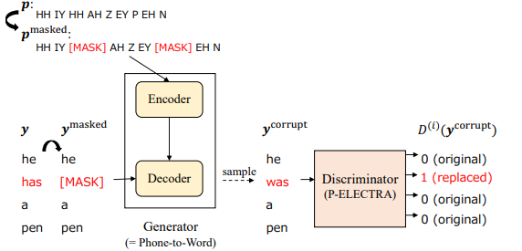
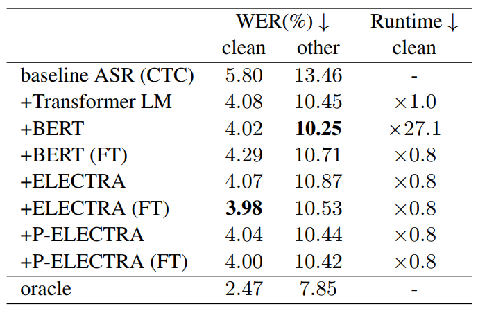

# [ASR RESCOREING AND CONFIDENCE ESTIMATION WITH ELECTRA](https://arxiv.org/abs/2110.01857)
# 문제
---

기존 LM과 BERT_LM이 가지고 있던
- Beam-Search를 거쳐 나온 n-bset 문장들의 오류를 검출 할 수 없는 문제
- Transformers기반의 LM의 Inference 시간이 늦어지는문제를 

등을 해결하기 위해 ELECTRA를 이용한 Sentence Scoring 방법을 소개

# 설명
---

   
1. Beam-Search에서 나온 N개 문장의 Score를 재평가해 가장 자연스러운 문장을 찾도록 한다. 
기존 BERT_LM과 달리 softmax를 사용하지 않고 sigmoid를 이용해 score를 계산한다.
- 이진분류의 경우 Softmax와 sigmoid와 동일하게 사용될 수 있다.

2. BERT_LM은 Score를 내기 위해 각 단어의 Masking된 Softmax값을 계산해 속도가 느리다. 
   하지만 ELECTRA의 경우 한번만 계산하면 되기 때문에 BERT_LM과 비교했을 때 속도가 빠르다.

   
3. Generator를 Phone to Word로 대체해 ==음성과 문장 간의 특징을 학습== 할 수 있도록 만듬.
   

   
ASR 모델과 관련된 내용은 논문에 설명되어 있지 않다.

3. Transformers LM, BERT, BERT(FineTune), ELECTRA, ELECTRA(FT), P-ELECTRA, P-ELECTRA(FT)를   
   비교했지만 ELECTRA가 P-ELECTRA보다 성능이 좋다.....(왜...?)
- generator는 단지 replace된 단어를 출력하는 모델이다. 발음과 관련된 데이터를 넣어도 단순 replace되는 단어를 좀 더 잘 예측할 뿐 발음에 대한 특징을 Discriminator가 학습을 할 수
  없을 거라고 생각한다.

# 여담
---
- 추가로 더 작성 할 수도 있습니다.
