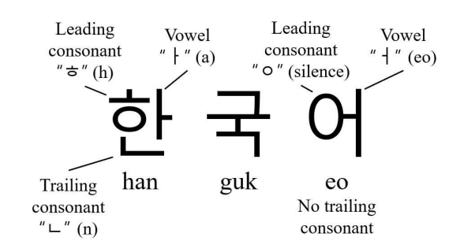
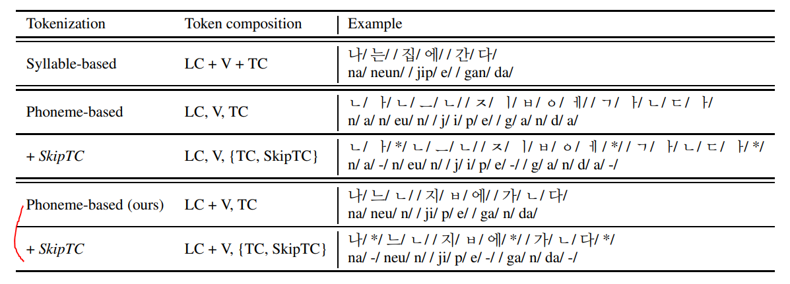
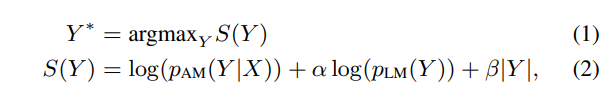
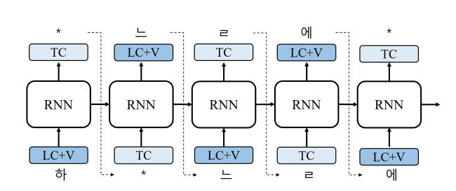
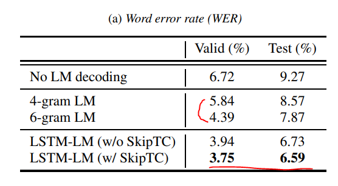
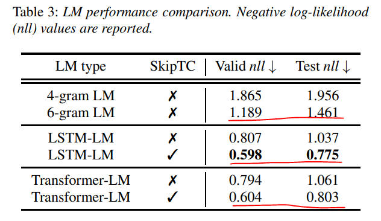
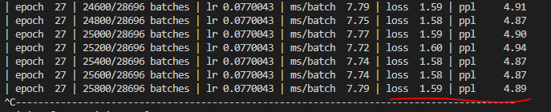
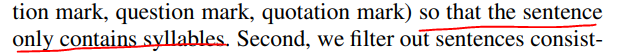

# Korean Tokenization for Beam Search Rescoring in Speech Recognition

## 논문
https://arxiv.org/abs/2203.03583

## 요약
1. 자소로 구분하자니 Sequence가 너무 길고, 음절, 단어로 하자니 OOV 여파와 Vocab Size가 부담된다. 하지만, 받침(Trailing)으로 구분하면 문제가 쉬워진다.

2. 이런식으로, 받침이 없는 문자열은 *(Skip Trailing Consonant Token)을 부여하여 처리할 수 있다.

3. 이후의 STT 모델 Output의 LM Score 적용은 기존의 방식과 동일하게 처리 가능하다. (ASR Model Score + Language Model Score / alpha, betha는 비율 가중치 HyperParam) 

4. LSTM-LM 사용시 모델의 예측은 아래와 같이 진행된다.

5. 실제로 WER도 더 낮아지며, loss 메트릭도 좋아지는 효과를 보인다.

Word Error Rate(WER) Metric

WER은 눈에 띄게 좋아지지는 않는 모습

NLL loss Metric

6. 철자 전사 (숫자와 영어를 기호 표기식으로 나타냄 ex) 일 -> 1) 기준 직접 학습해본 결과

이 정도면 50 Epoch 학습을 다 돌리면, Metric 기준상 약 5-gram LM 정도의 수준이지 않을까 생각된다.
### 논문의 결과대비 2배정도 안좋은 이유가 무엇일까?
- 논문은 음성 전사 기준이다. (숫자와 영어가 존재하지 않고, 한글 음절(Syllabel)만 존재함)

- 논문은 STT 모델을 학습시킨 Training Data만을 가지고 학습하였다. (STT모델의 output으로 들어가는 lm의 input이 도메인이나 상황이 매우 특정되어있다는 사실.)
- 소스가 공개되어있지는 않아서, [pytorch example](https://github.com/pytorch/examples/tree/main/word_language_model)을 변형하고, 논문 형식의 tokenizer를 직접 구현할 수 밖에 없어서, Human Error의 가능성도 있지 않나... 
### 즉, Wiki나 우리 실생활 데이터는 철자와 음성 전사 기준이 정해져있지 않거니와, STT 모델의 학습 데이터만 활용했다는 점에서 약간은 Metric은 당연히 좋은 결과가 나올 수 있지 않나 사료된다. (= 일반화가 잘 된 데이터 및 모델이라고 보기 어렵다.)

## 여담
- vocab이 논문에서 제시한 것과 비슷한 457개가 생성되었으며, 적은 vocab으로도 많은 단어를 수용 가능하다고 판단된다.
- STT의 경우 음성전사(한글표기식)를 선택하는 것이 정확도가 대체적으로 더 좋아, 해당 논문도 LM을 음성전사 기준으로만 타겟으로 만든 것 같다.
- 해당 논문은 Language Model용 데이터지만, 음성 길이, 음성의 상태, Text의 길이 등으로 전처리 규약이 매우 많아, 일반화 하기는 어려운 Data로 학습된 논문이라는 점이 아쉽다.
- 받침은 앞서 나온 음절에만 영향을 받게 되므로, Transformer로 학습된 SkipTC는 잘 되지 않은 것은 충분히 납득될만한 요소로 사료된다. (받침과 전체 문장의 상관을 고려하는 것이 단점으로 작용될 수 있음)
- LSTM-LM은 n-gram을 DeepLearning으로 n-gram을 학습시키는 것과 비슷한 방식으로, 문장에서의 토큰별 Windowing과 각 시점별 확률을 계산하기 위한 수정된 역전파 기법 (BPTT)를 활용하므로, 직접 PyTorch로 구현하는 것이 편했다.

## 후속 계획
- 숫자와 영어 표기식 <-> 한글표기식 이 가능한 모델을 만들 수 있다면, 음성전사(한글 표기식 기준)으로 전부 학습시켜 예측을 잘 하는 모델을 만든 다음, 숫자로 바꾸는 전략을 취할 수 있다.
- KenLM을 이용한 n-gram 방식과 성능의 차이가 크지 않으니, 일단은 재정의 없이 Pipeline을 쓸 수 있는 KenLM을 사용하고, 추후에 다시 건들여봐야겠다. (그러기 위해 남겨놓는다.)
