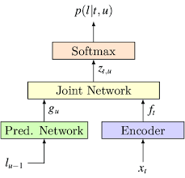
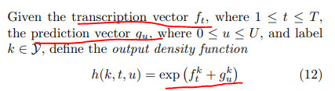
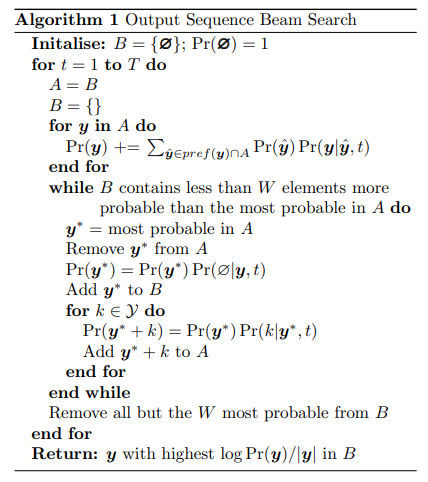
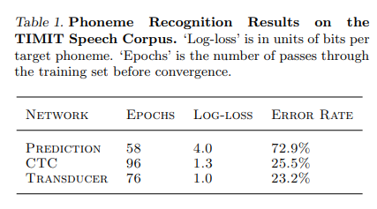

# Sequence Transduction with Recurrent Neural Network

## 논문
https://arxiv.org/abs/1211.3711

## 배경
1. 해당 논문은 2012년 논문으로, seq2seq논문은 2014년, 어텐션이 대중화될 2017년보다도 훨씬 이전 논문임을 명심해주세요.
2. RNN 기반은 순차적 특성을 순서적 변화를 잘 일반화하여 표현해왔다.
3. 다만, RNN은 Input Sequence와 Output Sequence가 고정이여야 하는 한계가 있다.
4. Sequence 길이에 상관없이 End-To-End로 학습시킬 수 있는 모델을 만들어보자!

## 요약
1. 음성의 순서적 특징과 텍스트의 순서적 특징을 RNN으로 추출하여 Joint하는 것으로,  
   한번에 학습 가능한, ASR에 LM을 추가한 효과를 내는 모델 구현이 가능하다.

## 구조
  
음성을 RNN으로 Encoding 하는 Encoder Layer와, 순차적 텍스트를 학습시키는 Pred. Network 구성이다.

### Prediction Network
1. Text Sequence 맨 앞에 Null을 추가하여 N, N+1을 학습시켜나가는 과정으로 이루어져있다.
2. Text는 One-Hot Vector로 표현된다.
3. RNN으로 구현되어 있으며 LSTM으로 학습하는 것도 방법이다.
4. Dense Layer는 tanh or sigmoid 사용.
5. 이전거로 다음거를 예측하는 것이, next-step-prediction RNN과 유사하며, 다만 맨 앞에 Null이 들어간다는 것만 다르다.

### Transcription Network (Encoder)
1. bidirectional RNN으로 구현되어 있으며 bidirectional LSTM을 선택해볼 수 있다.
2. 테스트 해보진 않았지만, 양방향이 단방향보다 잘 될 것이다.
3. Dense Layer는 tanh를 사용한다.
4. RNN+CTC를 학습하는 것과 유사하다.

### Joint Network
  
두 Layer의 Output을 합쳐서 사용하는 것으로 보이나, 구체적인 것은 소스를 보고 판단할 수 있을 것 같습니다.  
Joint Network의 설명은 구체적으로 되어있지 않습니다.

## 학습방법
각 시점의 음성에 대한 Text 확률 분포가 나올 수 있도록 학습한다.  
CTC Loss는 Length에 귀속적이기 때문에, RNNT Loss를 새로 소개한다.  
(RNNT loss 설명 참고)[https://github.com/42maru-ai/tadev_paper_summary/blob/main/SpeechToText/StreamingModel/Transformer_Transducer/Transformer_Transducer.md]  
BackPropagation에서 순차적 특성에 대한 각각의 역전파를 위해 BPTT(BackPropagation Through Time)를 사용해야 합니다. (코드 구현 시, 옵티마이징 과정의 재정의가 필요할 수 있음)  
BackPropagation이 각각 여러번 수행되는 것에 따른, 알고리즘적 성능 개선 구현도 논문에 설명되어있습니다.  
Inference는 재정의된 fixed-width beam search를 사용해야하며, 슈도코드는 아래와 같습니다.  
  

## 성능
  
실시간 스트리밍에 사용 가능한 모델이기에, Attention-Based 모델들과는 기능적 차이도 존재하지만, 성능도 조금은 떨어진다. (Attention-Based는 10% 언더로 떨어진다.)

## 여담
1. 속도를 위해 성능을 희생한 모델
2. Attention Based들도 연구가 많이 진행되고 있는 것 같은데, 아직은 RNN-T가 레퍼런스가 제일 많다.
3. 따지고 보면 Seq2Seq이랑 비슷하다. (Attention만 없는.)
