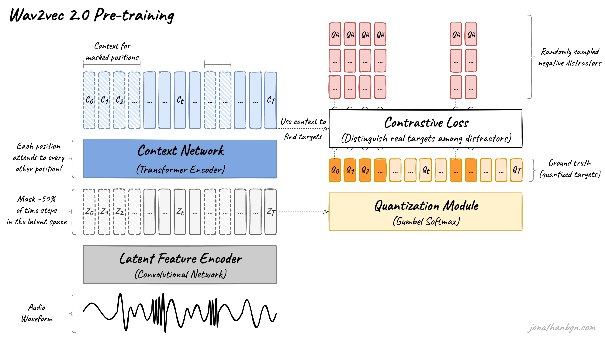
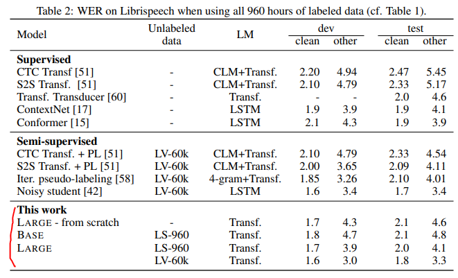

# wav2vec 2.0: A Framework for Self-Supervised Learning of Speech Representations

## 논문
https://arxiv.org/abs/2006.11477

## 요약
1. 음성 자체에서 특징을 뽑아보자 (MFCC 같은걸 더 이상 쓰지 않고.)
2. CNN으로 음성 구간 별 특징 표현을 잡아낸다.
3. Vector Quantize 기법을 통해 CNN으로 상대적으로 축소된 Shape에서조차 대표값을 찾아낸다.
4. 대표값을 학습시키기 위해 Masked 학습방식을 사용해서 Pre-Training한다.
=> 학습이 다 되면 음성을 임베딩한 Codebook을 얻을 수 있다! (= 음성에서 대표 특징을 잘 추출해낼 수 있다!)

## 구조
  
CNN -> Quantize -> Transformer 구조이다.  

### Latent speech representations (= Feature encoder)
CNN의 Kernel과 Stride를 이용하여, 매우 긴 Raw 음성을 Windowing 시키기 위해 사용된다.  
25ms 어치의 window로 20ms 어치씩 stride가 진행되며, Channel을 이용하여 높낮이 특성(49Hz 구간)을 잡아낸다.  
사람은 20ms 구간사이의 음성차이를 잘 느끼지 못한다 (음향학 도메인)  
49Hz는 음향장비의 최소 주파수 단위다 (음향학 도메인)  
즉, 여기서 사용되는 커널과 스트라이드와 같은 하이퍼 파라미터는 음향학에 근간을 둔다. (엥간하면 바꾸지 말라는 뜻)  

### Contextualized representations with Transformer Encoder (Context Network)
Feature Encoder에서 나온 값들을 self-attention하고, masked한다. BERT에서 masked 하는 이유와 동일하게, 해당 부분의 label을 가지고 빈칸맞추기를 할 예정이기 때문.  

### Quantization module
Feature Encoder에서 나온 값들로 Vector Quantize를 이용하여 Codebook을 구성할 수 있도록 한다.  
Vector Quantize는 쉽게말해 10개씩의 중앙값 등을 통하여, shape 10 vector에서 대표되는 값 1개를 결정하는 과정이다. (데이터가 작아짐과 동시에, 대표값을 얻어내는 의미를 가진다.)   
masked된 구간의 값을 Quantize된 값과 loss를 계산하는 것으로 학습을 진행하게 된다.  
그 의미는, 학습이 잘 된 Feature Encoder는 RAW 음성이 들어가면, 상호 의존이 고려된 대표값으로 치환해주는 Codebook 역할을 수행하게 된다.

### Loss
1. Contrastive Loss
    - Masking 된 위치의 Quantize된 positive sample과 negative samples들을 얼마나 잘 분간해 내는가? (객관식 문제로 오답과 정답 잘 분간해내는지 판단)
2. Diversity Loss
    - Codebook에 중복된 code가 많다면(아: 1, 어: 1), 특징을 잘 못잡아낸다고 볼 수 있다. (불확실하게 예측한다.)
    - 이 불확실성(엔트로피)를 최소화 하는것으로 중복된 code를 최소화 시킬 수 있다. (불확실성의 최소화 = 확실성의 최대화 = codebook에 중복안됨)
    - 때문의 Codebook의 크로스 엔트로피를 최소화 시키는 것으로 학습한다.

## 성능
  
Supervised에 비하면 훨씬 잘되고, semi와는 거의 비슷하다.  
Large같은 경우에는 대체적으로 잘 됨.

## 여담
1. **MFCC에서 자유로워진 것만으로 사실 대박이라고 생각한다. (MFCC, Torchaudio 같은거 쓰면 코드도 복잡하고, 속도도 엄청 느리다)**
2. 음성을 자기지도 학습하는 것으로, 음향 기술에서도 새로운 반향이 되지 않을까?
3. HuBERT가 Wav2Vec 2.0보다 늦게나왔지만, 간단하고, 조금 더 잘되므로 그걸 보는게 좋을 수도 있다. (복잡한 Quantize 과정을 K-Means로 간략화함)
4. 42Maru STT는 해당 모델을 근간으로 만들어졌습니다!🤗
