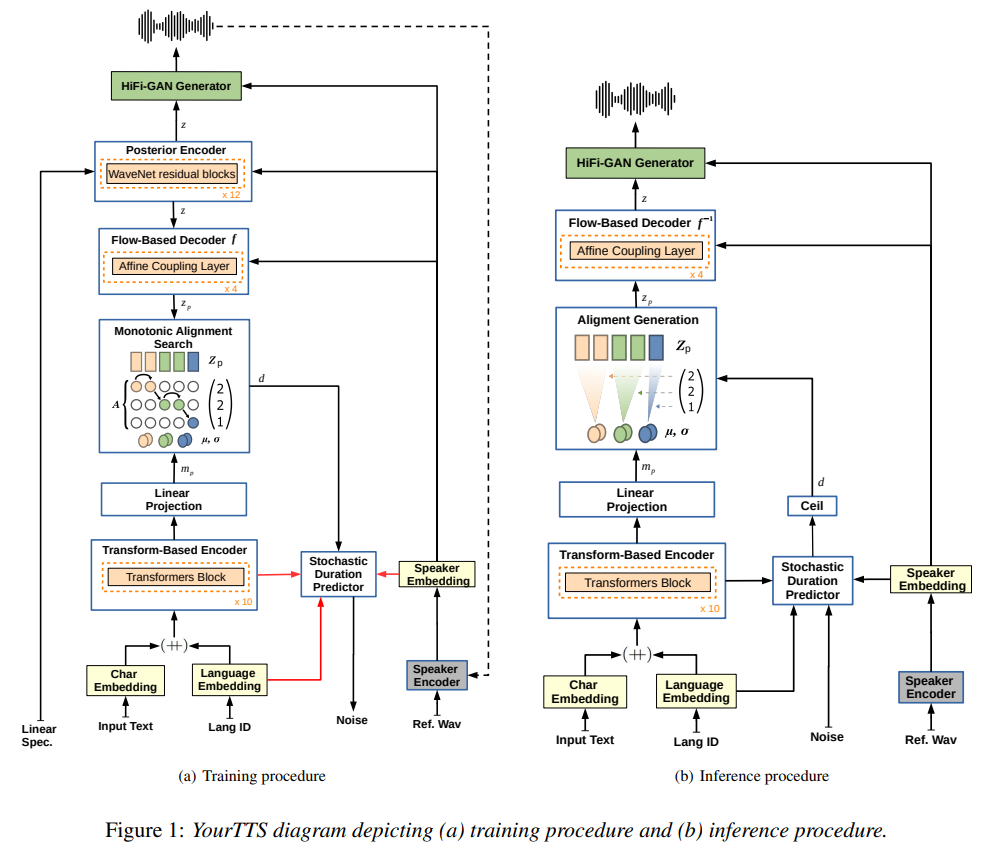

# YourTTS: Towards Zero-Shot Multi-Speaker TTS and Zero-Shot Voice Conversion for everyone

https://arxiv.org/abs/2112.02418

## 해결하고자 하는 문제

Zero-Shot TTS (ZS-TTS)는 많은 발전을 이뤄왔음에도 unseen speaker에 대해 자연스러우면서도 비슷한 음성을 합성하는 것은 쉽지 않다.  
더 자연스럽고 비슷하면서도 Multilingual한 ZS-TTS를 제시한다.

## 방법

[VITS](https://arxiv.org/abs/2106.06103) 기반으로 적절한 Modification을 추가했다.

변경사항은 다음과 같고 나머지는 VITS와 동일하다.

- Phoneme 대신 raw text를 input으로 활용한다. G2P없이도 사용할 수 있고 좀 더 realistic result를 얻을 수 있다.
- 4-dimentional trainable language embeddings를 각 character embeddings와 concat한다.
- Text encoder transformer block을 10개로 늘린다.
- Text encoder transformer hidden dim을 196으로 늘린다.
- Speaker encoder가 추가 되었다.
- Speaker Consistency Loss를 final loss에 추가하였다. (optional. fig1에 dashed line으로 표시되었다.)

**Speaker Consistency Loss (SCL)** 은 pre-trained speaker encoder를 이용하여 generated audio로 추출한 embedding과 ground truth로 추출한 embedding의 cosine similarity를 비교한다.

$$
L_{SCL} = \dfrac{-\alpha}{n} \cdot cos\_sim(\phi(g_i),\phi(h_i))
$$

where

- $\phi$: speaker encoder
- $g$: ground truth audio
- $h$: generated audio

Speaker encoder로는 VoxCeleb2 dataset과 [Prototypical Angular](https://arxiv.org/abs/2003.11982) plus Softmax loss로 훈련된 [H/ASP model](https://arxiv.org/abs/2009.14153)를 사용했다.

## Data

영어, 포르투갈어, 프랑스어 세가지 언어를 데이터로 활용했다.

|   |   | English | Portuguese | French |
|---|---|---|---|---|
| Train | Dataset | VCTK / LibriTTS | TTS-Portuguese Corpus | M-AILABS (fr_FR) |
|   | # of speakers | 109 / 1151 | 1 (1M) | 5 (3M/2F) |
|   | Data Quality | High / Low | Low | High |
| ZS TTS | Dataset | VCTK / LibriTTS | Multilingual LibriSpeech (MLS) | - |
|   | # of speakers | 11 (4M/7F) / 10 (5M/5F) | 10 (5M/5F) | - |
|   | Data Quality | High / Low | Low | - |
| ZS VC | Dataset | VCTK | Multilingual LibriSpeech (MLS) | - |
|   | # of speakers | 8 (4M/4F) | 8 (4M/4F) | - |
|   | Data Quality | High | Low | - |
| FT | Dataset | Common Voice | Common Voice | - |
|   | # of speakers | 2 (1M/1F) | 2 (1M/1F) | - |
|   | Data Quality | ? | ? | - |

## Metric

Synthesized speech quality 평가를 위해 Mean Opinion Score (MOS)를 사용하고, GT와 Synthesized를 비교하기 위해 Speaker Encoder Cosine Similarity (SECS)와 Sim-MOS를 사용했다.

## Result

- SCL은 similarity 측면에서 긍정적이었지만 quality 측면에서는 그렇지 못했다.
- VCTK에 대해 Zero-shot TTS, Zero-shot Voice conversion SOTA를 달성했다.
- 한명의 화자(성별 남자)만으로 훈련된 포르투갈어 역시 TTS와 VC에서 상당히 괜찮은 결과를 얻었다.
- 1분 미만의 데이터로 fine-tuning을 성공적으로 수행했다.

## limitations and future work

하지만 가끔 (특히 포르투갈어에서) mispronunciations가 발생했다. 이는 phonetic transcriptions을 사용하지 않았기 때문이다.  
더 나아가 ASR model에 Data augmentation 기법으로 이를 활용할 수 있을 것이다.

## 사견

실험이 과정과 결론 도출이 좀 ~~사실은 많이.. 굉장히..~~ 이상하다. 전체적으로 실험 결과로 이유를 예측함에 있어 논리의 비약이 많게 느껴진다.

하지만 본 논문이 VCTK의 Zero-Shot TTS에서 SOTA를 달성했음은 분명하다. 한국어에 잘 적용될지는 미지수이긴 하다. multilingual이나 G2P, 그리고 SCL등 여러가지 자체적인 실험이 필요할 것으로 보인다.
