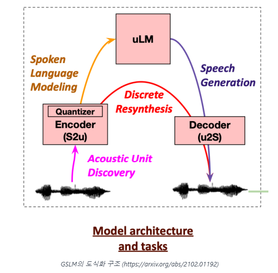
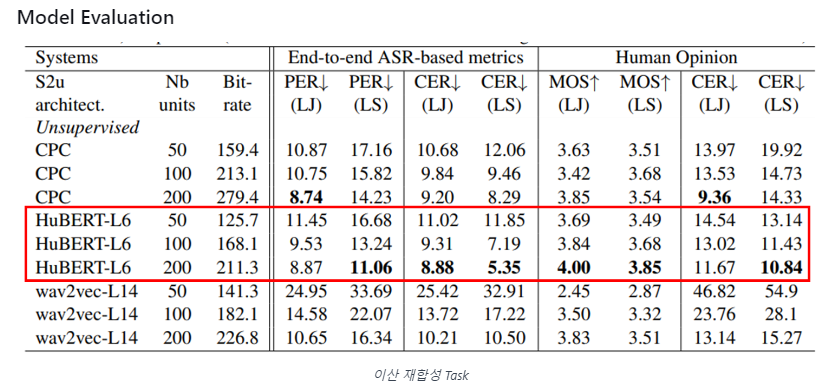
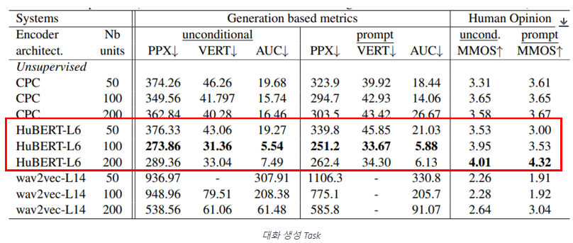

# Generative Spoken Language Modeling from Raw Audio

## 논문
https://arxiv.org/abs/2102.01192

## 서두
1. 어렸을때 사람이 언어를 배우는 것을 생각해보자, 글자부터 배웠는가? 대부분 말로부터 말을 배운다.

2. 음향 딥러닝을 위해서는 TextNLP가 필수로 필요하다. (STT/TTS를 생각해보자.)

3. 음향을 만드는 것은 쉬우나, 그에 대응되는 텍스트를 만드는데 리소스가 너무 많이 든다.

4. 대화에는 문맥이 없을까? 대화만으로 LanguageModel을 학습하는 것은 불가능한가?

## 요약

1. 이전 연구들 (Wav2Vec 2.0, HuBERT)로, 음성을 특징 벡터로 변환하는 것이 가능함을 입증했다. 

- 1번의 아이디어로, 음성의 변환된 벡터(Speech To Unit)로 CausalLM (다음 음성 생성) / Unit To Speech (원본 재합성)가 된다면, 
음성의 특징 벡터만으로, Textless한 LanguageModel과 TTS를 만들 수 있다.

## 구조

(S2u) HuBERT -> (uLM) Transformer (CausalLM) -> (u2S) Waveglow Vocoder(TTS) 
기존에 있던 녀석들을 합치는 것 만으로도 가능하다.

원본 재합성 Task

Automatic Metric (Text 인식이 잘 되는지 확인)  
Character Error Rate (CER), Phone Error Rate (PER) - 캐릭터 단위로, 들리는 소리대로의 글자 에러율  

Human Metric  
Mean Opinion Score (MOS) - 사람이 듣고 말이 유연하게 들리는지 1~5 척도로 조사하여 평균  

다음 음성 생성 Task

Perplexity (PPX) - 정답을 정확하게 예측할 수록 PPX는 낮아집니다.  
Diversity (VERT) - BLEU Metric을 수정하여, 중복된 단어가 연속으로 적게 발생하면서, 정답 문장과 유사하게 예측할 수록 낮아집니다.  
Area Under Curve (AUC) - PPX와 VERT의 관계 지표로, 둘 다 정확할 수록 낮아지니, AUC도 낮아져야 좋습니다.  

Human Metric  
Meaningfulness Opinion Score (MMOS) - 사람이 듣고 의미가 합리적인지 1~5 척도로 조사하여 평균  

## 여담
- S2u는 Pre Training 모델로 label이 필요없다.
- uLM은 Transformer CausalLM이므로 Label이 필요없다. (다음 벡터 예측하는 것이므로 따로 구축할 게 없음)
- u2S는 음성만 있으면 label을 구축할 수 있다.

=> 음성 벡터가 문맥을 의미하는 context vector와 비슷한 뉘앙스로 충분히 사용 가능함을 검증함. (다음 발화를 잘맞추는 것으로) 
=> TTS를 하는데 있어, 이제 Text는 필요가 없어질 것 
=> 음성 벡터를 시멘틱 Feature Vector와 매칭되어 학습 가능하다면, Textless Speech Semantic Search 기술이 가능하지 않을지?

## 한계점
- 음성을 재합성하므로 구체적인 검증 Metric이 없음. (논문에서도 사람이 검증함)
- 3개의 모델을 End To End로 한번에 학습 불가함. 따로따로 학습해야함. (각각의 모델의 파라미터도 무척 많아서, 답이 없음)

