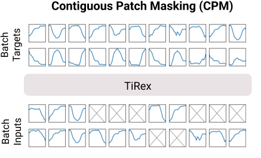
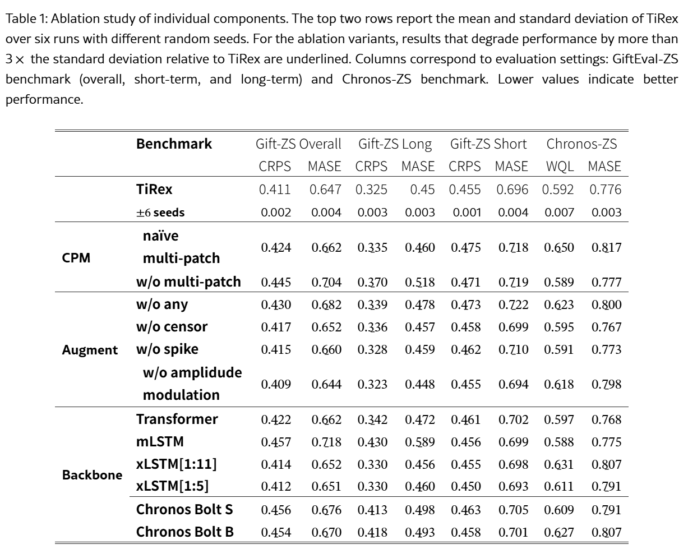

# TiRex: Zero-Shot Forecasting Across Long and Short Horizons with Enhanced In-Context Learning

## 논문

https://arxiv.org/abs/2505.23719

## 요약

### TimesFM-3을 이해하기 위한 초석으로 읽으므로, CPM 부분만 정리하도록 하였습니다. 장기 시계열모델 그리고 LSTM에 관심이 많으시면 다 읽어보시는게 좋을 것 같습니다.

### Abstract

xLSTM을 활용하여 In-Context가 되는 LSTM을 만들었다! 장기예측에도 강건하다!.

상태추적기능을 더욱 강화하기 위해서 CPM이라는 학습 마스킹 전략을 제안한다.

이 방법론은 TimesFM보다 훨씬 막강하다!

### 2. TiRex

**Multi-Patch Horizon Forecasts**

다중회귀 방식으로 다중 패치 예측을 다루는 경우가 많다. 이 방법은 probabilistic forecast의 uncertainty propagation을 끊는다고 이야기한다.
이는 왜 그러냐면 연속값의 예측은 불안정할 수 밖에 없다.(MSE 0은 사실상 불가능한 셈이니까.) 따라서 어떤 표준편차가 각 포인트별로 존재할 수 밖에 없다. TiRex의 경우 Quantile 0.1~0.9를 예측하게 하므로 결국 한 point에 9개에 해당하는 어떤 분포와 비슷한 데이터가 나오는데, 이거 어떻게 다음 input으로 사용할 것인가? (결국 평균이나 중앙값같은 거 밖에 없을 것이다.)

즉, 이런 환경에서 결국 값의 범위가 벌어질 것(uncertainty)을 고려해서 다음 input에 반영되어야하나, 대부분의 문제들은 그 부분들을 전부 뭉개버린다. (불확실성의 전파가 끊어지게 되는 것!)

TiRex는 이 문제를 해결하기 위해 미래 입력을 결측값으로 처리한다. 그러므로써, 불확실성을 전파할 수 있게 한다.

#### 2.1 Contiguous Patch Masking (CPM)

사전 학습 과정에서 전체 및 연속된 패치를 무작위로 마스킹한다.(좌측 그림) Inference타임에서 보지 못한 값으로 표현되는 것과 같은 맥락이다.

연속 패치의 수를 샘플링하고, 마스킹 확률을 샘플링해서 적용한다. 즉, 전체 패치를 마스킹 할 건지, 안 할건지 구분하는건데, BERT랑 차이점은 일단 디코더 형식이니까 bi direction이 아니고, 복원하는 것은 더더욱이 아니다.

여기서의 핵심은 값이 없는데 다음 값을 얼마나 잘 예측할 수 있느냐?를 보는게 맞다고 봐야한다.

한마디로 중간에 값이 비어도, 더 먼 원거리를 잘 맞추게 할 수 있도록 학습시키는 방법이다.

이전에 콜센터에서 학습시켰던 방법과 굉장히 유사한데, 일례로 이런식으로 학습시킨적이 있었다.

1주차 데이터로, 2주차를 예측하는 모델, 3주차를 예측하는 모델, 4주차를 예측하는 모델. 이런식으로 3주갭씩 모델을 롤링으로 4개를 만들어서 어떤 주차의 데이터가 있고, 그로 부터 얼마나 멀리 떨어져있어도 시점만 맞는 모델을 가져다가 예측시켰던 적이 있는데, 이때 LSTM AutoEncoder 방식으로 한 경험이 있다.

지금 현재 방법은 사전학습을 할 때 애시당초에 나는 Multi Task라고 부르고싶은, 이런 여러 모델로 표현했던 방법을 한 모델에 학습으로 충분히 가르쳐서 적용할 수 있겠다고 생각이 들었다.

### 4. Experiments

#### 4.2 Ablations

**Contiguous Patch Masking and Multi-Patch-Inference**

1. **w/o multi-patch:** TimesFM과 비슷한 자기회귀 방법론
2. **naive multi-patch:** Missing Patch를 두긴 하는데, 무조건 예측해야하는 끝자락만 Missing Patch만 두는 방식
   CPM과의 차이는 예측을 하기까지 모든 기간은 결측값이 없다는 전제이므로, 뭔가 1번과 3번의 중간방식을 하나 두고싶었던 모양...
3. **TiRex:** CPM

Long, Short을 보자. (CRPS는 Continuous Ranked Probability Score로 TiRex는 Quantile로 여러 값의 범위를 예측으로 내므로, 실제값의 분포와 비교해서 **값이 작아질 수록 좋다.(분포의 차이가 적음)**)

naive는 short 예측에서 오히려 TimesFM보다 안좋다. TimesFM 방식은 확실히 Long에서 점수가 떨어지고, CPM사용을 해야만이 장단기 성능이 전부 좋아짐을 보인다. (Inference Behavior가 정확하게 맞으므로...)

### Appendix D.4 Abalations

**Contiguous Patch Masking (CPM)**

얼마나 패치를 마스킹하는게 좋을까?

여기서는 드롭아웃 비율을 참고해서 마스킹은 0.25로, 최대 패치는 5정도가 좋았다고 하는데, 본인들의 데이터에 맞춰서 실험해봐야한다고 한다.

긴 horizon을 잘 하려면 긴 mask가 필요하다고 한다. (어찌보면 당연한 얘기다.)

근데 무엇보다 CPM 하이퍼 파라미터는 크게 영향은 없었고, CPM자체를 적용한다는 것 자체가 더 큰 팩터로 작용했다고 한다.

## 마치며

시계열 예측을 할 일이 있으면 어느정도 25년까지는 따라온거 같다. 과거에 해봤던 경험도 있고 금방금방 이해는 되었다.

나중에 실제로 현업에서 쓸 일이 있다면 더욱 파봐야겠다.
