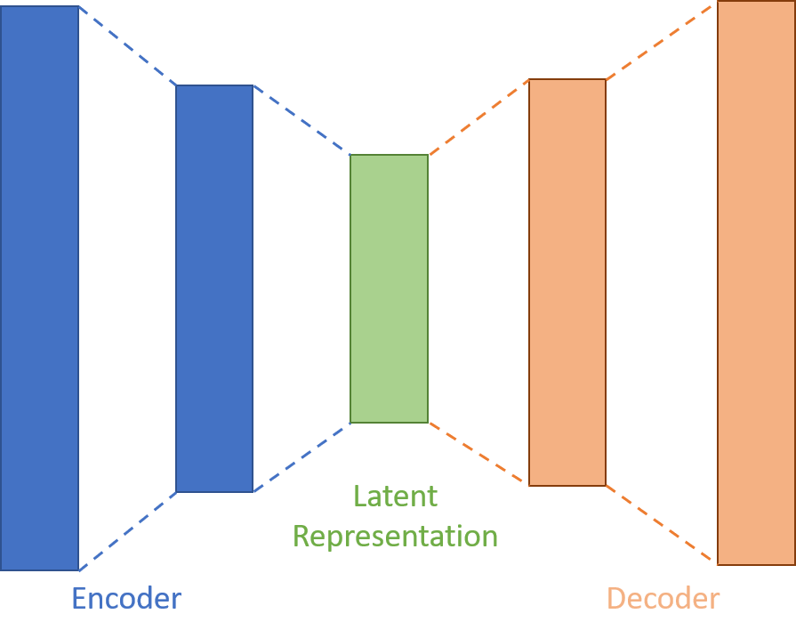
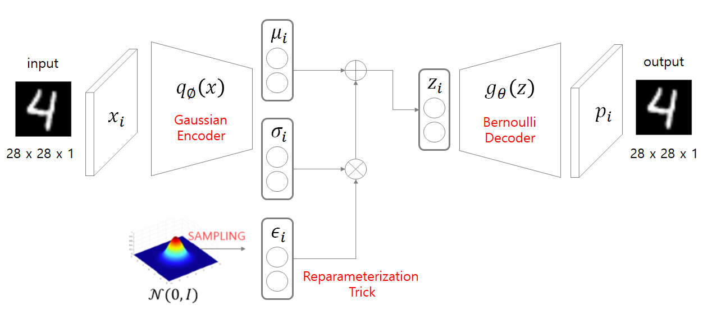
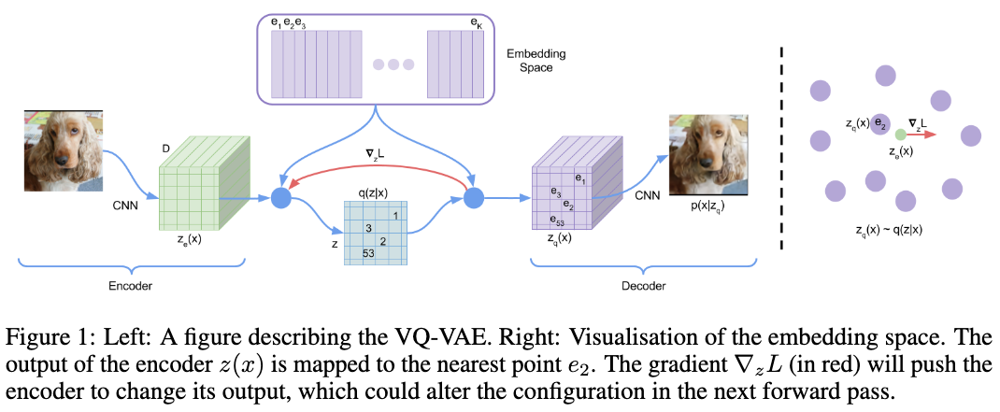
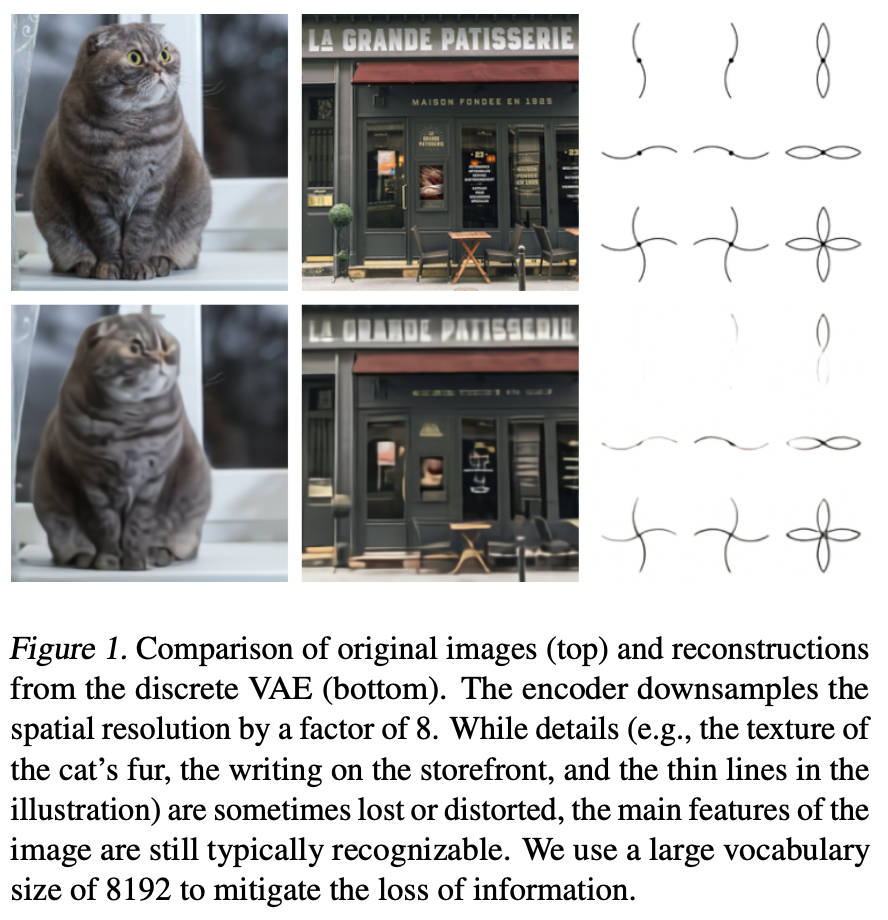
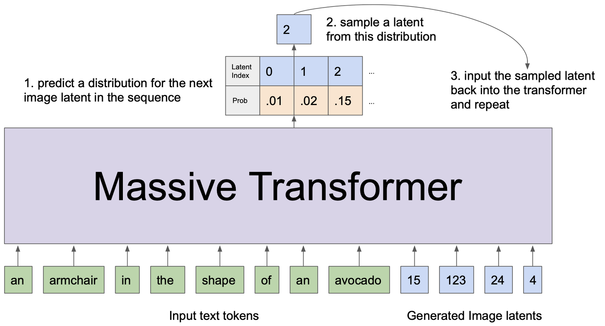
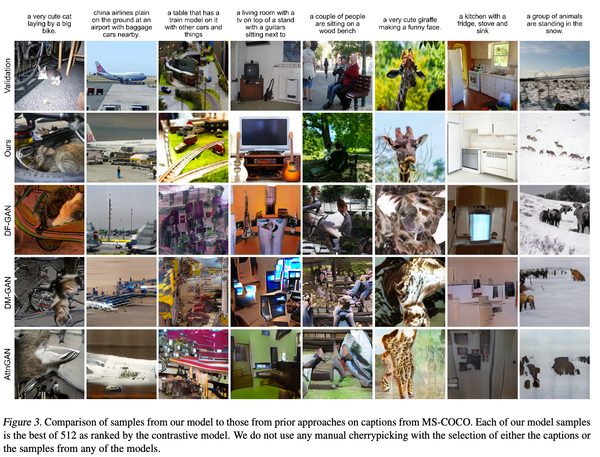
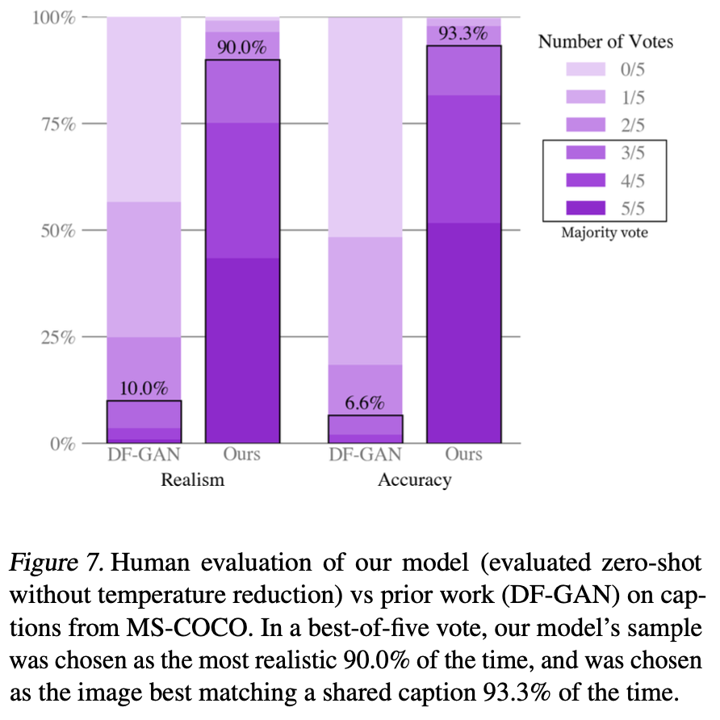

# Zero-Shot Text-to-Image Generation

## 논문

https://arxiv.org/abs/2102.12092

## (들어가기전) 오토인코더

### 1. AE

Auto Encoder

입력 데이터를 복원함으로 Latent space에 임베딩 벡터를 학습함

### 2. VAE

Variational Auto Encoder

현실의 데이터가 가우시안 분포를 가진다고 가정하면 AE의 분포는 sparse하기 때문에 가우시안 분포를 가지도록 AE를 학습

### 3. VQ-VAE

vocab(code book)을 만들어 Latent space를 양자화 시키는 VAE

입력된 데이터들(픽셀)에 대해 가장 유사한 vocab을 선택

선택된 vocab을 가지고 디코더에서 원본 데이터의 복원이 가능해야함 

### 4. dVAE

discrete VAE

VQ-VAE와 비슷하나, VQ-VAE는 가장 유사한 vocab을 선택, dVAE는 vocab을 선택하기 위한 분포를 학습

(좀더 알아보기 필요)

## 요약

### 1. 기존의 문제

- 전통적인 Text-to-image 생성 모델은 고정된 Train 데이터에서 더 좋은 모델을 찾는 것에 집중해옴 (데이터가 적음)

- 이러한 접근법은 학습에 복잡한 아키텍처, 보조적인 Loss, 학습중 객체 label 대한 side information 또는 segmentation mask들을 포함함

- 생성모델은 패러미터의 수, 잘 정제된 많은 데이터일때 autoregressive transformer는 텍스트와 이미지, 오디오 도메인 등에서 성과를 내었다.

- text2image 모델은 적은 데이터셋(CUB-200, MS-COCO)에서 평가되었다.
  - 위에서 언급한 고정된 데이터셋 문제

### 2. 제안

- 목표

  - 많은 데이터(250M)로 많은 패러미터(12B)의 autoregressive transformer를 학습시켜보자(복잡한 아키텍처 x, 고정된 데이터셋 x)

- 문제점

  - 256x256의 이미지를 픽셀 단위로 autoregressive 하게 학습시키기 위해서는 자원이 너무 많이 들어 학습이 불가능
  - 해상도를 낮추면 고품질의 이미지를 생성 못함

- 해결법

  - dVAE를 이용해 256x256 이미지를 32x32의 grid 토큰으로 만들어 해결(이때 8,192개의 토큰이 있다고 가정, 결과적으로 생성할 수 있는 이미지의 수는 8,192^1,024)

    

  - dVAE를 통해 transformer가 처리해야할 image context를 192배 압축하면서 imaged의 quality는 어느정도 유지가 가능((256x256x3) / (32x32) = 192)

  - 이후 최대 256개의 BPE된 텍스트와(vocab size 16,384) 1024개(vocal size 8,192)의 image 토큰을 autoregressive하게 학습한다.

    

  - 생성된 image 토큰이 1024개가 되면 dVAE의 디코더를 통해 이미지로 복원한다.

  ## 3. 결과

  
  
  

