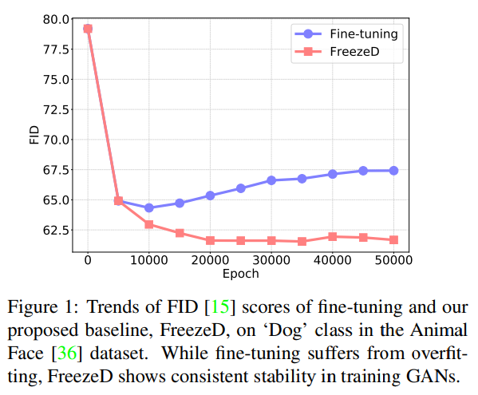
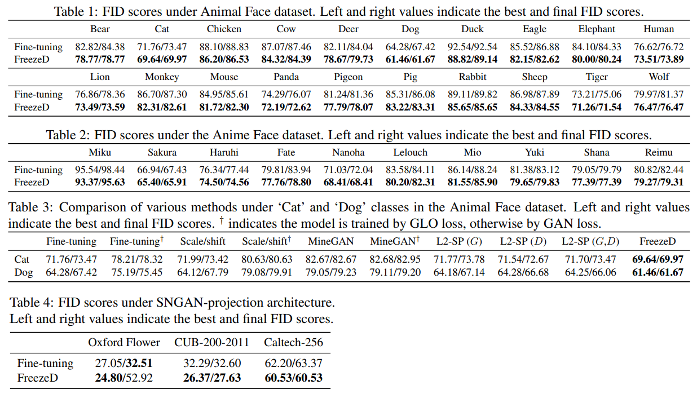

# Freeze the Discriminator: a Simple Baseline for Fine-Tuning GANs

## 논문

https://arxiv.org/pdf/2002.10964.pdf

## 해결하고자하는 문제

GAN은 많은 양의 데이터와 컴퓨터 리소스를 요구한다. 이런 문제 해결을 위해 GAN의 transfer learning technique이 제시되어왔지만 보통 이런 방법은 overfitting이 되기 쉽거나 small distribution shifts를 배우는것에 그쳤다. 이에 따라 discriminator의 lower layers만을 freeze 하여 진행하는 fine-tuning이 매우 잘 작동함을 소개한다.

## 방법

Image generator를 위한 GAN의 Discriminator는 lower layers가 generic한 feature를 배우고 upper layers는 그를 바탕으로 분류함을 직감적으로 생각할 수 있다. 이는 전혀 새로운 관점이 아니다.  
Image classifier의 fine-tuning 처럼 discriminator의 lower layers만을 freeze하여 fine-tuning을 진행한다. 이를 FreezeD라고 부른다. ~~세상 간단하다.~~

FreezeD와 함께 possible future directions 두가지도 추가로 소개한다. 목표는 sota달성이 아니라 simple and effective baseline을 set하는 것에 있다.

## 실험

FID(Frechet Inception Distance)<b>[1](#f1)</b>로 평가한다.

Unconditional GAN과 Conditional GAN 모두에서 좋은 모습을 보였다.

> <b>1</b> **FID(Frechet Inception Distance)** [↩](#a1)  
> 생성된 이미지의 분포와 원래 이미지의 분포가 어느정도 비슷한지 측정하는 지표.
> 거리를 나타낸 것으로  작을수록 좋다.

## 사견

개인적으로 Generator의 freeze는 어떻게 하는 것이 좋을지에 대해서도 제시를 해주었다면 어땠을까 싶다. 실험을 안했던건지 했는데 결과가 안좋아서 안적은지는 모르겠다.  
또한 learning rate나 batch size에 대한 이야기도 없는데 이런 hyper params는 어떻게 설정했는지 궁금하다. 이전꺼 그대로 이어받아서 했나.
