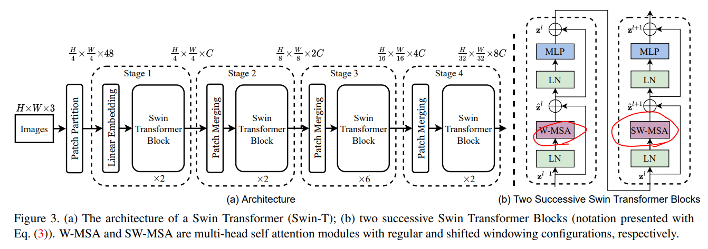
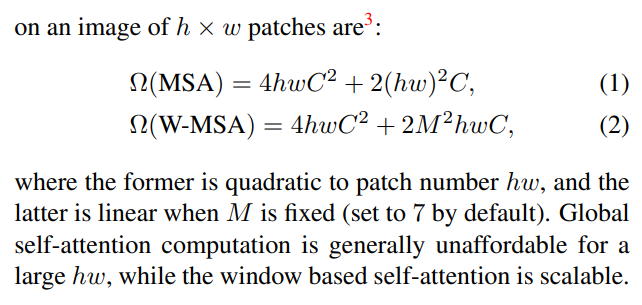
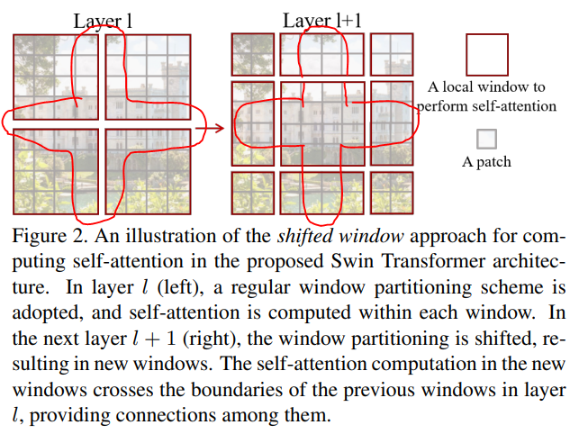
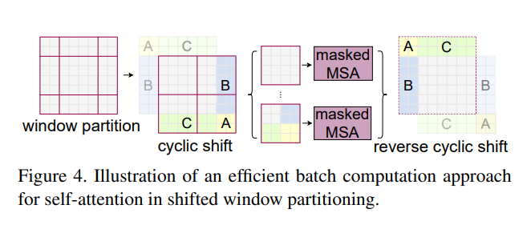
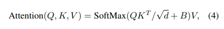
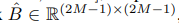
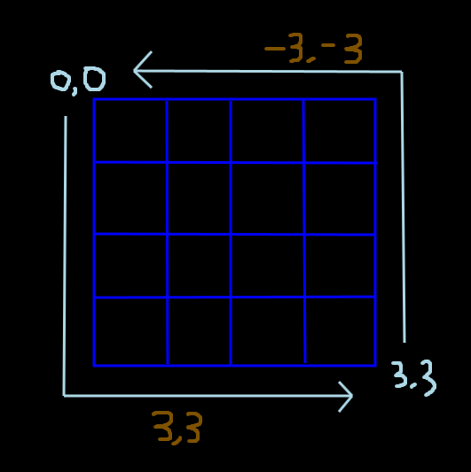
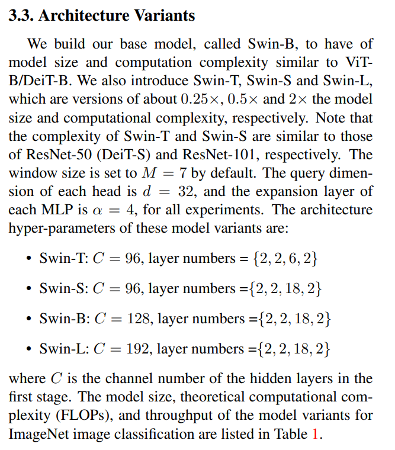

# Swin Transformer: Hierarchical Vision Transformer using Shifted Windows

## 논문
https://arxiv.org/abs/2103.14030

## 요약
1. ViT의 단점
   1. 결국에 픽셀수가 엄청 큰 Resolution의 이미지는 patch의 개수가 많아져 여전히 Quadratic 연산량에 문제가 존재함
   2. Kernel 이동시키지 않기 때문에, 정확히는 CNN의 특징을 완벽히 반영하지 못함

빨간색으로 표시한 W(in non-overlapped Windows)-MSA(Multi-head Self Attention)와 SW(Shifted Window)-MSA로 두개의 단점을 타파함

### Self-attention in non-overlapped windows (W-MSA)

Window 안에서, Patch들 끼리만의 Self-Attention을 진행한다. Window Size는 MXM으로 고정되므로, 기존에 height x width로 Attention 을 할때보다, 전체 이미지 사이즈에 연산량 영향에서 자유로워진다.

다만 이 방법만으로는, Window 간의 관계는 파악할 수 없다는 한계가 존재한다. (정확히는 Window에서 서로 인접한 Patch들 간의 관계를 파악하기 어렵다.)

=> Window가 어쩌다가 몸통하고 팔하고 나누어졌는데, 정확히 몸통하고 팔을 연결하는 그 부분은 Attention에 영향을 받지 못하니까.

### Shifted window partitioning in successive blocks

W-MSA의 한계를 개선하고자 Window간의 Self-Attention을 고려한다. 정확히는 Window로 나누어진 빨간색 영역간의 Attention이 진행되지 않으니, 커널을 11시 방향으로 이동하듯이 이동시켜 Patch들 끼리 Attention을 추가로 진행하면, 이전의 Window에서 떨어진 상호간 Attention을 처리할 수 있다.

11시 방향으로 Kernel을 이동하듯이 처리해서 Self-Attention하는 것으로, Window에서 인접한 Patch들도 전부 Attention을 보장할 수 있게 된다.

근데 문제는, Window가 2x2에서 3x3이 되며 MxM보다 작은 window들이 생겨서 연산량이라던지, 기존 W-MSA 사상과 맞지 않는 형태의 연산이 추가되게 된다. (어디는 작게보고 어디는 크게보면서, Attention으로 상관관계에 대한 영향력을 판단한다는 것이 불합리하다고 판단한 것 같다.)

때문에 pad를 강제로 채워 연산, 메모리 복잡도를 증대시키고 맘편하게 하는 naive방식도 있지만, 비추고

Masking을 이용해서, 인접하지 않은 녀석들은 mask 시켜 attention 진행을 무시하는 방법을 채택한다.

애매하게 잘리는 부분들을 A,B,C와 같이 붙히면, 해당 부분들은 이미지의 왼쪽, 윗쪽에서 짤라온 애들이기 때문에, 기존 회색 구간과 관계가 성립되지 않는다.

때문에 해당 위치의 patch들은 attention masking 시켜버린 다음에, 각 Window의 회색 구간만 어텐션한다. (여기서는 마치 실제로 이동시켜서 계산하고, 다시 patch를 원복시키는 형태로 소개하지만, Shifted라는 단어의 사상에 접목시키기 위한 표현이었다고 생각되고, 실제 구현체에서는 그냥 해당 위치 index의 patch만 masking 시키는 형태로 하지 않을까 싶긴하다.)

위와 같이 진행하면, **형식상 2번의 Swin Transformer Block을 가지면, 이미지의 모든 인접 Patch는 Attention을 수행할 수 있다.**

(그래서 위 전체 아키텍쳐에서 Swin Transformer Layer가 짝수개로 들어간다)

**여기서 근데 궁금한점, 왜 Stage 3 만 6으로 키웠을 생각을 했을까? 라는 점이다. 실험 결과보면 이미지는 클수록, 모델 사이즈도 클수록 성능이 좋은데, 모델의 사이즈는 꼭 Stage 3에서만 키우고, 왜 여기서만 키우는지는 못찾았다.** 

### Relative position bias

현재 Patch A 기준으로부터 C까지 얼마나 상대적으로 서로 얼마나 떨어졌는지에 대한 bias를 추가한다. [-A+C, A-C]

그러면 위와같은 상대 좌표는  

로 MxM Patch에서 전부 표현 가능하다.

### 실험

classification만을 이용한 pre-training 및 fine-tuning과 classfication을 이용해서 전체를 학습한 것 에 대한 실험을 진행한다.

모델은 stage 3번과, 아키텍쳐에서 C에 해당하는 patch size x channel의 배수에 해당하는 값으로 실험한다.

## 결론

Ablation Study까지 포함하면 결론이 거의 내용 설명만큼 나와서 매우 축약한형태로 설명하도록 하겠다.

1. Pre-Training을 진행한 것이, Scratch로만 하는 것 보다는 더 잘된다.
2. 리사이즈 하는 이미지는 사이즈가 클수록, 모델 파라미터는 많을 수록 잘된다.
3. 리사이즈 하는 이미지 사이즈가 큰 것이, 모델 파라미터 개수를 늘리는 것 보다 속도에 더 악영향을 미친다.
4. 거의 대부분의 실험에서 어떤 모델 형태를 사용하더라도 속도, 정확도에 있어 압도적으로 성능이 개선되었다.
5. Position 방식은 다른거 고민할 것 없이 Relative position bias만 쓴게 제일 잘됐음. (absolute라던지 해도 잘 안됨)
6. Sliding Window 형태로 미는 것(Kernel 하듯이 옆 혹은 아래로 가는 것) 보다, Shifted Window 방식이 정확도는 살짝 더 높고 속도는 압도적으로 빠름 (아마 Sliding은 이미지 끝까지 전부 다 봐야해서 그렇지 않을까 싶기도 하고...)
7. **연구자들은 해당 모델이 OCR에서도 좋은 성능을 내길 기도한다고 논문을 마무리 짓는다.** (실제로 잘된다.)

## 여담
- SwinV2도 있는데 일부 성능이 개선되었습니다.
  - **저해상도 이미지로 학습된 모델이 고해상도 이미지로 학습될때 정확도가 떨어지는 문제 수정** (relative position bias 수정)

  - 모델의 파라미터 개수를 확장할때, (베이스로 학습된걸 라지로 추가학습하는 것인지?) 큰 정확도 하향을 개선 (활성화 값이 큰 폭으로 증가하는걸 방지하기 위한 normalize term 추가)

  - 모델 사이즈가 커질때, 전체 이미지가 아닌 극히 일부 픽셀이 Feature Map에 큰 영향을 주는 현상을 발견하고 수정한다. (attention 기법을 Scaled Cosine Attention으로 변경)

  - **GPU 리소스 개선과 Self-Supervised Pre-Training을 제안** (V1에서는 ViT와 다르게 Image Classification으로만 Pre-Train 합니다.)

- 결론적으로 ViT보다 빠르고 Feature Map을 더 CNN스럽게 고려하는 Transformer가 완성되었습니다.

- V2를 통해서, 무조건적인 더 큰 성능향상을 기대해볼 수 있습니다.

- 더 큰 이미지도 수용할 수있고, **큰 이미지와 작은 이미지 사이의 성능저하를 최소폭으로 줄이는 모델(V2)**로 생각해볼 수 있습니다.

- **OCR에서는 길고 짧은 이미지가 많기에 TrOCR은 ViT로 Pre-Trained 되어있는데, SwinV2를 사용하는 것이 더 효과적일 것**으로 사료됩니다.
