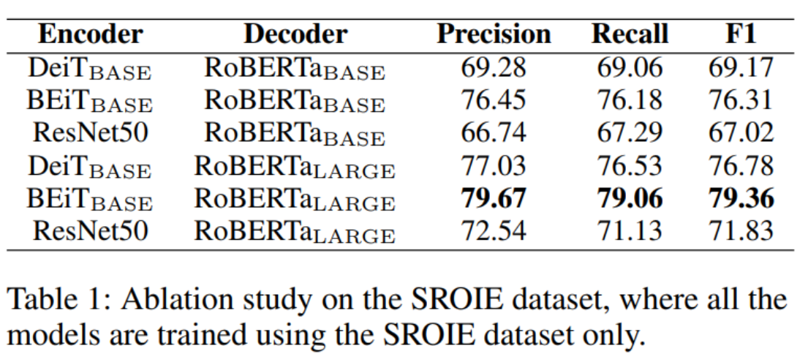
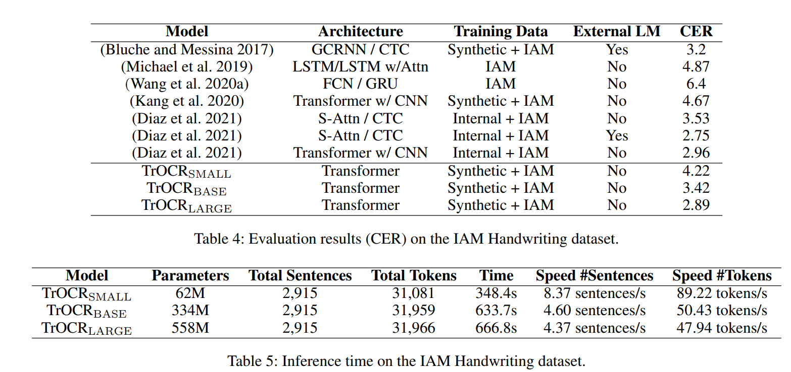
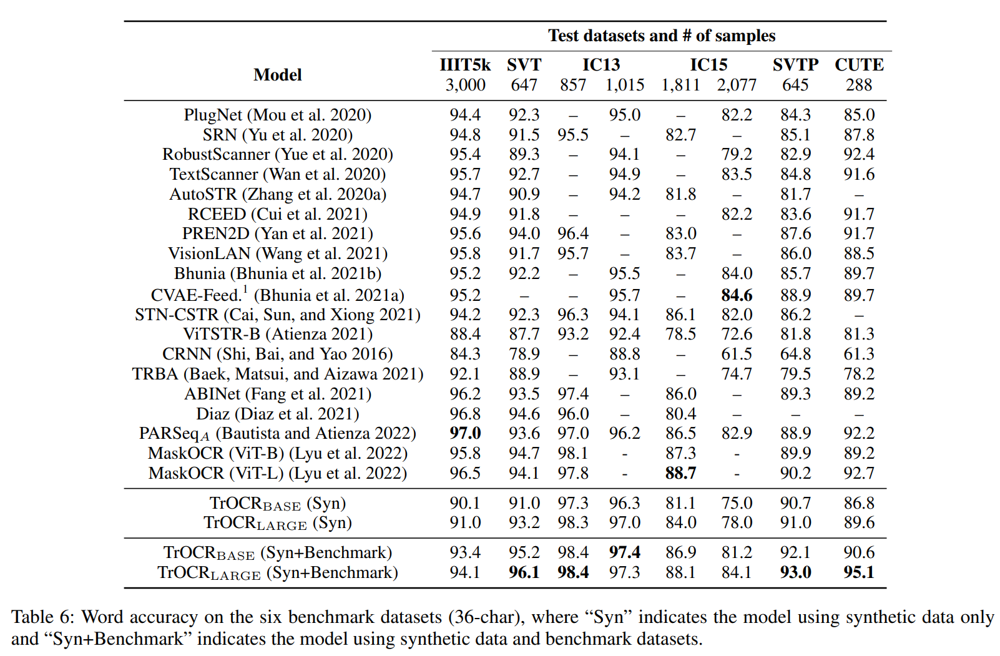

# TrOCR: Transformer-based Optical Character Recognition with Pre-trained Models

## 논문
https://arxiv.org/abs/2109.10282

## 요약
1. RCNN과 일반 Transformer Enc-CTC로 느슨해진 OCR 기술에 긴장감을 주는 Pre-Trained Base model
2. Image Transformer - Text Transformer 를 En-Decoder 형태로 써서 잘 되면, RCNN이랑 Transformer-CTC based를 뛰어넘는 기술의 발견, 실제로 잘됨
3. 기반기술에 대한 설명과, experiment에 초점을 둔 논문이다.

### Encoder

ViT Based 기술로 테스트 하였다.

**DeiT:** Distill Learning을 사용함. 저자가 하이퍼파라미터를 이것저것 바꿔보고 augmentation을 이것저것 모델에 적용해봤음.

**BEiT:** Masked Language Model Task처럼 학습된 모델. 이미지를 Discrete VAE를 통해 원복시켜서 masked를 학습시키나보다. DeiT랑 다르게 distilled token이 없음.

### Decoder

**RoBERTa:** 하이퍼 파라미터와 데이터 사이즈 변화로 영향을 면밀히 조사함. Masked를 학습간 random하게 적용하고, NSP loss가 없음.

**MiniLM:** 99%의 퍼포먼스를 유지하지만, large model을 압축한 형태. distillation하게 학습되었음.

이런 모델 load하다보면 어떤 파라미터는 Transformer decoder에 있고 없고 할텐데, 없는건 랜덤초기화 했음.

### Pre-training

pre-training과정에서 text recognition task를 적용해서 진행함.

Visual feature extraction 그에 대한, language modeling을 학습할 수 있기를 기대함.

pre-training은 2 stage로 나누어서 진행함.

첫번째 stage에서, printed textline images를 수억개 만들어서, TrOCR을 학습시킴.

두번째 stage에서, 2개의 상대적으로 적은 datasets를 활용함. printed or handwritten downstream task로 활용. public dataset으로 수백만개 사용함.

두번째 stage에서 load된 첫번째 stage의 모델 parameter도 미세조정 될 것임.

### Fine-tuning

text recognition task에서 미세조정되며, model의 출력물은 BPE와 SentencePiece에 영향을 받음

### Data Augmentation

원본+6개의 변형이미지 활용하였음. (printed, handwritten 각각)

random rotation (-10 to 10 degrees), Gaussian blurring, image dilation, image erosion, downscaling, underlining. 각 샘플에 대해 동일한 가능성으로 어떤 이미지 변환을 수행할지 무작위로 결정함. scene text datasts의 경우, [(Atienza 2021)](https://arxiv.org/abs/2105.08582)를 따르는, [RandAugment](https://arxiv.org/abs/1909.13719)을 적용했으며, inversion, curving, blur, noise, distortion, rotation, etc를 포함한다. 

## 결론

- Image Encoder의 영향을 많이 받는 것으로 보이며, Decoder는 클수록 좋음
- Fine-Tuning까지 한게 제일 잘됨 (학습은 stage를 깊게 유지할 수록 잘됨)

- printed 이미지 기준, 다른 업체들 대비 TrOCR이 잘됨. CLOVA가 2022년 하반기 논문인데 LSTM구조로 설명된다.

- Handwriting에서도 잘됨.
- 예측 속도는 base나 large나 비슷하게 떨어짐. small은 성능과 속도의 trade-off가 있지만, 성능이 나쁜 수준은 아니라, 상업 서비스에 적용 가능함을 어필함

- 사진으로 찍힌 이미지에 대해서도 잘됨. IIIT5k는 학습되지 않은 특수문자가 있어서 잘 안되는 경향이 있었음. 이런 부분들도 이후에 잘 고려해서 학습해야 할 것임.

## 여담

- Text Detection도 만들어야된다고 하는데 Future Work로 짬시켜놨음...ㅋㅋ
  
- 참고로 이미지 일일이 다 crop해서 테스트하고 학습했다고함..
  
- CRNN+CTC -> RNN을 BiLSTM으로 처리 -> seq2seq model -> Transformer based -> Image Transformer 의 역사로 흘러오면서 이후 논문들이 당연히 더 잘 됨을 여실히 보여줌
  
- 교원 컴페는 만약 발표에서 논문 소개를 하더라도, 모든 준비는 끝난 것 같습니다.
  
- **된다면 SwinV2로 encoder를 학습**하면 속도, 정확도 측면에서 훨씬 개선될 것 같네요.
  
- 그리고 **word단위보다 char단위가 더 잘되는 것** 같기도 하고요
  
