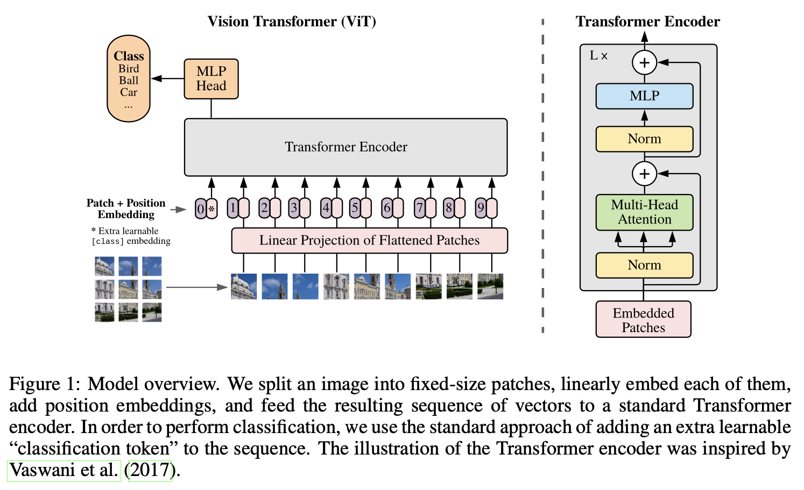
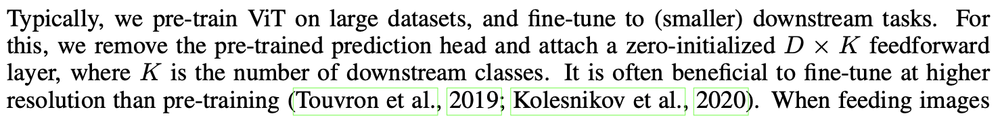
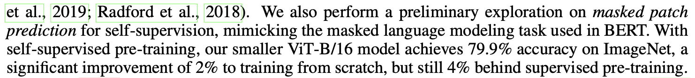
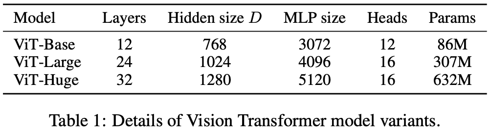
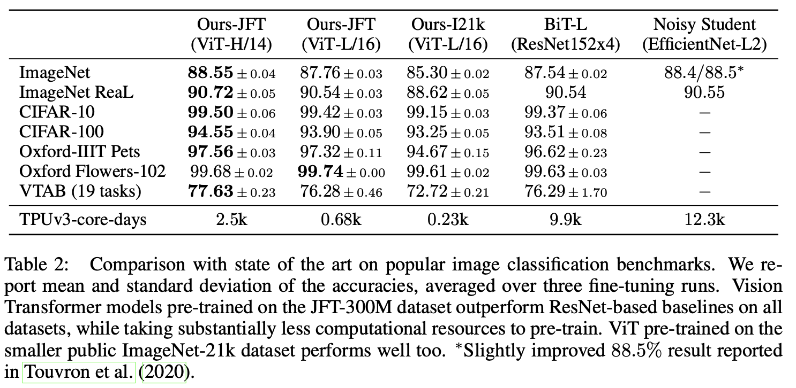
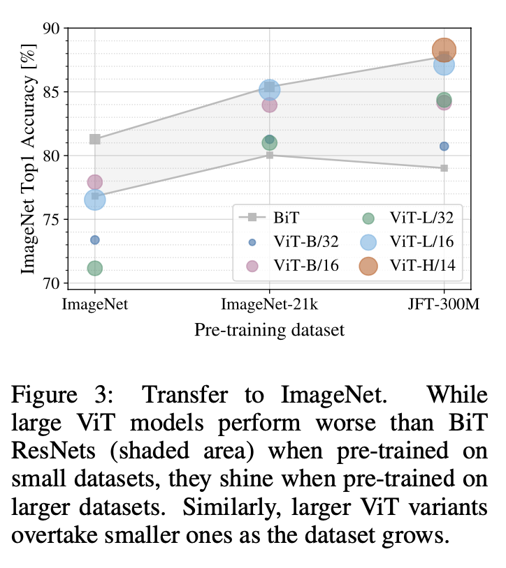
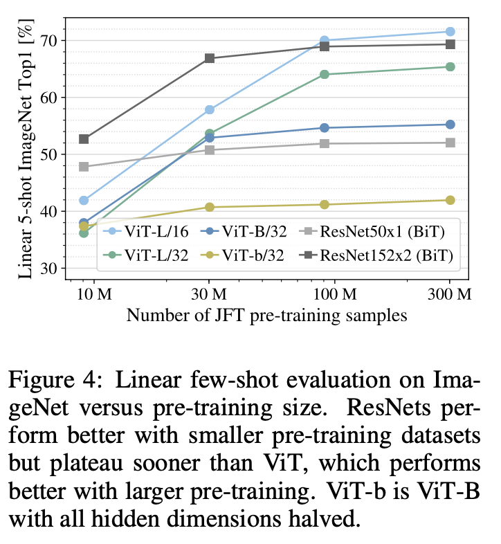
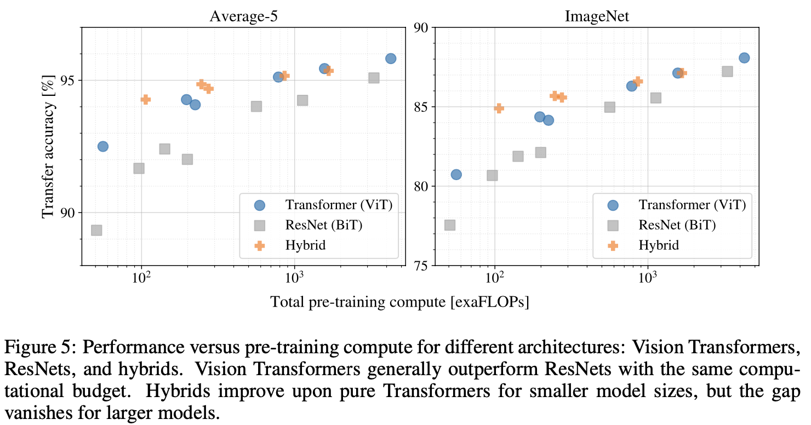
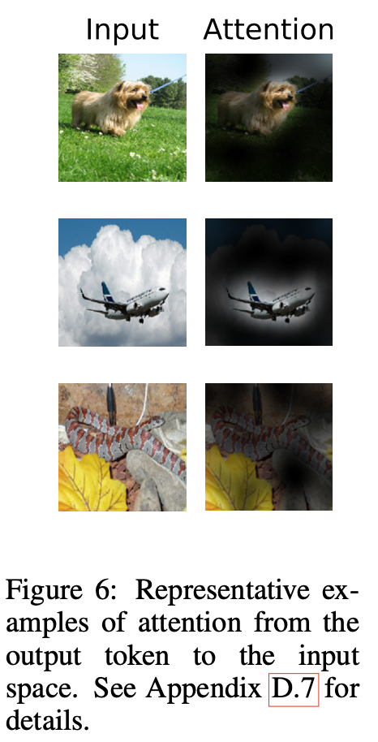

# An Image is Worth 16x16 Words: Transformers for Image Recognition at Scale

## 논문

https://arxiv.org/abs/2010.11929

## 요약

### 당시의 문제와 배경

- Transformer 구조는 사실상 NLP의 표준이 된 상태
- 그러나 Image 분야에서의 Self Attention의 적용은 아직 제한적이다.
- 여전히 CNN이 Image 분야에서 지배적인 성능을 내고 있다.
- NLP의 성공에 영감을 받아 Self Attention을 Image에도 사용하고 싶다.

### 기존의 방법(혹은 시도)

- 나이브하게 self-attention을 이미지에 적용하기 위해서는 이미지의 각 픽셀에 대하여 다른 픽셀 모두 attention 계산을 해야 하고 이는 quadratic cost를 가지기 때문에 현실적이지가 않다.
- 이를 위해 self-attention 계산을 근사하는 방법들이 있어왔음
- 또는 CNN과 유사한 구조를 self-attention과 결합하기 위한 시도가 있었음
- 혹은 완전히 CNN을 대체
  - 하지만 이러한 방법들은 최신 하드웨어에서 효과적으로 확장되지 않음
  - 그렇기에 large datasets 에서는 여전히 CNN이 우수

### 논문 요약

- transformer의 구조를 바꾸지 않으면서 Image를 처리 할 수 있게 만듬
- (기존의 방법중) 가장 비슷한 것은 [Cordonnier et al. (2020)](https://arxiv.org/abs/1911.03584)임
  - 해당 방법은 이미지를 2x2패치로 추출하고 full attention을 계산함
- 제시하는 모델과 거의 비슷하지만 large datasets을 통하여 pretraining을 하는 법이 추가, 또 2x2패치의 small resolution에만 적용 되던 방식을 medium-resolution에도 적용 할 수 있게 만듬
- 우리의 방법은 mid size dataset 에서는 기존의 resnet보다 일반화 성능이 떨어짐. 이유는 CNN과는 달리 inductive bias인 translation equivariance와 locality가 없기 때문
- 그러나 large dataest의 경우에 inductive bias를 뛰어넘어 더 나은 결과를 낼 수 있는 것을 확인했다.

### 방법(간단하게)



[^]: Model overview


- transformer는 토큰 임베딩의 1차원으로 있는 인풋을 입력 받음

- 이와 유사하게 만들기 위해 ViT는 다음과 같은 방식을 수행함

  1. Image reshape

      
     $$
     H \times W \times  C \space \rightarrow N \times(P^2*C)
     $$
     (H,W: resolution, P: Patch size size, N: HW/P^2)

  2. Linear Projection을 통해 D의 크기를 가지는 벡터로 각 패치를 만듬(결과로 1차원으로 있는 인풋 시퀀스가 완성됨, CNN주의: 리니어 처럼 작동해서 논문에서 CNN을 안썼다고 말한 말에 모순이 없음)

     ```python
     # transformers ViT의 구현
     class ViTPatchEmbeddings(nn.Module):
         """
         This class turns `pixel_values` of shape `(batch_size, num_channels, height, width)` into the initial
         `hidden_states` (patch embeddings) of shape `(batch_size, seq_length, hidden_size)` to be consumed by a
         Transformer.
         """
     
         def __init__(self, config):
             super().__init__()
             image_size, patch_size = config.image_size, config.patch_size
             num_channels, hidden_size = config.num_channels, config.hidden_size
             num_patches = (image_size[1] // patch_size[1]) * (image_size[0] // patch_size[0])
             self.image_size = image_size
             self.patch_size = patch_size
             self.num_channels = num_channels
             self.num_patches = num_patches
     
             self.projection = nn.Conv2d(num_channels, 
                                         hidden_size, 
                                         kernel_size=patch_size,
                                         stride=patch_size)
     
         def forward(self, pixel_values: torch.Tensor, interpolate_pos_encoding: bool = False)torch.Tensor:
             batch_size, num_channels, height, width = pixel_values.shape
             embeddings = self.projection(pixel_values).flatten(2).transpose(1, 2)
             return embeddings
     ```

     3. Encoder로 들어가기전 CLS 토큰을 만들어서 시퀀스의 맨 앞에 concat한 다음 position Embedding을 더해줌

     ```python
     # transformers ViT의 구현
     class ViTEmbeddings(nn.Module):
         """
         Construct the CLS token, position and patch embeddings. Optionally, also the mask token.
         """
     
         def __init__(self, config: ViTConfig, use_mask_token: bool = False) -> None:
             super().__init__()
     
             self.cls_token = nn.Parameter(
                 nn.init.trunc_normal_(
                   torch.zeros(1, 1, config.hidden_size, dtype=torch.float32), 
                   mean=0.0, 
                   std=config.initializer_range
                 )
             )
             self.mask_token = nn.Parameter(torch.zeros(1, 1, config.hidden_size))
             self.patch_embeddings = ViTPatchEmbeddings(config)
             num_patches = self.patch_embeddings.num_patches
             self.position_embeddings = nn.Parameter(
                 nn.init.trunc_normal_(
                     torch.zeros(1, num_patches + 1, config.hidden_size, dtype=torch.float32),
                     mean=0.0,
                     std=config.initializer_range,
                 )
             )
             self.dropout = nn.Dropout(config.hidden_dropout_prob)
             self.config = config
     
         def forward(
             self,
             pixel_values: torch.Tensor,
             bool_masked_pos: Optional[torch.BoolTensor] = None,
             interpolate_pos_encoding: bool = False,
         ) -> torch.Tensor:
             batch_size, num_channels, height, width = pixel_values.shape
             embeddings = self.patch_embeddings(
               pixel_values, 
               interpolate_pos_encoding=interpolate_pos_encoding
             )
     
             if bool_masked_pos is not None:
                 seq_length = embeddings.shape[1]
                 mask_tokens = self.mask_token.expand(batch_size, seq_length, -1)
                 # replace the masked visual tokens by mask_tokens
                 mask = bool_masked_pos.unsqueeze(-1).type_as(mask_tokens)
                 embeddings = embeddings * (1.0 - mask) + mask_tokens * mask
     
             # add the [CLS] token to the embedded patch tokens
             cls_tokens = self.cls_token.expand(batch_size, -1, -1)
             embeddings = torch.cat((cls_tokens, embeddings), dim=1)
     
             # add positional encoding to each token
             embeddings = embeddings + self.position_embeddings
     
             embeddings = self.dropout(embeddings)
     
             return embeddings
     ```

     4. 위의 과정을 수행 후 transformer의 input으로 사용 할 수 있다.

### pre-train

- 대용량 데이터셋에 대하여 클래스를 분류 하는 것을 수행

  

- self supervised pre-training(Masked Patch Prediction like BERT)을 시도 했을 경우 성능 향상은 존재 했으나 CNN을 넘지는 못했음

  

### results

- 모델 정보

  

- 다른 모델과의 비교

  

- supervised pre-training별 성능비교

  

  

  - Pre-training을 할 수록 CNN의 inductive-bias에 의한 성능을 넘어서는 경향을 보여줌

- pre-training의 flop당 성능 비교

  

- 충분히 학습된 ViT가 이미지의 Attention을 어떻게 잡는가?

  

  


## 의의

- 이미지에서도 transformer의 self attention이 좋은 성능을 낼 수 있다는 것을 증명
- 다만 CNN을 뛰어넘기 위해서는 정말 많은 데이터가 필요
- Self supervised pre training이 아니란 점은 아쉬울 수 있으나 이후 후속 논문들에서 활발히 연구됨(아마?)


## 사족

- 제대로 잘 정리 못한 것 같습니다.
- 좀더 관심이 있거나 자세히 알고 싶으면 원 논문과 다른 정리가 잘 된 블로그등을 찾아보는 것을 추천합니다 ㅠ

